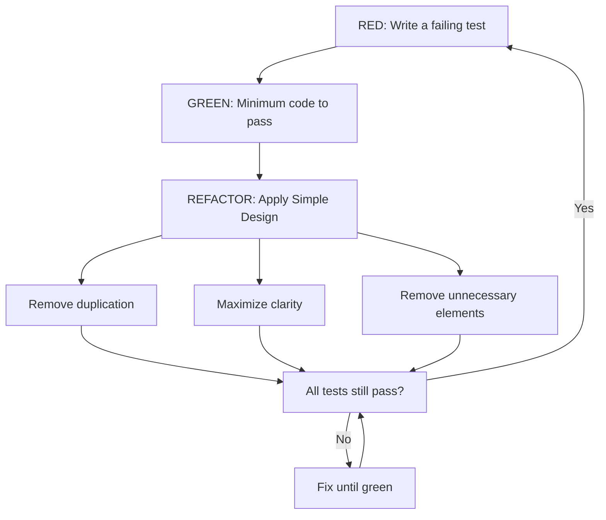
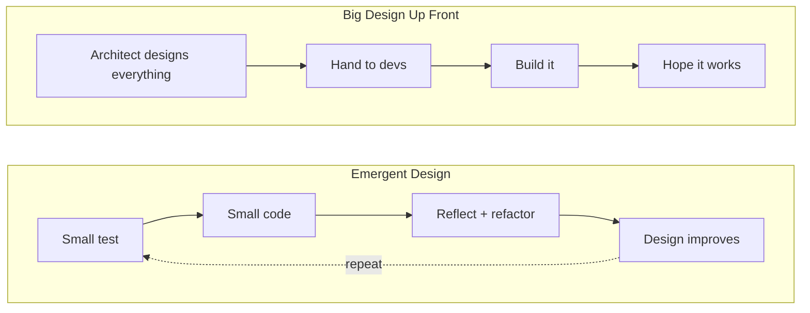
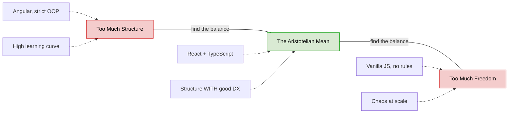
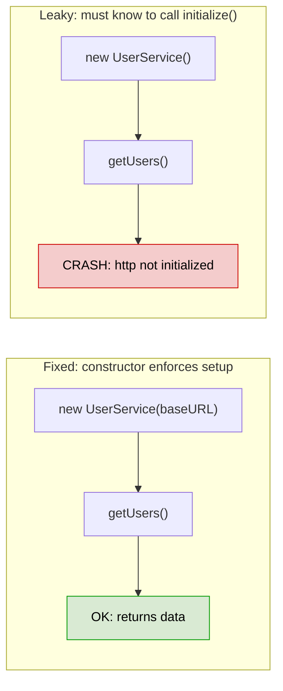
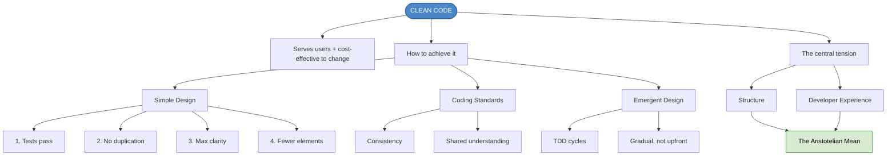

# Chapter 4: Demystifying Clean Code

## Core Question

**What is clean code, and how do we write it?**

The answer turns out to be less about code and more about *people*.

---

## 1. What Clean Code Actually Means

Clean code is code that:
- **Serves the needs of users** AND
- **Can be cost-effectively changed by developers**

The second part is what "cleanliness" is really about. If changing code is expensive, painful, or risky — it's not clean, no matter how pretty it looks.

Clean code minimizes **accidental complexity**: ripple effects, cognitive load, poor discoverability, and poor understanding.

### Community vs. Expert Perspectives

| Community Says | What It Really Means |
|---|---|
| "Easy to read and modify" | Good naming, formatting, loose coupling, tests exist |
| "Reveals intended purpose" | Declarative, functionally complete, tested |
| "No coupling between libraries" | Architectural boundaries enforced |
| "Tells a story about the domain" | Tests document business behavior |
| "Testable code" | Structure enables verification |
| "No magic. Simplicity." | Essential complexity only |

**Expert consensus**: clean code is more about **humans** than about code. Every expert quote centers on readability, understandability, and care for future maintainers.

> "The cost of ownership for a program includes the time humans spend to understand it." — Mathias Verraes

> "Clean code always looks like it was written by someone who cares." — Michael Feathers

---

## 2. Coding Standards

**A coding standard** = a collection of rules that pushes code toward a consistent style and approach.

It covers: project structure, feature implementation patterns, error handling, naming, formatting, commit process, comments, etc.

### Why Consistency Matters

We are **pattern-matching machines**. See something once → note it. Twice → believe it. Three times → it's law.

Consistency alone improves 3 of the 4 complexity detectors:
- ✅ Cognitive load (reduced)
- ✅ Discoverability (improved)
- ✅ Understandability (improved)
- ❌ Ripple (that's a coupling problem)

---

## 3. Simple Design (Kent Beck / XP)

The **best expert-agreed definition** of clean code. Four elements, applied **in order**:

```
1. Runs all tests          → It works, and we can prove it
2. Contains no duplication → DRY, no copy-paste
3. Maximizes clarity       → Expressive, readable, cohesive
4. Has fewer elements      → Minimal code, no unnecessary abstractions
```

### How It Works in Practice (with TDD)



**Key insight**: Refactoring happens *only when tests are passing*. We change structure, not behavior.

Good refactoring → improves cohesion, keeps coupling loose.
Bad refactoring → introduces coupling, creates wrong/confusing abstractions.

---

## 4. Emergent Design

Instead of Big Design Up Front (BDUF) where an architect hands down UML diagrams, design **emerges gradually** through TDD cycles.



**Benefit**: You get **many opportunities** to correct bad design before it hardens.

---

## 5. The Central Tension: Structure vs. Developer Experience

This is the **most important concept** in this chapter. Software design is a constant balancing act.



| | Structure | Developer Experience |
|---|---|---|
| **Optimizes for** | Maintainability, correctness | Speed, onboarding, joy |
| **Risk if excess** | High learning curve, slow devs | Chaos, inconsistency at scale |
| **Examples** | Angular, strict OOP | Vanilla React, dynamic languages |

### The Sweet Spot

The best tech decisions find the **mean between extremes**:
- React **+ TypeScript** (flexibility + safety)
- Typed language **+ escape hatches** (structure + pragmatism)
- Functional style **+ optional state** (purity + practicality)

---

## 6. APIs Are Everywhere

> An API is any code *intended to be used* by another developer.

Not just HTTP endpoints — every class, function, and library you write for others is an API. This means **you are an API designer**.

### The Leaky Abstraction Problem



**Principle**: Avoid partial object creation — ensure an object is fully created or not created at all. Use constructors/factory methods to enforce this.

---

## 7. Mental Map: The Full Picture



---

## Key Takeaways

1. **Clean code = Simple Design**: tests pass, no duplication, maximum clarity, minimum elements
2. **Consistency is king**: humans are pattern-matching machines — break patterns and you break understanding
3. **Design should emerge** through TDD, not be dictated upfront
4. **Structure vs. DX** is THE central tension — seek the Aristotelian mean
5. **You are an API designer** — every abstraction you create is an API for your teammates
6. **Don't leak abstractions** — enforce correct usage through language constructs (constructors, types)

---

## Concepts Introduced

- [Simple Design](../concepts/simple-design.md)
- [Extreme Programming (XP)](../concepts/extreme-programming.md)
- [Test-Driven Development (TDD)](../concepts/tdd.md)
- [Emergent Design](../concepts/emergent-design.md)
- [Coding Standards](../concepts/coding-standards.md)
- [Accidental vs Essential Complexity](../concepts/accidental-vs-essential-complexity.md)
- [Coupling & Cohesion](../concepts/coupling-and-cohesion.md)
- [Developer Experience (DX)](../concepts/developer-experience.md)
- [Code Smells](../concepts/code-smells.md)
- [Leaky Abstractions](../concepts/leaky-abstractions.md)
