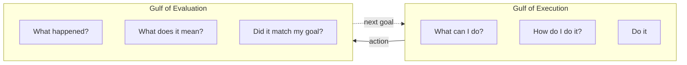
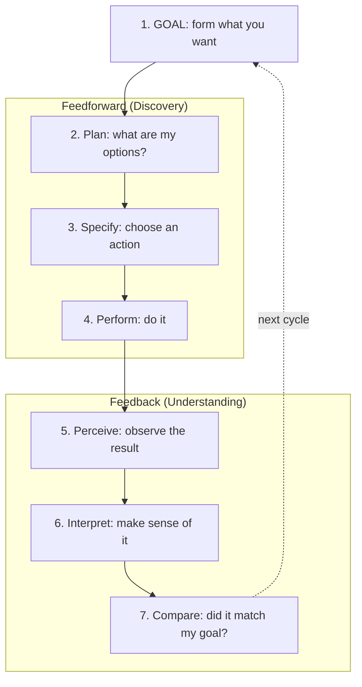
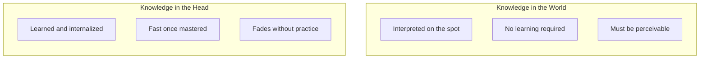
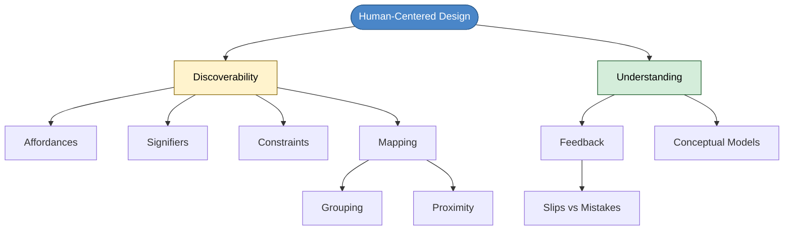

# Chapter 5: Human-Centered Design for Developers

## Core Question

**How do we systematically know if code is clean — not by gut feeling, but by understanding how humans discover and understand things?**

The answer: borrow from Don Norman's Human-Centered Design. The same psychology that explains why people walk into glass doors also explains why developers struggle with bad codebases.

---

## 1. Human-Centered Design (HCD)

A design philosophy that puts users' needs, behavior, and pain points first. Instead of designing what works, design what works *for humans*.

For us, the users are **other developers** (and future you). Our goal: make code easy to discover, understand, and change.

### Developer Use Cases

What developers actually need from a codebase:

- How to run the app and tests
- How and why code is organized the way it is
- How the domain is expressed in code
- How to add a new feature and where it belongs
- How to locate and change a specific feature
- How to debug
- How to improve code without breaking things

---

## 2. The Two Things to Optimize

> "Two of the most important characteristics of good design are discoverability and understanding." — Don Norman

| Discoverability | Understanding |
|---|---|
| Can I figure out what's possible? | Can I build a mental model of how this works? |
| Where do things live? | What happens when I do X? |
| What are my options? | Did my action succeed? |

These map to two "gulfs" every human crosses:

---

## 3. The 7 Stages of Action

The psychology of how humans interact with anything:

When you fly through these stages, it's muscle memory. When you get stuck at any stage, that's a **design problem** — and there's a specific principle to fix it.

---

## 4. The 7 Fundamental Design Principles

### For Discoverability (Feedforward Side)

**Affordances** — physical properties that show what's possible.

| Context | Example |
|---|---|
| Real life | A button affords pushing. A handle affords gripping. |
| Code | TypeScript affords interfaces and abstract classes. JavaScript does not afford `abstract`. |
| Takeaway | Your language choice determines what design patterns are even possible. |

**Signifiers** — labels or marks that communicate where and how to act.

| Type | Code Example |
|---|---|
| Intentional | `UserController` (pattern name in the class name), BDD test descriptions, JSDoc comments |
| Accidental | Dead code signals work-in-progress. Thin controllers signal robust architecture. Nested conditionals signal complex logic. |

**Constraints** — limit possible actions so you do the right thing.

| Type | Code Example |
|---|---|
| Physical | `const` can't be redeclared. `static` methods can't be called on instances. |
| Semantic | Value Objects enforce domain rules via factory pattern. |
| Logical | Type checking catches illegal operations at compile time. |

Key idea: **thin interfaces**. Minimize the public API. Encapsulate complexity inside. Humans have limited working memory.

**Mapping** — controls should match the layout of what they control.

Two sub-principles:

| Principle | What It Means | Code Equivalent |
|---|---|---|
| Grouping | Related controls together | High cohesion: state + behavior in one class |
| Proximity | Controls near what they control | Related files close together. No anemic domain models. |

### For Understanding (Feedback Side)

**Feedback** — immediate communication of the result.

| Code Example | What It Does |
|---|---|
| Compile-time type errors | Instant signal that something is illegal |
| Test results (red/green) | Immediate confirmation of correctness |
| Autocomplete | Shows all valid options in real-time |
| Pre-commit hooks | Forces you to deal with issues before committing |

Two types of user errors:
- **Slips**: correct goal, wrong sequence. Recoverable.
- **Mistakes**: wrong goal entirely. Design failure.

**Conceptual Models** — the mental model built from experience.

You don't need to know React's shadow DOM internals. You just need: "React re-renders when state changes." That's a good enough conceptual model.

Good conceptual models let you **predict the effects of your actions**. Without one, you're just trying random things.

---

## 5. Knowledge: Head vs. World

| Should require learning (Head) | Should require zero learning (World) |
|---|---|
| The domain | Type errors showing at compile time |
| The architecture | Failing tests |
| Feature patterns and constructs | Folder structure and file names |
| | Pre-commit hooks |

**Rule**: put things that need zero memorization into the world. Reserve head-knowledge for things genuinely worth learning.

---

## 6. Testing Code Cleanliness

Hand your code to another developer. Ask three questions:

| Question | What You're Testing | Key Concepts |
|---|---|---|
| "What does my code do?" | Readability, clarity, domain expression | Good names, encapsulation, intention-revealing interfaces |
| "Find the code to change for feature X" | Locatability, scannability, structure | Good names, smaller files, good packaging |
| "Change this without introducing bugs" | Stability, flexibility | Tests, coupling, dependency inversion, type safety |

---

## 7. Mental Map: The Full Picture

---

## Key Takeaways

1. **Discoverability + Understanding** are the two things to optimize in any design, including code
2. **The 7 stages of action** explain why developers get stuck — each stuck point maps to a fixable design principle
3. **Affordances** come from your language and tools — choose ones that afford the patterns you need
4. **Signifiers** are cheap — good names, pattern names in class names, and BDD tests are all signifiers
5. **Constraints** protect developers from mistakes — thin interfaces, type systems, access modifiers
6. **Mapping** means grouping related code and keeping controls near what they control (no anemic models)
7. **Feedback** must be immediate — type errors, test results, pre-commit hooks
8. **Conceptual models** are the end goal — good design builds the right mental model fast
9. **Test your cleanliness** by handing code to someone and asking: what does it do, find the code, change it safely

---

## Concepts Introduced

- [Human-Centered Design](../concepts/human-centered-design.md)
- [Affordances, Signifiers, Constraints, Mapping](../concepts/hcd-principles.md)
- [Conceptual Models](../concepts/conceptual-models.md)
- [Thin Interfaces](../concepts/thin-interfaces.md)
- [Anemic Domain Model](../concepts/anemic-domain-model.md)
