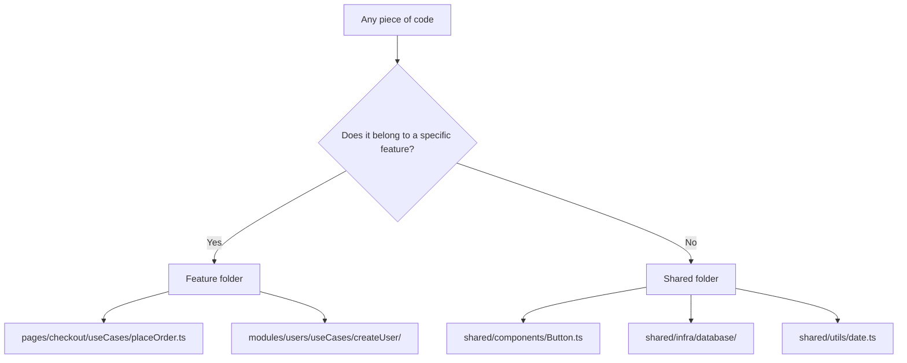
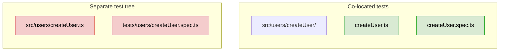
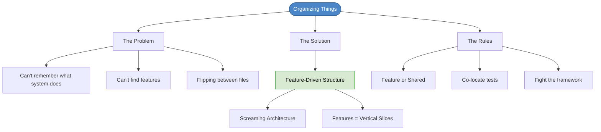

# Chapter 6: Organizing Things

## Core Question

**How should you structure your project so that features are easy to find, understand, and change?**

The answer: organize around **features/use cases**, not around infrastructure or technology.

---

## 1. Symptoms of Poor Project Structure

Three pain signals that tell you your structure is wrong:

| Symptom | What It Feels Like |
|---|---|
| **Forgetting what the system does** | You leave for a month, come back, and have no idea what the app does from looking at the folders |
| **Hard to locate features** | "Change the login redirect" — and you spend 10 minutes just *finding* the login code |
| **Constant file-flipping** | Working on one feature requires jumping between 6 folders scattered across the project |

---

## 2. Common Approaches (and Why They Fail)

### Approach 1: Just Evolve It

No plan, let folders emerge organically.

```
src/
  Register/
  Todos/
  services/
  hooks/
```

Fails all three tests. No consistency, no agreement on where things go. Recipe for conflicts with multiple devs.

### Approach 2: Package by Infrastructure/Type

Group by technical role: `components/`, `hooks/`, `services/`, `utils/`.

```
src/
  components/
  config/
  hooks/
  models/
  utils/
  services/
```

Looks organized but: features are **split across all folders**. To change one feature you must understand and navigate 5+ folders. A new developer can't tell what the app *does* from the folder names.

### Approach 3: Package by Domain

Group by business domain: `User/`, `Todos/`, `Payment/`.

```
src/
  domain/
    User/
    Todos/
    Payment/
  components/
```

Better — you can see the domains. But features within a domain are still not explicit, and file-flipping within a domain is still a problem.

### Scorecard

| Approach | Remember what system does? | Locate features? | Reduce file-flipping? |
|---|---|---|---|
| Evolve it | No | No | No |
| By infrastructure | No | No | No |
| By domain | Partially | If you know the domains | No |
| **By feature** | **Yes** | **Yes** | **Yes** |

---

## 3. The Feature-Driven Approach

### The Key Insight

> Systems are merely **features/use cases** and the **infrastructure** that supports them.

Features are **vertical slices** — they cut through every layer of your architecture (presentation, logic, transport, persistence). They are also the **entry-point** to how you work: every sprint, you're assigned features to add, change, or remove.

### Screaming Architecture

> "Software architectures should scream about the use cases of the application." — Robert C. Martin

When you open a project, does the folder structure tell you:
- "This is a React app" (infrastructure-driven)
- "This is a fitness app with workouts, plans, and tracking" (feature-driven)

The second is what you want.

---

## 4. Feature-Driven Structure: Backend

```
src/
  modules/
    users/
      useCases/
        createUser/
          CreateUserUseCase.ts
          CreateUserErrors.ts
          CreateUserController.ts
          CreateUserDTO.ts
        editUser/
        deleteUser/
  shared/
    core/
    infra/
    utils/
```

Each use case folder is a **workspace** — everything needed for that feature lives together.

---

## 5. Feature-Driven Structure: Frontend

Features live in **pages** (container/page components). A page is the top-level component rendered for a route.

```
src/
  pages/
    checkout/
      checkout.page.ts
      checkout.spec.ts
      components/
        billingInfo/
        confirmOrder/
        creditCard/
      useCases/
        placeOrder.ts
        setShippingAddress.ts
        setBillingAddress.ts
  shared/
    components/
    domain/
    infra/
    utils/
```

Key relationship: **pages have a 1-to-many relationship with features**. Integration tests target the page, which exercises the features, components, and state within it.

---

## 6. The Two Buckets Rule

Everything in your codebase belongs in one of two places:



This eliminates the "where does this go?" question permanently.

---

## 7. Project Organization Rules

| Rule | Why |
|---|---|
| **Follow top-level conventions** | `src/` for source, `dist/` for compiled, `public/` for web-served files |
| **Feature or shared** | If it belongs to a feature, put it there. Otherwise, `/shared`. |
| **Co-locate tests** | Tests next to the code they test, not in a separate `tests/` tree |
| **Fight the framework** | Don't let frameworks dictate your structure. Tuck framework code into `shared/infra/` |

### Why Co-locate Tests



Separate test trees create duplicate folder structures you have to maintain in sync. Co-located tests stay together with the code they verify.

---

## 8. Mental Map



---

## Key Takeaways

1. **Features are the essential complexity** — components, hooks, services are implementation details supporting features
2. **Screaming architecture** — your folder structure should tell a new developer what the app *does*, not what framework it uses
3. **Two buckets** — every file either belongs to a specific feature or it's shared infrastructure
4. **Feature folders = workspaces** — all code for one feature in one place, no file-flipping
5. **Co-locate tests** — tests next to the code they test, always
6. **Fight the framework** — tuck framework internals into `shared/infra/`, keep your structure yours

---

## Concepts Introduced

- [Screaming Architecture](../concepts/screaming-architecture.md)
- [Feature-Driven Structure](../concepts/feature-driven-structure.md)
