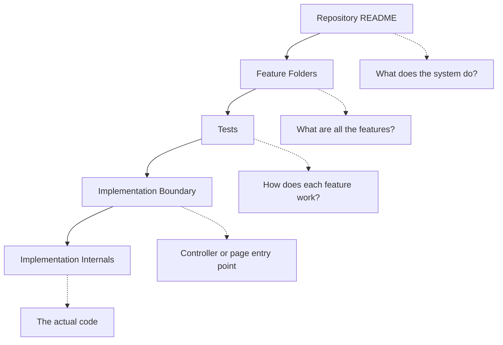
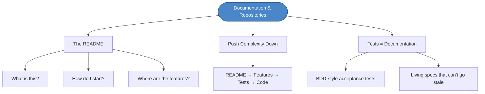

# Chapter 7: Documentation & Repositories

## Core Question

**What should a developer be able to learn from your repository before they even touch the code?**

A well-designed repo creates **leverage** — it answers common questions once so nobody has to ask them again.

---

## 1. The Six Questions a Repo Must Answer

When a developer opens your repository for the first time, they need answers to these questions as fast as possible:

| Question | What to Provide |
|---|---|
| **What is this?** | Title + one-sentence description. Is it the frontend? Backend? A service? |
| **What is it for?** | What problem does it solve? This builds affordances — "I can use this for X" |
| **How do I get started?** | Copy-pastable commands to install and run locally |
| **How do I run the tests?** | A single command. If setup is involved, link to an install guide |
| **How do I debug it?** | Flags, modes, or tools needed for debugging |
| **Where are the features?** | Point to the feature-driven folder structure |

If your repo answers all six, a new developer can become productive without asking anyone.

---

## 2. Push Complexity Downwards

A codebase should be structured like a book: parts → chapters → paragraphs → sentences. You read the high-level overview first and drill down only when you need detail.



Each layer answers a different level of question. The developer only goes as deep as they need to.

---

## 3. Tests as Documentation

> Our tests will act as the primary form of documentation.

This is the book's strong stance: for **most enterprise apps**, written API documentation is more work than it's worth. Tests are the documentation.

| When Tests Are Enough | When Written Docs Are Needed |
|---|---|
| Internal enterprise apps | Public SDKs and libraries |
| Web apps consumed by customers | Developer tooling (Stripe, Apollo) |
| Backend services with known consumers | Open-source frameworks |

BDD-style tests describe **what the system does** in plain language:

```
describe('Login')
  Given 'I have an account'
    When 'I try to login'
      Then 'I should be redirected to the dashboard'
```

This is both a test and a living specification. It can't go stale because it runs.

---

## 4. Mental Map



---

## Key Takeaways

1. **A repo is your first impression** — answer the six questions upfront so nobody needs to ask
2. **Push complexity downwards** — README → feature folders → tests → code. Each layer reveals more detail.
3. **Tests are your docs** — for most apps, BDD-style tests are better documentation than written API docs because they run and can't go stale
4. **Create leverage** — design the repo so it answers questions for you, even when you're gone from the project

---

## Concepts Introduced

No new standalone concepts — this chapter applies:
- [Feature-Driven Structure](../concepts/feature-driven-structure.md) — the repo links to feature folders
- [HCD Principles](../concepts/hcd-principles.md) — README is an affordance/signifier; tests are feedback
- [Conceptual Models](../concepts/conceptual-models.md) — pushing complexity downwards builds the mental model layer by layer
