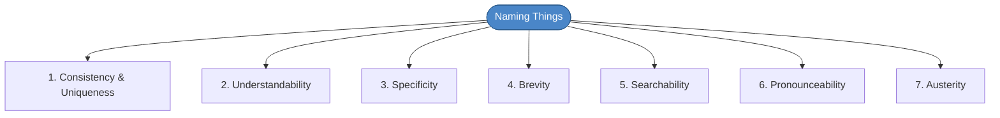
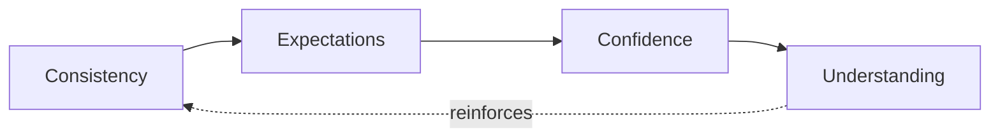
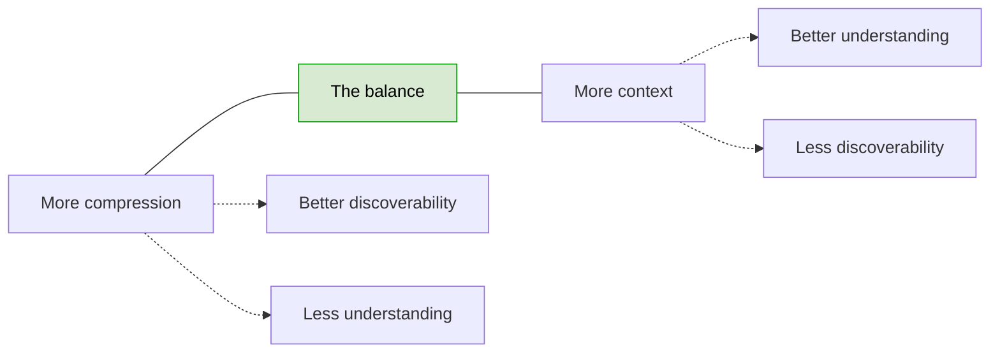
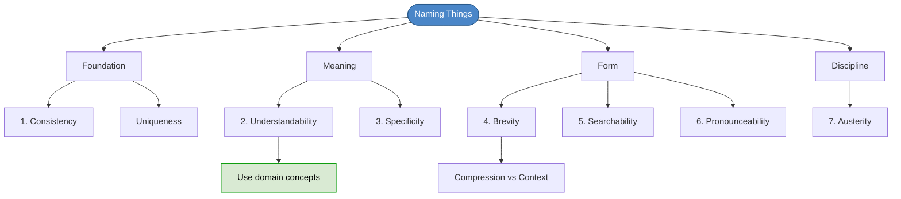

# Chapter 8: Naming Things

## Core Question

**How do you name things in code so that other developers can discover and understand what the code does?**

The answer: seven principles from NamingThings.co, grounded in HCD psychology and domain-driven thinking.

---

## 1. Why Naming Matters

Good names tell readers **what** code does and **how**. Poor names make developers slower, force them to read implementation details, and create confusion that compounds over time.

Names are **signifiers** (HCD) — they're the cheapest, most powerful way to improve discoverability and understanding in a codebase.

---

## 2. The Seven Principles of Naming



---

### Principle 1: Consistency & Uniqueness

> Each concept should be represented by a single, unique name.

This is the **most important principle** because it affects all others.

**Consistency** builds the learning feedback loop:



**Rules:**

| Rule | Bad | Good |
|---|---|---|
| One word per concept | `getAuthor`, `fetchPosts`, `showTags` | `getAuthor`, `getPosts`, `getTags` |
| Follow language conventions | `myclass`, `My_Class` | `MyClass` (PascalCase for classes in TS) |
| No misspellings | `PaymentProccessor` | `PaymentProcessor` |
| Don't recycle variables | `sum` used for two totals | `categorySum`, `tagSum` |
| Unique regardless of case | `empName`, `EmpName`, `Empname` | Pick one |

### Principle 2: Understandability

> A name should describe the concept it represents.

**Key insight**: lean on **knowledge in the world**, not knowledge in the head. Name things after their **real-world domain concepts** — when developers learn the business, the code automatically makes sense.

```typescript
// Domain-specific names — understandable once you know the business
type Member = { id: MemberId, name: UserName }
type Post = { postId: PostId, postedBy: Member, title: PostTitle }
type Upvote = { postId: PostId, memberId: MemberId }
```

**Rules:**

| Rule | Example |
|---|---|
| Domain names for business concepts | `Invoice`, `Member`, `Upvote` |
| Technical names for technical things | `UserRepo`, `UserMapper`, `UserController` |
| Use CQS for method names | Commands: `createUser()`. Queries: `getUserById()` |
| Document side effects in names | `createUserAndSendVerificationEmail()` |
| Avoid negatives in booleans | `!isEmailValid()` not `isEmailNotValid()` |
| Avoid misleading names | `isValid()` should return boolean, not string |
| Name people by roles | `Admin`, `Editor`, `Visitor` — not always `User` |

### Principle 3: Specificity

> A name shouldn't be overly vague or overly specific.

**Over-specifying** creates fatigue:

```typescript
// Bad — over-specified, encodes conditionals in the name
userHasAuthenticatedAndVerifiedEmailShouldTheyBeNonAdmins()

// Good — split into focused methods
userIsAuthenticated()
userVerifiedEmail()
userIsAdmin()
```

**Under-specifying** hides intent:

```typescript
// Bad — Option? Option for what?
class Option { private food: Food; ... }

// Good — name reveals the actual purpose
class FoodOption { private food: Food; ... }
```

**The rule**: a name should describe **what is inside the variable — nothing more, nothing less**.

### Principle 4: Brevity

> A name should be neither overly short nor overly long.

This is the tension between **compression** and **context**:



> **Communicate *what* with names, explain *why* with context.**

Context comes from grouping (classes, namespaces, folders), not from stuffing more words into the name:

```typescript
// Bad — no context, what does create() operate on?
function create(props) {}

// Good — class provides context
class StudentRepo {
  create(props) {}
  edit(id, props) {}
  delete(id) {}
}
```

**Rules:**
- Omit needless words (`in order to` → `to`)
- Single-letter vars only for conventional patterns (`i` in loops, `a,b` in `sum`)
- Both the **operation** and **resource** must be in context
- No unnecessary member prefixes (`_firstName` → `firstName` with `private`)
- No blob parameters (`args: any` → `props: UserProps`)

### Principle 5: Searchability

> A name should be easily found across code and documentation.

Made worse by:
- Names too short (`a`, `t`)
- Names too generic (`user` when there are many user types)
- Different names for the same concept (stale docs)

**Key rule**: replace magic numbers with named constants.

```typescript
// Bad — what is 8?
function addMovieRating(rating = 8) {}

// Good
const DEFAULT_MOVIE_RATING = 8;
function addMovieRating(rating = DEFAULT_MOVIE_RATING) {}
```

### Principle 6: Pronounceability

> A name should be easy to use in speech.

If you can't say it in a code review or standup, it's a bad name.

- `tmStmp` → `timeStamp`
- `prepareARead` not `preparearead` (camelCase signals word breaks)
- Booleans should ask questions: `isPostEmpty()`, `hasCompletedOnboarding()`

### Principle 7: Austerity

> A name should not be clever or rely on temporary concepts.

No jokes, memes, pop culture references. Some projects live 10-20 years. Your joke will need explaining for a decade.

```typescript
// Bad
marypoppins = (superman + starship) / god;

// Good
adjustedScore = (baseRating + velocityBonus) / normalizer;
```

---

## 3. The Domain Layer Connection

The best names come from **the domain** — the real-world business concepts. This connects directly to Domain-Driven Design:

| Layer | Naming Source | Examples |
|---|---|---|
| **Domain** | Real-world business concepts | `Invoice`, `Member`, `Upvote`, `PostTitle` |
| **Application** | Use case names | `CreatePost`, `UpvoteComment`, `GetPostBySlug` |
| **Infrastructure** | Technical constructs | `UserController`, `PostRepo`, `RedisCache` |

---

## 4. Mental Map



---

## Key Takeaways

1. **Consistency is king** — one word per concept, everywhere, always
2. **Name after domain concepts** — they outlive you on the project and make code self-documenting
3. **Describe what's inside** — nothing more, nothing less
4. **Compression vs. context** — communicate *what* with names, explain *why* with surrounding structure
5. **Context comes from grouping** — classes, namespaces, and folders provide context so names can be shorter
6. **CQS for methods** — commands do things, queries return things, name them accordingly
7. **No cleverness** — austerity is professionalism

---

## Concepts Introduced

- [CQS (Command Query Separation)](../concepts/cqs.md)
- [Domain-Driven Design](../concepts/ddd.md)
