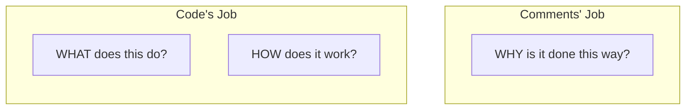
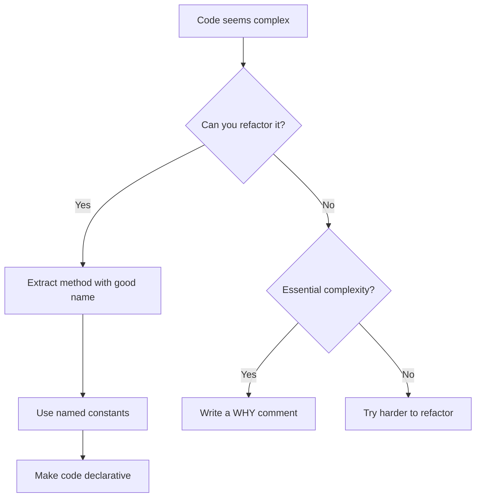
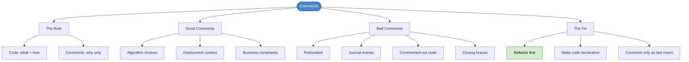

# Chapter 9: Comments

## Core Question

**When should you write comments, and when are they a sign that the code needs refactoring instead?**

The answer: code explains **what** and **how**. Comments explain **why**. If a comment explains what or how, refactor the code to be self-explanatory.

---

## 1. The Golden Rule

> Code explains **what** and **how**. Comments explain **why**.



If your code needs a comment to explain *what* it does, the real fix is better names, smaller functions, or refactoring — not a comment.

---

## 2. When Comments Add Value

Comments are justified only when:

1. Code is **fundamentally complex** (essential complexity, not accidental)
2. There's important **context** that can't be expressed in code
3. You've **already tried refactoring** and it didn't help

### Good Comment Examples

**Explaining an algorithm choice (why):**
```
/* We use a Splay Tree because binary search trees get very slow
   past 5000 entries. Splay Trees push accessed entries toward
   the top, making subsequent retrievals more efficient. */
```

**Adding deployment context (why):**
```
// This function is unused in production and should be
// pruned by any well-configured minifier.
function warnAboutDataLoss(...) { ... }
```

**Explaining a business constraint (why):**
```
// We pad zeros because JavaScript's default string formatting
// shows :0 instead of :00 for seconds less than ten.
function padZeros(num) { return ('0'+num).substr(-2) }
```

---

## 3. When Comments Are Bad

| Bad Comment Type | Example | Why It's Bad |
|---|---|---|
| **Redundancy** | `// Gets user by ID` above `getUserById()` | Says what the code already says |
| **Journal entries** | `// 01-03-2008 - Tony - Added string support` | That's what git history is for |
| **Commented-out code** | Entire functions commented out | Delete it. Git has it if you need it. |
| **Closing brace comments** | `} // end of if` | If you need these, your function is too long |
| **What/how comments** | `// Loop through users and check if active` | Refactor the code to say this instead |

---

## 4. The Refactoring Path

When you see complex code that "needs" a comment, try this sequence first:



### The Transformation

**Step 1 — Unreadable code with comments acting as crutches:**
```
// Check to see if buyer eligible for loan
// if credit score > min AND employment length > min
// AND downpayment >= minimum for property type
// THEN approve
```

**Step 2 — Refactored to declarative code, comments become unnecessary:**
```typescript
if (buyer.isEligibleForLoan(property, downpaymentPercentage))
```

The comment's words became the method name. The code now *is* the explanation.

---

## 5. Comments Clutter Code

Comments wedged into bad code don't make it readable. It's lipstick on a pig.

```typescript
// Bad — comments don't save unclean code
if (0 < _x & x != deviceInfo.position.x) {
  if (0 > x - deviceInfo.position.x) {
    directionCode = 0x04 /*left*/;
  }
}

// Good — named constants make comments unnecessary
const DIRECTION_LEFT = 0x04;
const DIRECTION_RIGHT = 0x02;
const directionCode = (x > oldX) ? DIRECTION_RIGHT
                    : (x < oldX) ? DIRECTION_LEFT
                    : DIRECTION_NONE;
```

---

## 6. Single Layer of Abstraction

The refactoring demonstration shows a key technique: **maintain a single layer of abstraction** per function.

High-level code reads like a table of contents. Readers can drill deeper only if they choose to.

```typescript
// High level — reads like English
get formConfig() {
  .reduce((fields, field) => {
    if (this.isSectionFirstInArray(fields)) {
      fields = this.makeArray(fields);
    }
    if (this.shouldAddToFieldsList(fields, field)) {
      return [...fields, field];
    }
    return fields;
  })
}
```

The details of `isSectionFirstInArray` and `shouldAddToFieldsList` are one level deeper — available if needed, invisible if not.

---

## 7. Mental Map



---

## Key Takeaways

1. **Code explains what/how, comments explain why** — this is the only rule you need
2. **Prefer refactoring over commenting** — if you can make the code self-explanatory, do that instead
3. **Comments don't fix bad code** — they add clutter to already unreadable code
4. **Delete commented-out code** — git has it if you need it
5. **Maintain single layer of abstraction** — high-level methods read like a table of contents, details live one level deeper
6. **When you do comment, explain context** — why this algorithm, why this workaround, why this constraint

---

## Concepts Introduced

No new standalone concepts — this chapter applies:
- [Coding Standards](../concepts/coding-standards.md) — comment policy is part of your coding standard
- [Accidental vs Essential Complexity](../concepts/accidental-vs-essential-complexity.md) — comments are justified only for essential complexity
- [HCD Principles](../concepts/hcd-principles.md) — comments are signifiers; refactored code is a better signifier
