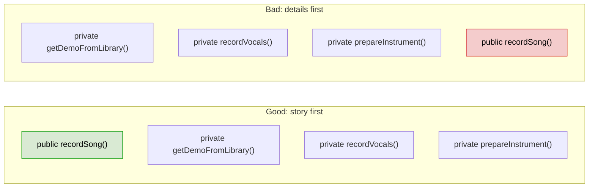
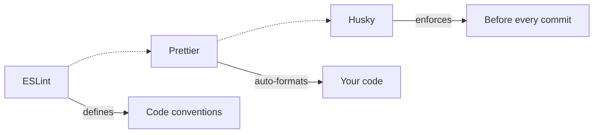
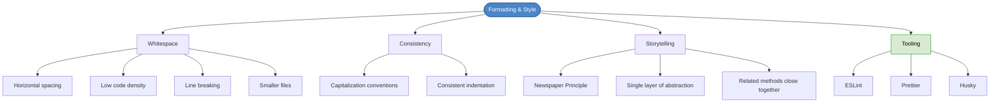

# Chapter 10: Formatting & Style

## Core Question

**What objective readability truths exist beyond subjective style preferences, and how do you enforce them?**

Formatting is subjective (tabs vs spaces will never be settled), but there are three things all humans share: we need whitespace to parse, consistency to build momentum, and storytelling to stay engaged.

---

## 1. The Three Objective Readability Truths

| Truth | Without It |
|---|---|
| **Whitespace** | Code becomes a wall of text, virtually impossible to read |
| **Consistency** | Brain can't pattern-match, momentum never builds |
| **Storytelling** | Reader drowns in details before understanding the main idea |

---

## 2. Whitespace

Whitespace is one of the five programming token types (keywords, identifiers, operators, **separators**, literals). It's not decoration — it's structure.

### Rules

**Horizontal spacing** — separate tokens so each line is scannable:

```typescript
// Bad
const user={name:"khalil"}

// Good
const user = { name: "khalil" }
```

**Low code density** — use line breaks between separate thoughts, like commas in English:

```typescript
// Each step gets breathing room
const cacheKey = options.cacheKey || request.url;

const entry = await this.cache.get(cacheKey);

if (!entry) {
  const response = await this.httpFetch(request);
  return this.storeAndReturn(response, cacheKey);
}
```

**Horizontal breaking** — break long lines (80-120 char) rather than forcing horizontal scrolling:

```typescript
// Bad — one unreadable line
constructor (memberRepo: IMemberRepo, postRepo: IPostRepo, postVotesRepo: IPostVotesRepo) {

// Good — one parameter per line
constructor (
  memberRepo: IMemberRepo,
  postRepo: IPostRepo,
  postVotesRepo: IPostVotesRepo
) {
```

**Prefer smaller files** — Uncle Bob found enterprise Java files averaged 200-500 lines. Smaller files = less to read = better separation of concerns.

---

## 3. Consistency

Consistency lets pattern-matching kick in. When you can tell what a construct is *by its casing alone*, you're reading faster.

### Capitalization Conventions (TypeScript/JavaScript)

| Convention | Used For | Example |
|---|---|---|
| `PascalCase` | Classes, types, interfaces, enums | `UserModel`, `Serializable` |
| `camelCase` | Variables, functions, class members | `getUserById`, `shouldRetry` |
| `UPPER_SNAKE_CASE` | Constants | `DAYS_IN_WEEK`, `DEFAULT_RATING` |

The specific choice doesn't matter as much as **everyone following the same one**.

### Consistent Whitespace

If one dev uses 4-space tabs and another uses 2-space, you'll see the difference in every file. Fix this with tooling (Prettier), not willpower.

---

## 4. Storytelling

### The Newspaper Principle

**Front-load the most important things.** Public methods go above private ones. The reader should understand *why this class exists* within seconds.



### Single Layer of Abstraction

Each method should operate at **one level of abstraction**. If you see detailed operations mixed with high-level calls, extract the details:

```typescript
// Bad — mixed abstraction levels
public async recordSong(query, artist) {
  const demo = this.getDemoFromLibrary(query, artist);
  const instruments = demo.getInstruments();
  for (let i of instruments) { this.prepareInstrument(i); }
  this.metronome.setBpm(demo.bpm);
  this.assembleMusicians(instruments);
  this.controls.startRecording();
  await this.bandroom.performSong(demo);
  this.controls.stopRecording();
  await this.recordVocals(demo);
  await this.mixLevels(demo);
  await this.masterDemo(demo);
}

// Good — consistent abstraction level
public async recordSong(query, artist) {
  const demo = this.getDemoFromLibrary(query, artist);
  await this.recordMusicFromDemo(demo);
  await this.recordVocals(demo);
  await this.mixLevels(demo);
  await this.masterDemo(demo);
}
```

### Keep Related Methods Close

Getter/setter pairs, related operations — don't let unrelated methods break the grouping. This is the **mapping** principle (proximity) from HCD.

---

## 5. Enforcing With Tooling

Don't rely on willpower or PR reviews for formatting. Use the trifecta:



| Tool | Role |
|---|---|
| **ESLint** | Defines code conventions (no console.log, naming rules, etc.) |
| **Prettier** | Auto-formats code based on those rules on save |
| **Husky** | Runs linting/formatting as a pre-commit hook — nothing unformatted gets in |

This is a **physical constraint** (HCD) — it makes the wrong thing impossible rather than just discouraged.

---

## 6. Mental Map



---

## Key Takeaways

1. **Three objective truths**: whitespace, consistency, and storytelling transcend subjective style debates
2. **Whitespace is structure** — spacing, line breaks, and line length directly affect readability
3. **Consistency enables pattern-matching** — the specific convention matters less than everyone following it
4. **Newspaper Principle** — public methods first, most important things at the top
5. **Single layer of abstraction** — each method should read at one level, details pushed down
6. **Use tooling, not willpower** — ESLint defines rules, Prettier formats, Husky enforces before commit

---

## Concepts Introduced

No new standalone concepts — this chapter applies:
- [Coding Standards](../concepts/coding-standards.md) — formatting rules are part of coding standards
- [HCD Principles](../concepts/hcd-principles.md) — Husky is a physical constraint; file organization is mapping
- [CQS](../concepts/cqs.md) — referenced for method ordering during refactoring
