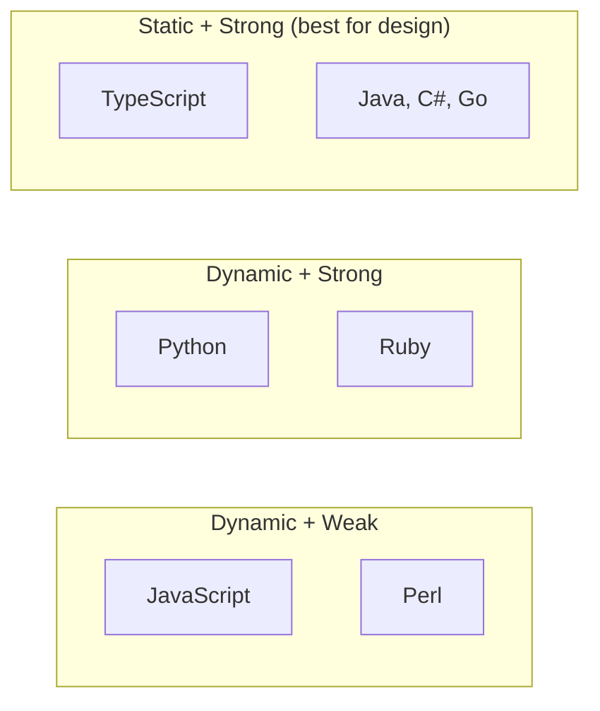
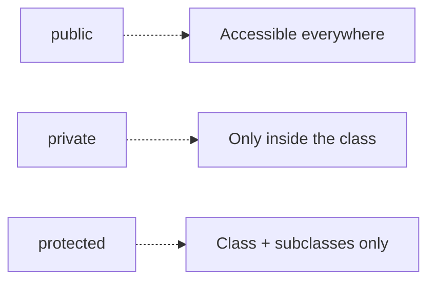
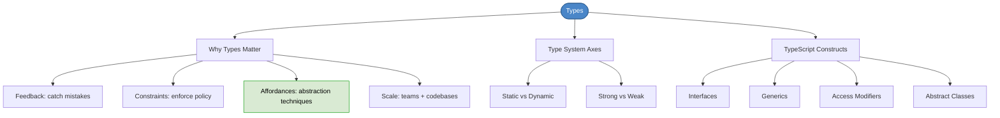

# Chapter 11: Types

## Core Question

**Why do strictly-typed languages matter for software design, and what do they unlock?**

Types aren't just about catching bugs. They separate **contract from implementation** — and that separation is the foundation of every design principle, pattern, and architectural technique in this book.

---

## 1. Understanding Type Systems

Two axes for classifying languages:


| Axis                   | Question                                                       |
| ---------------------- | -------------------------------------------------------------- |
| **Static vs. Dynamic** | When does type-checking happen? Compile time or runtime?       |
| **Strong vs. Weak**    | How strict are the rules? Does the compiler auto-coerce types? |





**Static** = types checked at compile time, before the code runs.
**Strong** = no implicit type coercion (`"2" + 6` throws an error, not `"26"`).

The book recommends **static + strong** (TypeScript) for the best design affordances.

---

## 2. Why Static Types Matter

Types are HCD **constraints** and **feedback** applied to code:

### Catch Silly Mistakes (Feedback)

```typescript
function createMessage(from: string, to: string, text: string): Message { ... }

createMessage('khalil', 'bill'); // Error: missing argument
```

The compiler catches typos, missing args, and wrong types *before* you run anything.

### Enable Abstraction Techniques (Affordances)

Static types give you constructs that dynamic languages simply don't have:


| Construct            | What It Enables                                 |
| -------------------- | ----------------------------------------------- |
| **Interfaces**       | Separate contract from implementation           |
| **Abstract classes** | Force subclasses to implement behavior          |
| **Generics**         | Reusable, type-safe data structures             |
| **Access modifiers** | Control visibility (public, private, protected) |


> The ability to separate the abstract from the concrete is at the very heart of software design.

Without these, you can't properly implement SOLID principles, dependency inversion, or plugin architectures.

### Enforce Policy (Constraints)

```typescript
// Primitives allow invalid state
createUser("", ""); // Compiles fine but meaningless

// Domain types make invalid state impossible
createUser(email: Email, password: Password); // Must pass through factory validation
```

### Make the Implicit Explicit

Wrap primitives in domain-specific types (Value Objects):

```typescript
class Email {
  private constructor(props: { value: string }) { ... }

  static create(email: string): Email {
    if (!this.isValidEmail(email)) throw new Error("Invalid email");
    return new Email({ value: email });
  }
}
```

Now `createUser(Email, Password)` is self-documenting. You can't pass a random string.

### Communicate Design Intent

Compare JavaScript vs TypeScript for the Abstract Factory pattern:


| JavaScript                                    | TypeScript                                       |
| --------------------------------------------- | ------------------------------------------------ |
| Must read implementation to see it's abstract | `abstract class AudioDevice` — clear immediately |
| Abstract class can be instantiated (bug)      | `abstract` keyword prevents instantiation        |
| No visibility control                         | `protected`, `private` enforce scope             |
| No interface dependency                       | `ITrack` interface enables dependency inversion  |


### Scale Teams and Codebases

TypeScript is "JavaScript that scales." Dynamic languages are productive early but degrade with team size, code size, and domain complexity.

---

## 3. TypeScript Type System Basics

### Four Kinds of Types


| Kind                  | What It Is                              | Example                                                      |
| --------------------- | --------------------------------------- | ------------------------------------------------------------ |
| **Implicit**          | Compiler infers the type from the value | `const age = 13` → inferred as `number`                      |
| **Explicit**          | Developer annotates the type            | `const age: number = 13`                                     |
| **Structural (Duck)** | Compatibility by shape, not by name     | A `Reply` satisfies `Comment` if it has all `Comment` fields |
| **Ambient**           | Declarations for external JS libraries  | `declare var $: any`                                         |


### Duck Typing

> "If it looks like a Duck and quacks like a Duck, it must be a Duck."

TypeScript checks **structural shape**, not class name:

```typescript
interface Comment { id: number; name: string; content: string; }
interface Reply   { id: number; name: string; content: string; parentId: number; }

function postComment(comment: Comment) { ... }

postComment(reply);        // OK — Reply has all Comment fields
postComment({ id: 1 });    // Error — missing name, content
```

---

## 4. Key TypeScript Constructs

### Interfaces

Declare structure. Disappear at compile time (zero runtime cost).

```typescript
interface Coordinate {
  latitude: number;
  longitude: number;
  dateCreated?: Date; // optional
}
```

Classes can implement them. Interfaces can extend other interfaces.

### Access Modifiers




Default is `public`. Prefer `private` by default, expose only what's needed (thin interfaces principle).

### Generics

Type-safe reusable structures:

```typescript
interface Queue<T> {
  data: T[];
  push: (t: T) => void;
  pop: () => T | undefined;
}

class MonkeyQueue implements Queue<Monkey> { ... }
```

### Abstract Classes

Can't be instantiated directly. Subclasses must implement abstract methods.

```typescript
abstract class AudioDevice {
  abstract handlePlayTrack(): void; // subclass MUST implement
  play(track: ITrack): void { ... } // shared implementation
}
```

---

## 5. Mental Map




---

## Key Takeaways

1. **Types separate contract from implementation** — this is the foundation of all software design
2. **Types are HCD constraints and feedback** — the compiler catches mistakes and enforces rules
3. **Abstraction requires language support** — interfaces, abstract classes, and generics aren't optional luxuries
4. **Wrap primitives in domain types** — `Email` instead of `string` makes invalid state impossible
5. **Duck typing in TypeScript** — compatibility is by shape, not by name
6. **Prefer private by default** — expose only what consumers need (thin interfaces)
7. **Types enable scaling** — dynamic languages degrade as teams and codebases grow

---

## Concepts Introduced

- [Value Objects](../concepts/value-objects.md)

