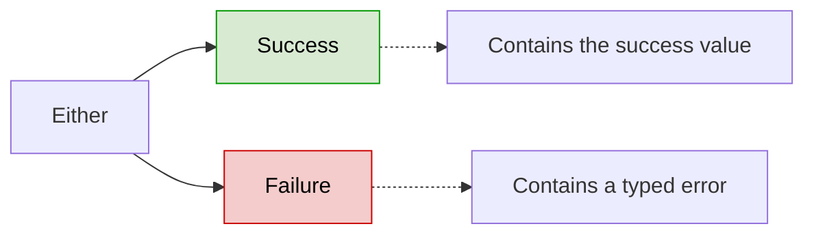
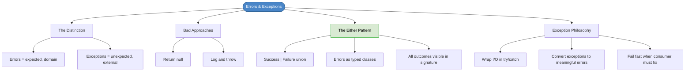

# Chapter 12: Errors and Exceptions

## Core Question

**How do you handle things going wrong without making the code fragile, surprising, or hard to use?**

The answer: errors are **domain concepts** — model them with types. Exceptions are for **unexpected failures** in code you don't own. Never return `null` or throw blindly.

---

## 1. Errors vs. Exceptions

This is the most important distinction in the chapter:

| | Errors | Exceptions |
|---|---|---|
| **Expected?** | Yes — part of the domain | No — unexpected failures |
| **Whose fault?** | Business rules violated | External systems failed |
| **Complexity type** | Essential | Accidental |
| **Examples** | `EmailInvalid`, `UserAlreadyExists`, `UsernameTaken` | Database down, API timeout, lost connectivity |
| **How to handle** | Model as typed domain concepts | Wrap I/O in try/catch, convert to meaningful errors |

---

## 2. Common Approaches (and Why They Fail)

### Return Null

```typescript
function createUser(email, password) {
  if (!validateEmail(email)) return null;
  if (!validatePassword(password)) return null;
  return new User(email, password);
}
```

Problems:
- **Not expressive** — `null` doesn't say *which* error occurred
- **Provokes mistrust** — caller must know to check for `null`
- **Clutters code** — `null`-checks everywhere

### Log and Throw

```typescript
function createUser(email, password) {
  if (!validateEmail(email)) throw new Error('The email was invalid');
  return new User(email, password);
}
```

Problems:
- **Not typed** — error messages are fragile strings
- **GOTO-like** — `throw` disrupts program flow unpredictably
- **Fragile** — change the message text and your `catch` blocks break

---

## 3. The Either Pattern

The solution: model results as a **union of success and failure types**.



### The Infrastructure

```typescript
type Either<S, F> = Success<S, F> | Failure<S, F>;

// success(value) → creates a Success
// failure(error) → creates a Failure
// result.isSuccess() / result.isFailure() → check which one
// result.value → get the typed value
```

### Modelling a Feature's Response

Every feature has **one happy path** and **multiple sad paths**:

```typescript
// Errors as classes — encapsulate message construction
class EmailInvalid implements DomainError {
  message: string;
  constructor(email: string) {
    this.message = `The email ${email} is invalid.`;
  }
}

class UserAlreadyExists implements DomainError { ... }
class PasswordDoesntMeetCriteria implements DomainError { ... }

// The result type — ALL possible outcomes are visible
type CreateUserResult = Either<
  CreateUserSuccess,
  EmailInvalid |
  UserAlreadyExists |
  PasswordDoesntMeetCriteria |
  ApplicationError
>;
```

### Usage

```typescript
function createUser(request: CreateUserRequest): CreateUserResult {
  if (!isEmailValid()) return failure(new EmailInvalid(request.email));
  if (!passwordMeetsCriteria()) return failure(new PasswordDoesntMeetCriteria(request.password));
  if (userAlreadyExists()) return failure(new UserAlreadyExists(request.email));

  const user = db.User.save({ email, password });
  return success(new CreateUserSuccess(user.id));
}

// Consumer — no surprises, all paths are typed
const result = createUser({ email, password });

if (result.isSuccess()) {
  result.value.id; // typed as CreateUserSuccess
}

if (result.isFailure()) {
  switch (result.value.constructor) {
    case EmailInvalid: ...
    case UserAlreadyExists: ...
  }
}
```

---

## 4. Exception Handling Philosophy

### For Code You Don't Own

Two rules:

1. **Wrap I/O in try/catch** — database calls, API requests, file system
2. **Turn exceptions into meaningful errors** — don't let raw exceptions leak

```typescript
try {
  user = db.User.save({ email, password });
} catch (err) {
  return failure(new DatabaseError(err)); // Wrap in our own type
}
```

### When to Throw Exceptions

**Fail fast** when the consumer must fix the problem before anything else can happen:

- Missing CLI arguments
- Missing auth token in an SDK
- Invalid URL in a REST API
- Unimplemented abstract methods

---

## 5. Handling Nothingness

Don't return `null` silently. Make it **explicit in the type signature**:

```typescript
type Nothing = null | undefined | '';

class UserService {
  async getUserById(id: string): Promise<User | Nothing> { ... }
}
```

Now the consumer *sees* that `Nothing` is a possible outcome and can handle it upfront.

---

## 6. Mental Map



---

## Key Takeaways

1. **Errors are domain concepts** — model them as typed classes, not strings or null
2. **Errors vs. exceptions** — errors are expected (essential complexity), exceptions are unexpected (accidental)
3. **The Either pattern** — `Success | Failure` union makes all outcomes visible and typed
4. **Never return null** — if nothing is a valid outcome, express it in the type signature
5. **Wrap I/O in try/catch** — turn external exceptions into errors you own
6. **Fail fast** — throw exceptions when the consumer must fix the problem immediately
7. **Make the implicit explicit** — the consumer should never be surprised by a failure mode

---

## Concepts Introduced

- [The Either Pattern](../concepts/either-pattern.md)
