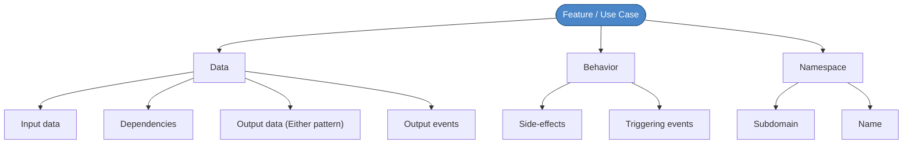
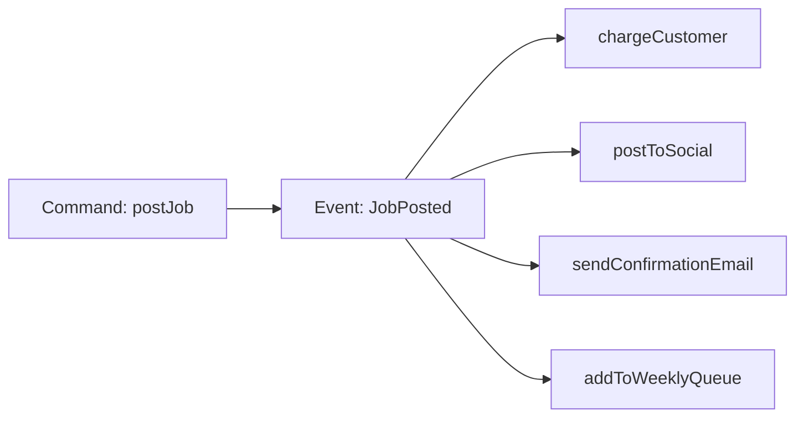
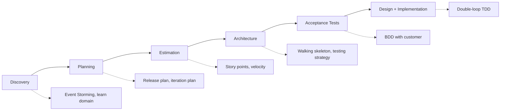
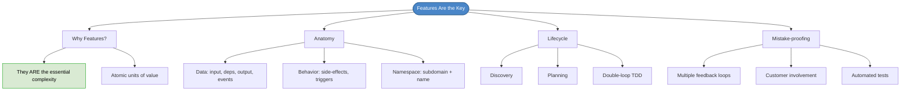

# Chapter 13: Features (Use Cases) Are the Key

## Core Question

**What is the atomic unit of value in software development, and how does everything else orbit around it?**

The answer: **features (use cases)**. They represent the essential complexity. Everything else — databases, APIs, frameworks — is infrastructure that supports them.

---

## 1. Why Code-First Approaches Fail

Most developers start projects one of these ways:

| Approach | What You Do First | What Goes Wrong |
|---|---|---|
| **Tactical** | Sit down and code until it works | No tests, no design, bugs found late |
| **Database-first** | Design all tables and relationships | Over-engineer things you don't need |
| **UI-first** | Build all wireframes and components | Miss non-visual features (background jobs, events) |
| **API-first** | Enumerate all API endpoints | Can document data and namespaces, but not behavior |

API-first is the best of the four because it focuses on the contract (essential complexity), but it still can't contractualize **behavior** — what state changes, what side-effects happen, what events fire.

> Without a complete understanding of behavior, you get: missed requirements, anemic domain models, accidental complexity, and bad architecture downstream.

---

## 2. The Feature-Driven Philosophy

> Features represent the essential complexity. Everything else is accidental.

A **feature** (= use case) is an operation that can be either:
- A **command** — changes state (`createUser`, `upvotePost`, `deleteComment`)
- A **query** — fetches data (`getUserById`, `getPopularPosts`)

Features are the **atomic units of value**. Our success depends on our ability to discover, understand, and implement them reliably.

---

## 3. The Anatomy of a Feature

Every feature is made of three parts: **data, behavior, and namespace**.

### Data

| Type | What It Is | Example |
|---|---|---|
| **Input data** | What's necessary and sufficient to execute | `postId`, `memberId` (not full objects) |
| **Dependencies** | Other objects/functions the use case needs | Repositories, external APIs (Stripe, etc.) |
| **Output data** | Success/failure result using Either pattern | `UpvotePostSuccess \| MemberNotFound \| AlreadyUpvoted` |
| **Output events** | Domain events published on success | `PostUpvoted`, `AccountCreated` |

### Behavior

- **Side-effects**: Database writes, email sends, API calls. Push them to the boundaries of the operation.
- **Triggering events**: Some features are triggered by other features' events, not by direct user action. "After `JobPosted`, execute `PostToSocialMedia`."

### Namespace

- **Subdomain**: Which slice of the business does this belong to? (`Billing`, `Trading`, `Users`)
- **Name**: Imperative present tense for commands (`upvotePost`), past tense for events (`postUpvoted`)

---

## 4. Events Chain Features Together

This is the key to keeping features **decoupled yet connected**:

Commands are **imperative**: "do this."
Events are **past tense**: "this happened."

Events replace the messy `afterJobPosted()` function that does 10 unrelated things. Instead, each reaction is its own use case, subscribed to the event.

---

## 5. The Lifecycle of a Feature

A feature transforms through the project:

| Phase | Feature Shape | Key Activity |
|---|---|---|
| **Discovery** | Undocumented pain point | Event Storming, domain learning |
| **Planning** | User story | Release + iteration planning |
| **Estimation** | Estimated story | Story points, spike unknowns |
| **Architecture** | Architectural requirement | Walking skeleton, testing strategy |
| **Acceptance Tests** | BDD scenarios | Customer specifies success criteria |
| **Implementation** | Passing tests | Double-loop TDD (outer acceptance, inner unit) |

---

## 6. Serving Two Masters

The feature-driven approach serves **both** sides of the goal of software:

| For the Customer | For the Maintainers |
|---|---|
| Scope, estimate, and plan releases | Consistent, repeatable implementation process |
| Change priorities at any time | All code enters under acceptance tests |
| Flexible plan that adapts | Features are locatable, testable, removable |
| Business strategy stays on track | Simple Design applied within refactor step |

---

## 7. Mistake-Proofing (Poka-Yoke)

Three symptoms of bugs and how the approach prevents each:

| Bug Symptom | Prevention |
|---|---|
| Requirements correct, code doesn't work | TDD — all code passes through tests |
| Requirements wrong or incomplete | On-site customer, acceptance tests co-written with domain expert |
| Requirements correct, developers misunderstood | Ubiquitous language, Event Storming, pair programming |

> All features must pass through communication, feedback loops, and tests to exist.

---

## 8. Mental Map

---

## Key Takeaways

1. **Features = essential complexity** — databases, APIs, frameworks are infrastructure that supports features
2. **Code-first approaches fail** because they don't fully discover behavior before coding
3. **A feature is data + behavior + namespace** — input, output, dependencies, events, side-effects, subdomain
4. **Events chain features together** — commands do work, events notify others, subscriptions trigger next steps
5. **Features transform** from pain points → stories → estimates → acceptance tests → passing code
6. **Double-loop TDD** — outer acceptance test loop + inner unit test loop = safe, complete implementation
7. **Mistake-proofing** — multiple feedback loops (Event Storming, BDD, pair programming, tests) catch human error at every stage

---

## Concepts Introduced

- [Domain Events](../concepts/domain-events.md)
- [Acceptance Tests](../concepts/acceptance-tests.md)
- [Transaction Script vs Domain Model](../concepts/transaction-script-vs-domain-model.md)
