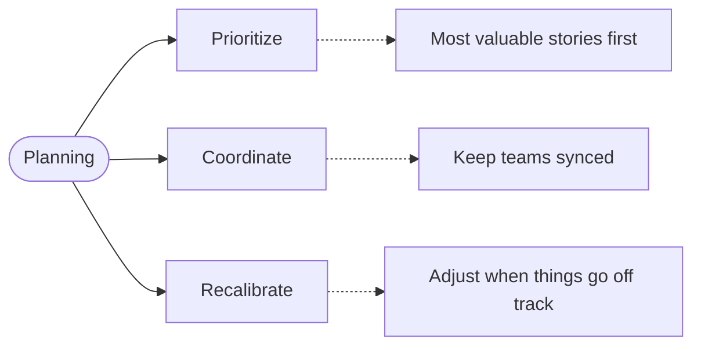
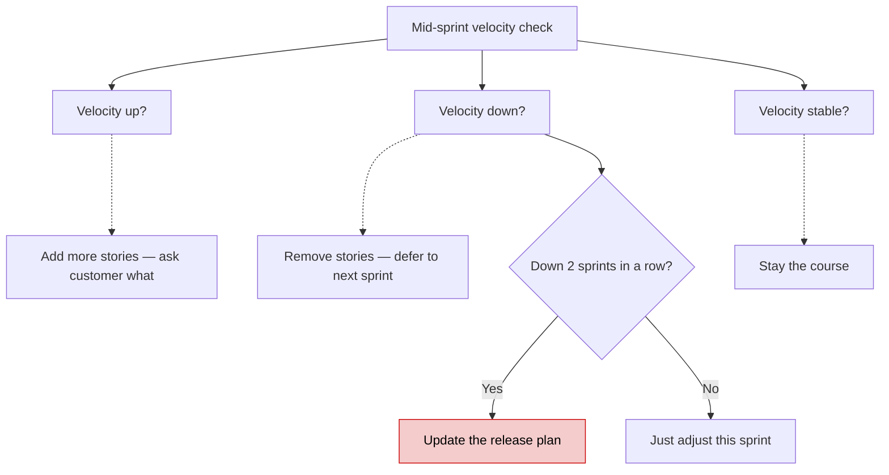
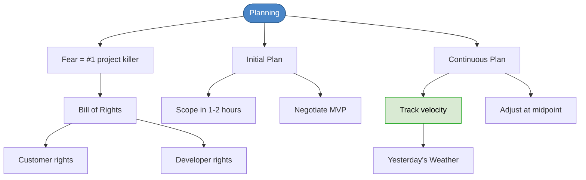

# Chapter 14: Planning

## Core Question

**Why do software projects fail, and how does planning prevent it?**

The answer isn't skill, deadlines, or resources. It's **unacknowledged fear**. Planning overcomes fear by making expectations transparent and giving both sides the power to adapt.

---

## 1. Fear Is the Real Enemy

Projects fail because customers and developers are both scared — and instead of addressing it, they put up walls.

| Customers Fear | Developers Fear |
|---|---|
| Won't get what they asked for | Will get tasks they can't complete |
| Will pay too much for too little | Won't be smart enough |
| Will be in the dark about progress | Will have to sacrifice quality for deadlines |
| Can't change their mind later | Won't get clear requirements |
| Plan will be unrealistic | Will run out of time |
| Nobody will be honest | Will be told what to do without input |

The solution isn't to hide — it's to establish **what we expect from each other**.

---

## 2. The Bill of Rights

### For Customers

- Know the plan, timeline, and cost
- Choose which stories yield the most value each week
- Be informed of schedule changes in time to reduce scope
- See progress at any time via running acceptance tests
- Cancel the project and keep a working system reflecting investment to date
- Change priorities without paying unreasonable costs

### For Developers

- Know what tasks exist and their priority
- Always carry out technical practices that yield quality (no cutting corners)
- Ask for and receive help from peers, managers, and customers
- Make and update our own estimates
- Accept responsibilities instead of having them assigned

> When fears are acknowledged and rights are accepted, we can be courageous.

---

## 3. Why Plan?

Planning enables three things:

- **Prioritize**: Customer decides what's most important. We do that first.
- **Coordinate**: Marketing, sales, and other teams plan around releases.
- **Recalibrate**: When velocity drops, adjust the plan *before* it's too late.

---

## 4. The Two Stages of Planning

### Stage 1: The Initial Plan

The first plan is **intentionally rough**. It scopes the project just enough to get started.

**Step 1 — Scope it** (1-2 hours max):
- Identify big stories (epics)
- Give rough estimates in months
- Consider team size and constraints
- Ask: "What is the goal?" and "What would you accomplish with it?"

**Step 2 — Negotiate the first release**:

The full scope is always too big. Customer reaction: "2 years?!"

The fix: **squeeze the most value into the smallest first release.**

> "What's the most critical functionality that brings the most value the earliest?"

Customer picks the MVP. Everything else goes into later releases. This is Agile — **provide value incrementally, not all at once**.

**Step 3 — Execute**:
- Estimate stories in detail (story points)
- Break into iterations (1-2 week sprints)
- Build the walking skeleton
- Start coding with acceptance tests + TDD

### Stage 2: Continuous Planning

The first plan **will be wrong**. That's expected. Continuous planning fixes it with **velocity tracking**.

---

## 5. Velocity: Yesterday's Weather

**Velocity** = total story points completed in a sprint.

Track actuals, not hopes:

| Estimated | Actual | What Happened |
|---|---|---|
| 20 points | 16 points | Velocity is 16, not 20 |
| 16 points | 18 points | Velocity improved to 18 |

**The rule**: next sprint, only take on stories that fit within your current velocity.

### Mid-Sprint Check

At the midpoint of every sprint:

If velocity declines dramatically two sprints in a row, the **release plan** must change — not just the iteration.

---

## 6. Why This Works

> "The primary benefit of Agile is that you learn how screwed you are in time to do something about it." — Robert Martin

The continuous plan:
- Removes the fear of missed deadlines by communicating early
- Gives customers power to adjust scope instead of being surprised
- Gives developers honest estimates based on real data, not hopes
- Makes change a feature of the process, not a failure

---

## 7. Mental Map

---

## Key Takeaways

1. **Fear kills projects** — not deadlines. Acknowledge it, establish expectations, and communicate honestly.
2. **Bill of Rights** — customers can change priorities; developers can always do quality work. Both sides know the rules.
3. **Initial plan is intentionally rough** — scope in 1-2 hours, negotiate the MVP, expect to be wrong.
4. **Velocity = your real speed** — track actuals, not estimates. Use yesterday's weather for next sprint.
5. **Continuous planning** — adjust at every midpoint. If velocity drops twice, update the release plan.
6. **Agile = incremental value** — deliver the most valuable thing first, adapt as you learn.

---

## Concepts Introduced

No new standalone concepts — this chapter applies:
- [Extreme Programming](../concepts/extreme-programming.md) — planning is a core XP practice
- [Acceptance Tests](../concepts/acceptance-tests.md) — customer measures progress through passing tests
