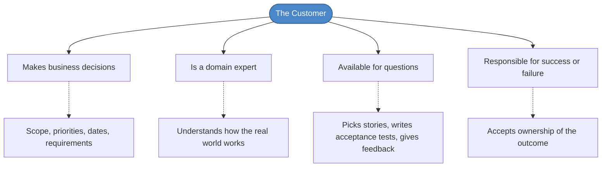
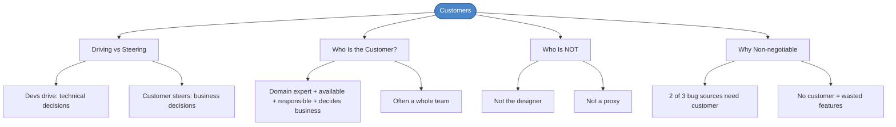

# Chapter 15: Customers

## Core Question

**Who is the customer, and why is their involvement non-negotiable?**

Without a real customer, you're playing telephone — and what gets built won't be what was needed.

> "It's not stakeholder knowledge but developers' ignorance that gets deployed into production." — Alberto Brandolini

---

## 1. Driving vs. Steering

Software development is like driving a car:

| Role | Who | Responsibilities |
|---|---|---|
| **Driver** | Developers | Technical practices (TDD, architecture, refactoring) |
| **Navigator** | Customer | Direction (priorities, requirements, business decisions) |

The passenger doesn't need to know which gear you're in. You don't need to debate which route to take — just drive where they point.

**Don't get mad when the customer adds a requirement** after you just finished a feature. That's normal. That's navigation. Adjust and keep driving.

---

## 2. Who Is the Customer?

The customer is defined by **four properties**:

### The Split of Responsibilities

| Customer Decides | Developer Decides |
|---|---|
| Scope | Estimates |
| Priorities | Design & development |
| Dates | Technical practices |
| Requirements (functional + non-functional) | Architecture |

### Often a Whole Team

The "customer" is often not one person. XP calls this **Whole Team** — a group that collectively fills the role:

- Domain experts
- Business analysts
- Product managers
- User representatives
- The person paying for the project
- Stakeholders from adjacent departments

Ideally co-located. Remotely is harder but doable.

---

## 3. Who Is NOT the Customer

| Role | Why They're Not Enough |
|---|---|
| **Designer** | Creates screens but can't prioritize stories or define all requirements |
| **Proxy / middleman** | Creates a telephone chain — lossy communication |
| **Nobody** | Without a customer, you'll build features nobody uses and miss real acceptance criteria |

> "No customer at all leads to waste as you develop features that aren't used." — Kent Beck

---

## 4. Why You Can't Skip This

Recall the three bug symptoms from Chapter 13:

| Bug Symptom | Can Tests Alone Fix It? | Customer Needed? |
|---|---|---|
| Requirements correct, code doesn't work | Yes — just write tests | No |
| Requirements correct, devs misunderstood | No | **Yes** — need a customer to verify |
| Requirements wrong | No | **Yes** — need the right customer |

Two of three bug sources can only be solved with **real customer involvement**.

---

## 5. Mental Map

---

## Key Takeaways

1. **Devs drive, customers steer** — we handle technical practices, they handle direction and priorities
2. **The customer is a domain expert** who makes business decisions, is available for questions, and owns the outcome
3. **Often a team, not one person** — product manager + domain expert + stakeholders = the "customer"
4. **Designers are not customers** — they can't prioritize stories or define all requirements
5. **No customer = telephone game** — lossy communication guarantees you'll build the wrong thing
6. **Two of three bug sources** can only be prevented by real customer involvement

---

## Concepts Introduced

No new standalone concepts — this chapter deepens:
- [Extreme Programming](../concepts/extreme-programming.md) — Whole Team practice
- [Acceptance Tests](../concepts/acceptance-tests.md) — customer specifies and signs off on these
