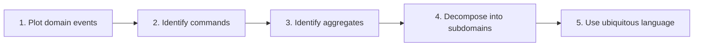
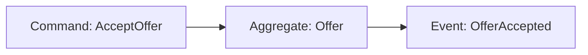
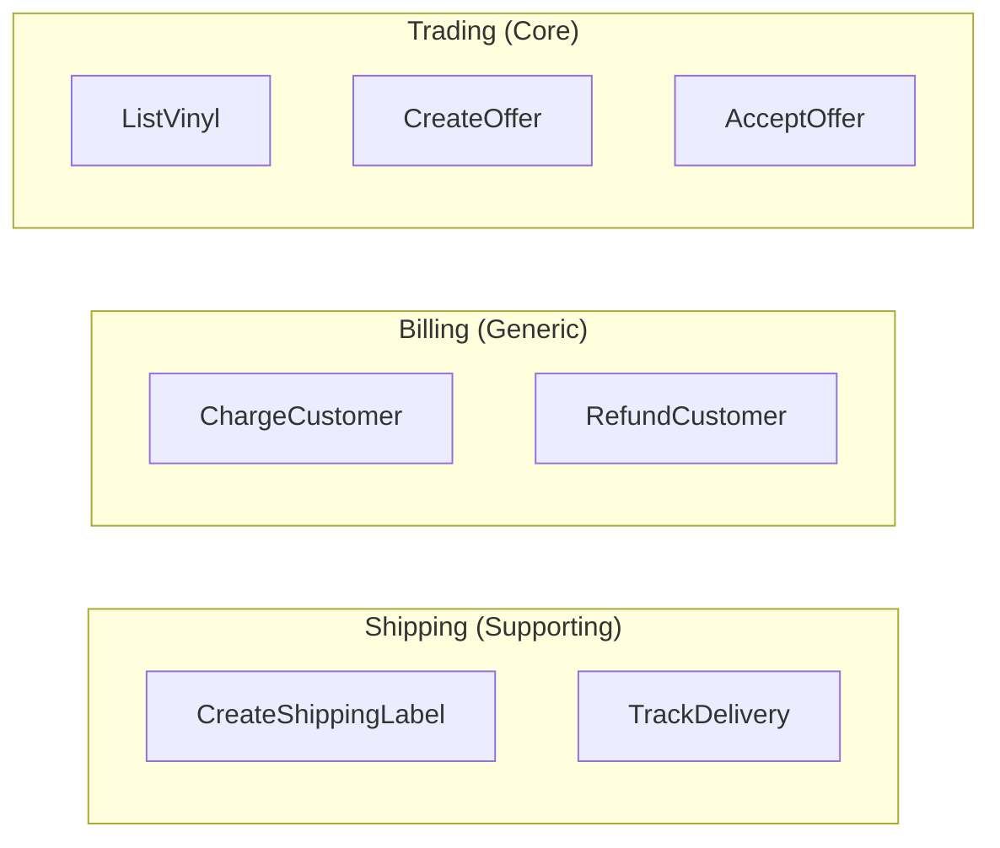
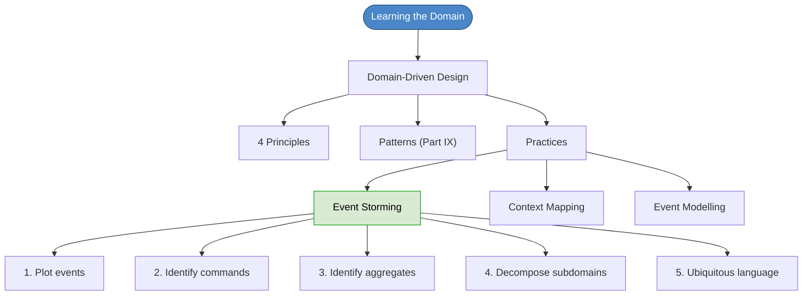

# Chapter 16: Learning the Domain

## Core Question

**How do you quickly learn a complex business domain and turn that knowledge into code that actually represents the real world?**

The answer: **Domain-Driven Design** — specifically, use Event Storming to build a shared model with domain experts, decompose into subdomains, and use the ubiquitous language everywhere.

---

## 1. The Shared Model Problem

Three ways teams learn the domain, from worst to best:

| Approach | How It Works | Problem |
|---|---|---|
| **Telephone chain** | Domain expert → BA → PM → dev | Lossy. Each hop loses meaning. |
| **Devs + domain expert** | Developers talk directly to experts | Only one translator (devs think technically). |
| **Whole team** | Everyone in the room together | Best. Multiple perspectives, less lossy. |

> Without a shared model, your interpretation of a "Job" or "Customer" could be completely different from the customer's.

---

## 2. Domain-Driven Design — The Framework

DDD has three layers:

| Layer | What It Contains |
|---|---|
| **Principles** | Focus on events, divide into subdomains, build shared model, use ubiquitous language |
| **Patterns** | Aggregates, entities, value objects, repositories, domain events, layered architecture |
| **Practices** | Event Storming, Event Modelling, Context Mapping |

### The Four DDD Principles

1. **Focus on events and processes** rather than data structures
2. **Divide the problem domain** into smaller subdomains
3. **Create a model** of each subdomain, focus on the core one first
4. **Develop a ubiquitous language** shared by everyone and used in code

---

## 3. Event Storming — The Practice

A workshop where developers and domain experts plot the **story of the business** using sticky notes on a wall, chronologically from left to right.

### The 5 Steps

### Step 1: Plot Domain Events (past tense)

Everyone writes events on orange stickies. Sort chronologically left to right. Stack alternatives vertically.

Example events for a vinyl trading platform:
- `TraderRegistered` → `VinylPosted` → `OfferCreated` → `OfferAccepted` → `SellerShippedVinyl` → `VinylDelivered` → `TraderRated`

**Push to the edges**: ask "what happens before the first event?" and "what happens after the last event?" to find hidden requirements.

### Step 2: Identify Commands (imperative present tense)

Commands are the **use cases/features**. They cause events.

| Command | Event It Produces |
|---|---|
| `AcceptOffer` | `OfferAccepted` |
| `DeclineOffer` | `OfferDeclined` |
| `ListVinyl` | `VinylPosted` |
| `ShipVinyl` | `VinylShipped` |

Commands can be triggered by actors (users) OR by events from other commands. This is how features chain together.

### Step 3: Identify Aggregates (optional)

The domain object that sits between command and event. It encapsulates the business rules and decides if the command succeeds or fails.

### Step 4: Decompose into Subdomains

Draw circles around related command-event pairs and name the groups:

Three types of subdomains:
- **Core**: what you're getting paid to build (focus here first)
- **Generic**: utility (could buy off-the-shelf — Auth0, Stripe)
- **Supporting**: supports the core but isn't the main value

### Step 5: Ubiquitous Language

- Use domain concepts in code: if experts say "Vinyl", code has `Vinyl`
- Don't invent technical jargon the domain expert wouldn't understand
- Each subdomain has its own dialect — don't conflate terms across subdomains

---

## 4. Context Maps

Document **relationships between subdomains** explicitly. Subdomains are never fully decoupled — they rely on each other.

| Relationship | What It Means | Example |
|---|---|---|
| **Customer-Supplier** | Upstream provides, downstream consumes | `Billing` supplies payment capabilities to `Trading` |
| **Conformist** | Downstream conforms to upstream's model | You use Stripe's API as-is |
| **Anticorruption Layer** | Downstream translates upstream's model | Wrap a legacy API in your own types |

---

## 5. Event Modelling (the evolution)

Event Storming's successor, fixing two problems:

| Problem | Event Storming | Event Modelling |
|---|---|---|
| Finding views/queries | Hard — no UI context | Rough UI sketches show what queries are needed |
| Cross-subdomain flows | Messy on a linear timeline | Swimlanes per subdomain keep it clean |

The author prefers Event Modelling. Check [eventmodeling.org](https://eventmodeling.org).

---

## 6. Why Model with Events?

| Benefit | What It Gives You |
|---|---|
| **Feasibility** | Spot technical and semantic problems early |
| **Capture missing requirements** | "After X happens" requirements are found before coding |
| **Auditing & reporting** | Events = history of everything that happened |
| **Cross-team understanding** | Everyone sees how their work connects |

---

## 7. Mental Map

---

## Key Takeaways

1. **Build a shared model** with the whole team, not through a telephone chain of documents
2. **Focus on events and processes**, not data structures — events reveal the timeline of the business
3. **Event Storming** = sticky notes + domain experts + wall. Plot events → commands → aggregates → subdomains
4. **Subdomains** = decomposed slices of the problem. Core (build it), Generic (buy it), Supporting (assists core)
5. **Context Maps** make subdomain relationships explicit — they're never fully decoupled
6. **Ubiquitous language** = same words in conversation and in code. Each subdomain has its own dialect.
7. **Commands + queries = all features.** Once you have them, you can estimate, plan, test, and release.

---

## Concepts Introduced

- [Event Storming](../concepts/event-storming.md)
- [Subdomains](../concepts/subdomains.md)
