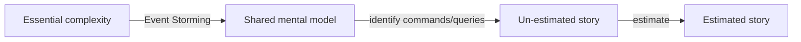
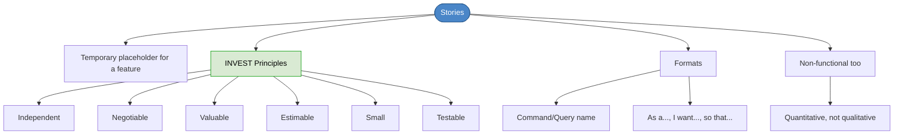

# Chapter 17: Stories

## Core Question

**How do you turn discovered features into artifacts you can estimate, plan, and track?**

The answer: **user stories** — temporary placeholders for communicating, estimating, and planning features. Not detailed specs. Just enough to agree on what to build.

---

## 1. What Is a Story?

A story is a **temporary placeholder** for a feature. It captures the essence of what needs to be built — not the implementation details.

The evolution of a feature so far:

Stories are how we track progress. Once a story becomes acceptance-tested, deployed code — it's done.

### Who Does What

| Role | Responsibility |
|---|---|
| **Customer** | Ideates stories, plans releases, specifies acceptance tests |
| **Developer** | Helps identify stories, estimates them, implements them |

Key developer discipline: **reject detail** at this stage. Too much detail makes stories un-estimable. Leave the data/behavior specifics for later.

---

## 2. INVEST — Story-Writing Principles

| Letter | Principle | What It Means |
|---|---|---|
| **I** | Independent | Stories can be implemented in any order. Structure acceptance tests with proper preconditions. |
| **N** | Negotiable | Everything before the acceptance test is negotiable — the story, the estimate, the scope. |
| **V** | Valuable | Must provide business value. Technical tasks (styling, refactoring) are not stories. |
| **E** | Estimable | If too big, split. If too uncertain, spike. If unclear, ask the magic question. |
| **S** | Small | 2-4 ideal days. If it contains multiple commands/queries, split it. |
| **T** | Testable | Must have a precondition (GIVEN), action (WHEN), and verifiable result (THEN). |

### The Magic Question

When a story is vague, too big, or untestable, ask:

> **"How will I know when I've done that?"**

If the customer can't answer, the story needs rework.

---

## 3. Story Formats

### Format 1: Command/Query Name

Take commands and queries directly from Event Storming:

- `Create Offer`
- `Accept Offer`
- `Search For Vinyl`
- `Get Recently Posted Vinyl`

Simple, fast, works well when the context is clear.

### Format 2: As a [role], I want [feature], so that [value]

More context when needed:

> "As a **trader**, I want to **search for vinyl from the main page and results page** so that **I can find rare vinyl to make an offer for**."

The "so that" part is critical — it forces you to articulate the **value**. If you can't, the story probably shouldn't exist.

---

## 4. Non-Functional Requirements as Stories

Non-functional requirements (performance, security, availability) are still valuable and can be written as stories. The key: use **quantitative** values, not qualitative.

| Bad (qualitative) | Good (quantitative) |
|---|---|
| "The website is always up" | "Available 99.999% of the time" |
| "It works on most machines" | "Runs on all Windows versions from Win 95+" |
| "Notifications are fast" | "Notified within 1-10 seconds of occurrence" |
| "Has accessibility" | "Supports German language localization" |

Format:

> As a **day trader**, I want to **be notified when a stock goes up 5% within 1-10 seconds** so that **I can decide whether to trade**.

---

## 5. Splitting Stories

Signs a story needs splitting:

| Signal | Action |
|---|---|
| Contains multiple commands/queries | Split each into its own story |
| Takes more than 4 ideal days | Break into smaller pieces |
| "Do Profile" | Split into `Edit Profile`, `Upload Picture`, `Get Profile`, `Get Public Profile` |
| Mixes functional + non-functional | Separate the performance concern from the feature |

---

## 6. Mental Map

---

## Key Takeaways

1. **Stories are placeholders**, not specs — capture the essence, reject detail
2. **INVEST** — Independent, Negotiable, Valuable, Estimable, Small, Testable
3. **The magic question** — "How will I know when I've done that?" fixes vague stories
4. **Two formats** — command/query name (fast) or "as a / I want / so that" (more context)
5. **Non-functional requirements are stories too** — use quantitative values, not qualitative
6. **Split aggressively** — if a story contains multiple commands or takes > 4 days, break it up

---

## Concepts Introduced

No new standalone concepts — this chapter applies:
- [Acceptance Tests](../concepts/acceptance-tests.md) — stories become acceptance tests
- [Event Storming](../concepts/event-storming.md) — commands/queries from storming become stories
- [CQS](../concepts/cqs.md) — stories are commands or queries
