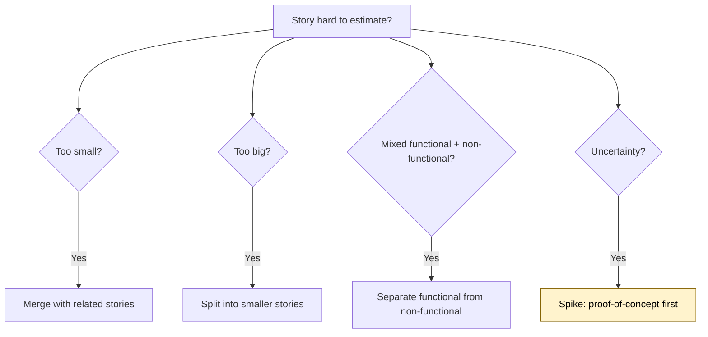
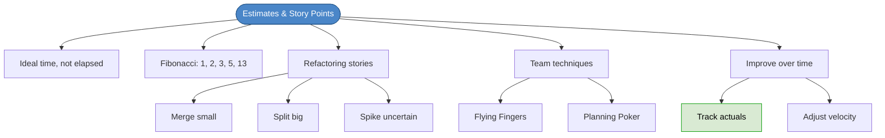

# Chapter 18: Estimates & Story Points

## Core Question

**How do you estimate how long features will take without committing to deadlines you can't meet?**

The answer: estimate **ideal time** (effort without distractions) using **story points**, track your actuals, and improve over time.

---

## 1. Estimates Are Not Commitments

> Professionals never commit to anything they're uncertain of. Estimates are approximations, not promises.

Estimation is a **developer responsibility**. If a business person tells you how long a task should take, they're estimating for you — push back.

---

## 2. Ideal Time vs. Elapsed Time

Estimate based on **ideal time** — time spent fully focused, no meetings, no distractions.

| Concept | Definition | Example |
|---|---|---|
| **Ideal time** | Productive hours on the task | 4 hours of focused coding |
| **Elapsed time** | Calendar time from start to finish | 2 days (due to meetings, context switching) |

If you only get 2 hours of ideal time per day, a "4 hour" story takes 2 elapsed days. Track both, but estimate in ideal time.

---

## 3. Story Points (Fibonacci)

Story points map to effort using the Fibonacci sequence:

| Points | Knowledge | Dependencies | Ideal Time |
|---|---|---|---|
| **1** | Know exactly what to do | None | < 2 hours |
| **2** | Mostly know | Almost none | ~half day |
| **3** | Know some | Some | < 2 days |
| **5** | Know very little | Fair amount | 2-4 days |
| **13** | Don't know | Unknown | > 1 week |

**When in doubt, estimate up.** It's safer to over-estimate than under-estimate.

Story points connect to **velocity**: the total points completed per iteration. Customers can only add stories that fit within the current velocity.

---

## 4. Refactoring Stories

When a story is hard to estimate, there's a fix:

### Merge — too small to stand alone
Consolidate cohesive tiny stories into one. Add up the points.

### Split — too big (8+ points)
Break into smaller INVEST-compliant stories.

Example: "Login" → `Login with Password`, `Facebook Login`, `Google Login`, `Forgot Password`

### Split — mixed requirements
Separate functional from non-functional:

- Functional: "Show all active trades"
- Non-functional: "Show them in under 2 seconds"

### Spike — uncertainty
A **meta-story**: allocate time to research and experiment. Throw the spike code away. Come back with a real estimate.

Use when: unfamiliar library, unknown architecture, never done it before.

---

## 5. Team Estimation Techniques

| Technique | How It Works |
|---|---|
| **Flying Fingers** | Discuss, think individually, simultaneously show fingers for points. Average if not unanimous. |
| **Planning Poker** | Same but with cards from a deck. Reveal simultaneously. |

### When estimates disagree:
- Take the average
- Take the lowest (team learns from getting burned)
- High/low estimators discuss, then re-vote until consensus

---

## 6. Improving Estimates

The **only** way to improve: make estimates and track actuals.

| Practice | How |
|---|---|
| Track time | Use tools like RescueTime to measure actual productive hours |
| Record actuals | Store completed story points vs estimated in a database |
| Use analogies | "This looks like two Logins, and Login took 3 days" |
| Update when velocity changes | Team member leaves, someone goes on vacation |

---

## 7. Mental Map

---

## Key Takeaways

1. **Estimates are not commitments** — they're approximations based on current knowledge
2. **Estimate ideal time** — focused, uninterrupted effort, not calendar days
3. **Fibonacci story points** — 1 (trivial) to 13 (unknown). When in doubt, round up.
4. **Merge, split, or spike** — fix stories that are too small, too big, or too uncertain
5. **Track actuals** — the only way to improve estimates is data from past performance
6. **Velocity = your budget** — customers fill iterations up to but not beyond current velocity

---

## Concepts Introduced

No new standalone concepts — this chapter applies:
- [Extreme Programming](../concepts/extreme-programming.md) — estimation is a core XP practice
- [Acceptance Tests](../concepts/acceptance-tests.md) — stories eventually become acceptance tests
