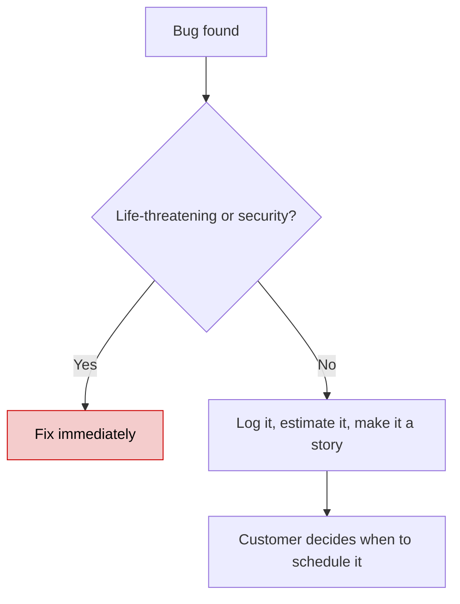
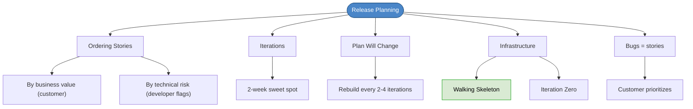

# Chapter 19: Release Planning

## Core Question

**How do you decide which stories to build first and when to ship them?**

The answer: the customer picks stories by **business value**, developers flag **technical risk**, and together you arrange stories into releases and iterations.

---

## 1. What Is Release Planning?

The customer picks several months worth of estimated stories and schedules them into **releases** — public deployments that align with business goals.

| Role | Decides |
|---|---|
| **Customer** | Time (when), Scope (what), Priority (order) |
| **Developer** | Estimates (how long), Technical risk (what's dangerous) |

### Why It Matters

| For the Customer | For Developers |
|---|---|
| Sync other departments (marketing, sales) | Make the customer feel heard |
| Deliver MVP early, gather feedback | Consistently deliver the most value soonest |
| Start revenue before everything is built | Build trust through reliable delivery |

---

## 2. Ordering Stories

Two ordering strategies — value always comes first:

### By Business Value (customer drives)

> "Eat the steak first, not the rice."

Customer arranges stories so the most valuable features ship earliest. An MVP first, then premium features in later releases.

### By Technical Risk (developer flags)

When there's major uncertainty (unfamiliar SDK, new architecture pattern), **don't leave it for later**. Flag it.

Your job: **address the risk, not decide what to do about it.** Let the customer choose:
- Spike the risky stories early alongside value stories
- Defer the risk (customer's call, not yours)

---

## 3. Iteration Size

| Size | Pros | Cons |
|---|---|---|
| **1 week** | Fastest feedback | Too much overhead from replanning |
| **2 weeks** | Sweet spot for most teams | — |
| **3 weeks** | Less replanning overhead | More chance to get off track |

Most teams settle on **2 weeks**.

---

## 4. Plan Stability

The plan **will** change. Accept it.

Events that change the plan:
- Customer changes priorities or adds/removes stories
- Developers learn something new about a story
- Velocity changes (up or down)
- New requirements emerge

**Rebuild the release plan every 2-4 iterations** (Fowler's recommendation).

---

## 5. Dealing with Bugs

Bugs are a **code tax**, not an emergency (usually).

Don't drop everything to fix non-critical bugs. Turn them into stories. Customer decides priority.

Fix bugs by writing a **failing test first**, then making it pass — proves the bug is actually fixed.

---

## 6. Planning Infrastructure

### Build Infrastructure With the Features

Don't build all infrastructure upfront. Build only what's needed for the current stories.

### The Walking Skeleton

The simplest architecture that:
- Performs one end-to-end function
- Runs tests
- Can be deployed

This is the platform upon which you write your first acceptance test.

### Iteration Zero

If you've never used your tools before, spend the **first iteration** on:
- Testing framework setup
- Automated builds
- Install, test, and deploy scripts
- Docker/infrastructure configuration

This prevents the first "real" iteration from being consumed by infrastructure surprises.

### Mob Programming to Start

First few days: everyone on one screen, one keyboard. Write the first tests, evolve the design together. Once enough pieces exist, split into independent work.

---

## 7. Mental Map

---

## Key Takeaways

1. **Customer drives scope and priority**, developers provide estimates and flag risk
2. **Value first** — most valuable features ship earliest. Technical risk gets flagged, not hidden.
3. **2-week iterations** — the sweet spot for most teams
4. **The plan will change** — rebuild it every 2-4 iterations. Everyone accepts this.
5. **Bugs are stories** — log them, estimate them, let the customer schedule them (unless critical)
6. **Walking skeleton + iteration zero** — build just enough infrastructure to write the first acceptance test
7. **Mob programming** to start — everyone together until there's enough to split into independent work

---

## Concepts Introduced

- [Walking Skeleton](../concepts/walking-skeleton.md)
