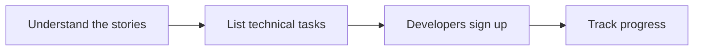
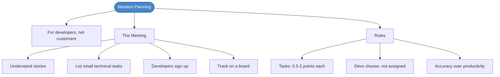

# Chapter 20: Iteration Planning

## Core Question

**How do you break stories into tasks that developers can actually work on?**

If release planning is for the customer, iteration planning is for developers. It's how we split full-stack stories into tasks that play to individual strengths.

---

## 1. The Iteration Planning Meeting

Four steps, takes a few hours:

| Step | What Happens |
|---|---|
| **Understand** | Customer/domain expert explains the story or provides acceptance tests |
| **List tasks** | Break each story into small technical tasks (half day to 1 day each) |
| **Sign up** | Developers choose tasks based on strengths and interests |
| **Track** | Use a board (Jira, Notion, Kanban) to monitor progress throughout the iteration |

---

## 2. Understanding a Story

Before listing tasks, you need to understand the story. The customer can:
- Explain it verbally
- Put details in writing
- Write acceptance tests (ideal, but rare at iteration start)

A story is **not done until acceptance tests pass** — but you don't always have them at planning time. That's OK. Get them before you finish.

---

## 3. Technical Tasks

Tasks are **developer-focused** — they don't need to make sense to customers.

Examples for an "Approve Trade" story:

| Task | Developer | Points |
|---|---|---|
| Create unit of work object | KS | 2 |
| Build approve trade use case (integration test) | SB | 3 |
| GraphQL types and resolvers | MS | 1 |
| Repository interface | KS | 1 |
| MySQL adapter with contract tests | SB | 2 |
| UI for trade screen | MS | 3 |
| UI for approve trade (E2E test) | MS | 3 |
| Trade approved event handler | KS | 2 |

Keep tasks **small**: half-point to 2 points (30 min to half a day). Smaller tasks are easier to shuffle and share.

---

## 4. Signing Up

Developers **choose** tasks — they're not assigned. This means:

- People work in areas they're strong in or want to grow
- Estimates are based on **individual velocity** (Yesterday's Weather, per person)
- If pair programming, estimate for the pair

> Accuracy matters more than volume. Predict what you can do and execute on it. Build that muscle.

---

## 5. Catching Problems Early

Track the plan so you can spot over/under-commitment early:

- If someone is over-committed, shuffle tasks before velocity takes a hit
- Sync regularly — standups (in person or async via Slack bots)
- The goal: adjust within the iteration without changing the release plan

---

## 6. Mental Map

---

## Key Takeaways

1. **Release plan = customer, iteration plan = developers** — iteration planning breaks stories into technical tasks
2. **Understand the story first** — get explanation from the customer/domain expert before listing tasks
3. **Small tasks** — 0.5 to 2 points each. Easier to share, shuffle, and estimate.
4. **Developers choose tasks** — play to strengths, estimate on individual velocity
5. **Accuracy > speed** — predict accurately, build the estimation muscle
6. **Catch problems early** — track progress, shuffle tasks before velocity drops

---

## Concepts Introduced

No new standalone concepts — this chapter applies:
- [Extreme Programming](../concepts/extreme-programming.md) — iteration planning is a core XP practice
- [Acceptance Tests](../concepts/acceptance-tests.md) — stories aren't done without them
