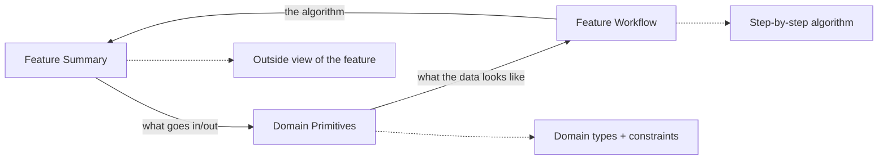
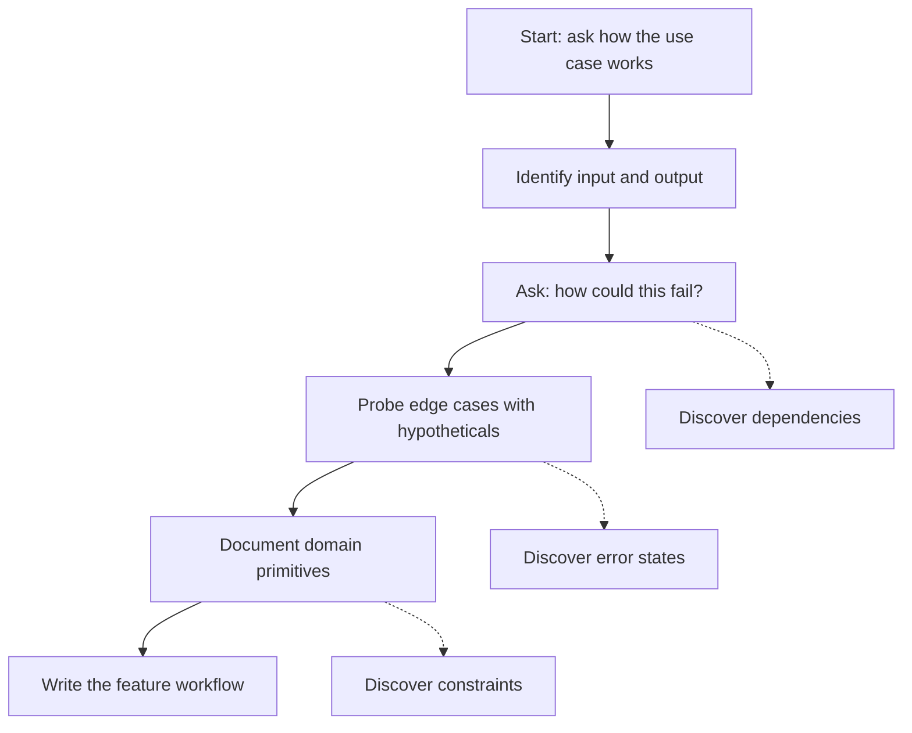
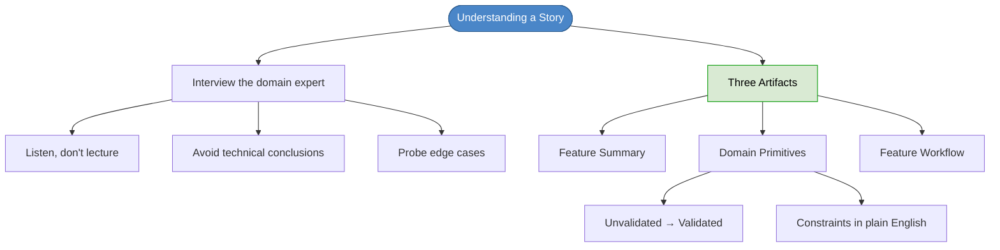

# Chapter 21: Understanding a Story

## Core Question

**How do you uncover the full essential complexity of a feature before writing any code?**

Interview the domain expert. Document with pseudocode — not UML, not class diagrams. Three artifacts: Feature Summary, Domain Primitives, and Feature Workflow.

> When it comes to complexity: elucidate the essential, avoid the accidental.

---

## 1. Why This Step Matters

After Event Storming, you know the command/event pair and the subdomain. You're still missing the **data** and **behavior** details. If you jump into code now, you'll "discover" requirements mid-implementation — the classic "requirements keep changing" complaint.

The truth: the requirements were always there. You just didn't find them yet.

---

## 2. Interviewing the Domain Expert

### Rules

| Rule | Why |
|---|---|
| **Listen more than you speak** | You're here to learn, not to teach |
| **Avoid technical conclusions** | No database schemas, no class hierarchies, no API designs |
| **Use the ubiquitous language** | Domain experts don't know what "observables" or "repositories" are |

Interviews are short: **15-30 minutes**, rarely more than an hour. Stories are small slices of functionality.

### Probe Edge Cases with Hypotheticals

Ask devil's advocate questions:
- "What if I do X and Y at the same time?"
- "Can this ever be unavailable?"
- "What happens if the payment fails?"

Edge cases found now become acceptance tests later. Edge cases found in production become bugs.

---

## 3. Three Pseudocode Artifacts



### Artifact 1: Feature Summary

The outside view — inputs, outputs, dependencies, side-effects:

```
Feature: "Make Offer"
    Namespace:
        Subdomain: Trading

    Data:
        Input: An offer
        Dependencies:
            Check credits (credits service)
            Check payment method (payments service)
            Check vinyl (inventory service)
        Output:
            Success: "Offer Placed" event
            Failure:
                InsufficientCredits
                NoValidPaymentMethod
                VinylNotAvailable
                MixedVinylOwnersInOffer

    Behavior:
        Triggered by: A request from a trader
        Side-effects:
            Offer saved
            Email notification sent to vinyl owner
```

### Artifact 2: Domain Primitives

Model the data types with `AND` (required) and `OR` (variant/optional). Include constraints in plain English.

```
data UnvalidatedOffer =
    AND UnvalidatedOfferMethod
    AND list of UnvalidatedVinyl

data UnvalidatedOfferMethod =
    UnvalidatedCreditsForTrade
    OR AutomaticallyPurchaseCredits

data CreditsForTrade = decimal number between 1 and 1000

data ValidatedOffer =
    AND ValidatedOfferMethod
    AND list of ValidatedVinyl
```

Key techniques:
- **Variants/state machines**: `UnvalidatedOffer` → `ValidatedOffer`. Each step in the lifecycle gets its own type name.
- **Constraints**: `decimal number between 1 and 1000`, not just "number"
- **No technical details**: no classes, no interfaces, just domain concepts

### Artifact 3: Feature Workflow

The algorithm at the highest level of abstraction:

```
Feature: "Make Offer"
    Input: UnvalidatedOffer
    Output: OfferPlaced event OR errors

    Step 1: do ValidateVinyl
    Step 2: do ValidateCreditsOrPaymentMethod
    Step 3: do CreateOffer
    Step 4: do SendNotificationToOwner
    Step 5: return OfferCreated event
```

Each sub-step follows the same template:

```
Substep "ValidateVinyl"
    Input: list of UnvalidatedVinyl
    Output: list of ValidatedVinyl
        OR VinylNotAvailable
        OR MixedVinylOwnersInOffer
    Dependencies: CheckIfAvailable, CheckVinylOwner

    for each vinyl: check available, check owner
    if any not available: return VinylNotAvailable
    if multiple owners: return MixedVinylOwnersInOffer
    else: return list of ValidatedVinyl
```

---

## 4. The Interview Flow



---

## 5. Why Pseudocode, Not UML

| Pseudocode | UML / Formal Docs |
|---|---|
| Checkable by domain experts | Requires training to read |
| Cheap to change | Expensive to update |
| Translates almost directly to code | Far from implementation |
| Forces you to think in domain terms | Tempts technical thinking |
| Shows variants and state explicitly | Hides state transitions |

---

## 6. Mental Map



---

## Key Takeaways

1. **Don't touch code yet** — understand the full essential complexity first through domain expert interviews
2. **Three artifacts**: Feature Summary (outside view), Domain Primitives (data types), Feature Workflow (algorithm)
3. **Pseudocode, not UML** — checkable by domain experts, translates directly to code, cheap to change
4. **Variants make the implicit explicit** — `UnvalidatedOffer` → `ValidatedOffer` captures the state machine
5. **Probe edge cases with hypotheticals** — "what if X fails?" finds bugs before they reach production
6. **Constraints in plain English** — "decimal between 1 and 1000", not "number"
7. **15-30 minute interviews** — stories are small, interviews should be too

---

## Concepts Introduced

No new standalone concepts — this chapter applies:
- [DDD](../concepts/ddd.md) — ubiquitous language, domain primitives
- [Value Objects](../concepts/value-objects.md) — constraints on primitives map to value objects in code
- [Either Pattern](../concepts/either-pattern.md) — output data modeled as success OR failures
