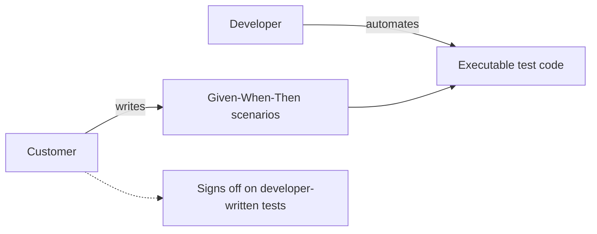
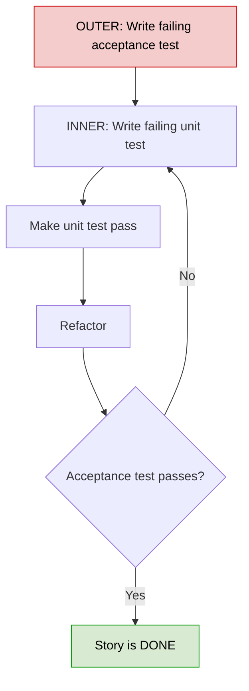
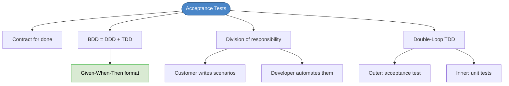

# Chapter 22: Acceptance Tests

## Core Question

**How do you create a contract for "done" that both customers and developers can agree on?**

Acceptance tests. Written by customers in Given-When-Then format, automated by developers. When they pass, the story is complete.

---

## 1. What Are Acceptance Tests?

A formalized way to describe the **behavior** of a story — the success and failure scenarios.

They are:
- A **contract** between customer and developer for what "done" means
- A **regression safety net** — features can't silently break
- **Proof** that we built what was agreed upon
- The **definition of done**

---

## 2. BDD: The Origin Story

Dan North struggled to teach developers what to test and how to name tests. In 2006, he introduced **Behavior-Driven Development** — essentially "TDD done right."

### BDD Principles

| Principle | What It Means |
|---|---|
| Test names should be sentences | `it('contains all days for the month')` not `test('array data')` |
| Focus on behavior, not implementation | Test *what* happens, not *how* it's coded |
| Use domain language | No "arrays", "floats", "observers" in test names |
| Acceptance criteria should be executable | Specs become running code |

BDD = **DDD + TDD**. Use domain language in your tests, focus on observable behavior.

---

## 3. Given-When-Then Format

Every scenario has three parts:

```
Given  [preconditions — state of the world]
When   [action — the thing being tested]
Then   [postconditions — expected result]
```

### Example: Notion-to-Calendar Sync

```
Feature: Sync Notion tasks to Google Calendar

  Scenario: Syncing new tasks
    Given there are tasks in my tasks database
    And they don't exist in my calendar
    When I sync my tasks database to my calendar
    Then I should see them in my calendar

  Scenario: Updating tasks
    Given tasks already exist in my calendar
    And there are changes in my tasks database
    When I sync my tasks database to my calendar
    Then I should see the updated tasks in my calendar

  Scenario: Preventing duplicates
    Given tasks already exist in my calendar
    When I sync again
    Then I should not see duplicate tasks
```

This reads like English. Customers can write this. Developers automate it.

---

## 4. Division of Responsibilities



| Who | Does What |
|---|---|
| **Customer** | Writes scenarios in Given-When-Then. Ideally before the first half of the sprint. |
| **Developer** | Automates scenarios into executable code. Fills in the implementation. |

If the customer hasn't written them yet, developers can draft their own based on interviews — but the customer must **sign off**.

---

## 5. Three Formats for Writing Them in Code

| Format | What It Looks Like | Quality |
|---|---|---|
| **Single-line** | `it('takes me to dashboard after login')` | Misses preconditions. Clumsy for acceptance tests. |
| **Nested describe** | `describe('Given...', () => describe('When...', () => test('Then...')))` | Works but awkward nesting. |
| **Feature files + jest-cucumber** | `.feature` file consumed by test code with `given`, `when`, `then` callbacks | Best. Spec is readable, code is separate. |

The preferred approach: write a `.feature` file (Gherkin), then automate it with `jest-cucumber` or similar:

```typescript
test('Sync new tasks', ({ given, and, when, then }) => {
  given('there are tasks in my tasks database', () => {
    taskDatabase = builder.withAFullWeekOfTasks().build();
  });
  and("they don't exist in my calendar", () => {
    calendar = builder.withEmptyCalendar().build();
  });
  when('I sync my tasks database to my calendar', async () => {
    await syncTasks.execute();
  });
  then('I should see them in my calendar', () => {
    expect(syncPlan.creates.length).toEqual(taskDatabase.count());
  });
});
```

---

## 6. Double-Loop TDD

Acceptance tests are the **outer loop**. Unit tests are the **inner loop**.



- Outer loop prevents regressions
- Inner loop measures progress toward completing the feature
- When both pass, the story is complete

---

## 7. Mental Map



---

## Key Takeaways

1. **Acceptance tests = definition of done** — when they pass, the story is complete
2. **BDD = TDD done right** — focus on behavior, use domain language, test by example
3. **Given-When-Then** — preconditions, action, postconditions. Readable by customers.
4. **Customer writes, developer automates** — two separate tasks, two separate roles
5. **Feature files are the spec** — `.feature` files consumed by test code, best of both worlds
6. **Double-Loop TDD** — outer acceptance test + inner unit tests. Story is done when both pass.

---

## Concepts Introduced

No new standalone concepts — this chapter deepens:
- [Acceptance Tests](../concepts/acceptance-tests.md) — updated with BDD, Given-When-Then, double-loop TDD
- [TDD](../concepts/tdd.md) — acceptance tests are the outer loop of TDD
