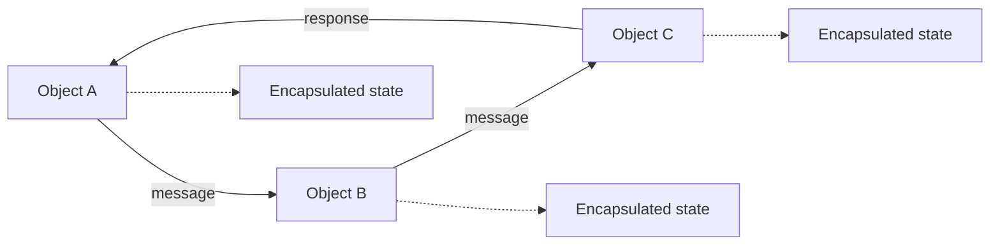
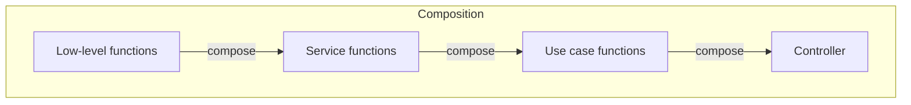
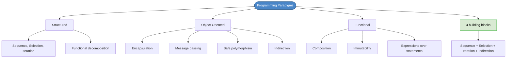

# Chapter 23: Programming Paradigms

## Core Question

**What are the correct conceptual models for the three programming paradigms, and what does each actually give us?**

All software is built from four constructs: **sequence, selection, iteration, and indirection**. Each paradigm imposes different constraints on how we use them.

---

## 1. The Four Building Blocks

> Software is composed of sequence, selection, iteration, and indirection. Nothing more. Nothing less. — Robert C. Martin

| Building Block | What It Is | Came From |
|---|---|---|
| **Sequence** | Line after line, instruction by instruction | Structured programming |
| **Selection** | if/else/then, switch | Structured programming |
| **Iteration** | for, while loops | Structured programming |
| **Indirection** | Programming against abstractions, not implementations | Object-oriented programming |

---

## 2. Structured Programming

**Origin**: Dijkstra, 1968

### What It Gave Us

- **Functional decomposition** — break large problems into smaller subroutines
- **Three control structures** — sequence, selection, iteration (and nothing else)
- **Testing via the scientific method** — we can't prove code correct, only fail to prove it wrong

### What It Took Away

The `GOTO` statement — undisciplined direct transfer of control. Without `GOTO`, code can be decomposed into provable smaller pieces.

### Problems It Couldn't Solve

| Problem | Issue |
|---|---|
| **Shared mutable state** | Persistent state was global and mutable by any subroutine — tight coupling |
| **Cyclomatic complexity** | Programs grew into spaghetti — too many paths, too many conditionals |
| **Unsafe polymorphism** | Function pointers (C) allowed swapping implementations but with no safety — forget to initialize a pointer → hard bugs |

---

## 3. Object-Oriented Programming

**Origin**: Alan Kay, 1966-67

### The Correct Conceptual Model

OO is **NOT** about class hierarchies and inheritance trees. It's about a **web of objects** communicating via **messages**.

### The Three Things OO Gave Us

| Concept | What It Means |
|---|---|
| **Encapsulation** | State is hidden inside objects. No reaching into other objects' internals. |
| **Message passing** | Objects communicate through methods. A method IS a message handler. |
| **Dynamic binding (polymorphism)** | Program against interfaces, swap implementations safely at runtime. |

### How OO Solves Structured Programming's Problems

| Problem | OO Solution |
|---|---|
| Shared mutable state | **Encapsulation** — state belongs to the object it's closest to |
| Cyclomatic complexity | **Encapsulation + polymorphism** — program against abstractions, leave implementations to others |
| Unsafe polymorphism | **Interfaces/abstract classes** — compiler-checked, safe dependency inversion |

### The OO Trap: Inheritance

Inheritance (`extends`) creates **hard source code dependencies**. Change the base class → ripple into every subclass. Use sparingly, only for stable infrastructure.

> If your introduction to OO was Animal → Cat → Dog, you built the wrong conceptual model.

### The Three OO Values

| Value | Key Questions |
|---|---|
| **Messaging** | Are my methods expressive messages? Can I use patterns to express communication? |
| **Encapsulation** | Is this class cohesive? Is the API minimal? Would another dev understand? |
| **Dynamic binding** | Do I know where to create boundaries? Can I design good abstractions? |

---

## 4. Functional Programming

**Origin**: Alonzo Church, 1930s (Lambda calculus). Oldest paradigm.

### The Conceptual Model

Functions map inputs to outputs. No state. No sequence. Just composition.

### Key Ideas

| Concept | What It Means |
|---|---|
| **First-class functions** | Functions as inputs, outputs, and parameters |
| **Expressions over statements** | Declarative, not imperative |
| **Immutability** | No mutable state — push state changes to the boundaries |
| **Composition** | Glue small functions into larger ones, all the way up to use cases |

### Why FP Matters

- **Predictability** — no state means fewer surprises
- **State at boundaries** — push side-effects to the edges (Unit of Work pattern)
- **Scalability** — no locks, no race conditions (nothing to lock)
- **Readability** — debatable. Mathematically-minded devs find it cleaner. Most find imperative more natural.

---

## 5. Design Principles Are Paradigm-Agnostic

Immutability isn't only FP. Encapsulation isn't only OO. The best approach: **use the best principles from each paradigm**.

| Paradigm | What It Taught Us NOT to Do |
|---|---|
| **Structured** | No undisciplined direct transfer of control (no GOTO) |
| **OO** | No undisciplined indirect transfer of control (use safe polymorphism) |
| **Functional** | No undisciplined assignment (push state to boundaries) |

### The Pragmatic Recommendation

Master OO (it's what most teams use), apply FP principles to it (immutability, pure functions, composition), and learn pure FP on your own time.

---

## 6. Mental Map

---

## Key Takeaways

1. **Four building blocks** — sequence, selection, iteration (from structured), indirection (from OO). That's all software.
2. **OO is about messaging**, not inheritance — a web of objects communicating through encapsulated interfaces
3. **Inheritance is dangerous** — creates hard coupling. Prefer composition and interfaces.
4. **FP is about composition** — small pure functions glued together, state pushed to the boundaries
5. **Each paradigm teaches what NOT to do** — no GOTO, no unsafe polymorphism, no undisciplined state
6. **Design principles are paradigm-agnostic** — use the best of all three
7. **Master OO, apply FP principles** — the pragmatic path for most teams

---

## Concepts Introduced

- [Polymorphism & Indirection](../concepts/polymorphism.md)
