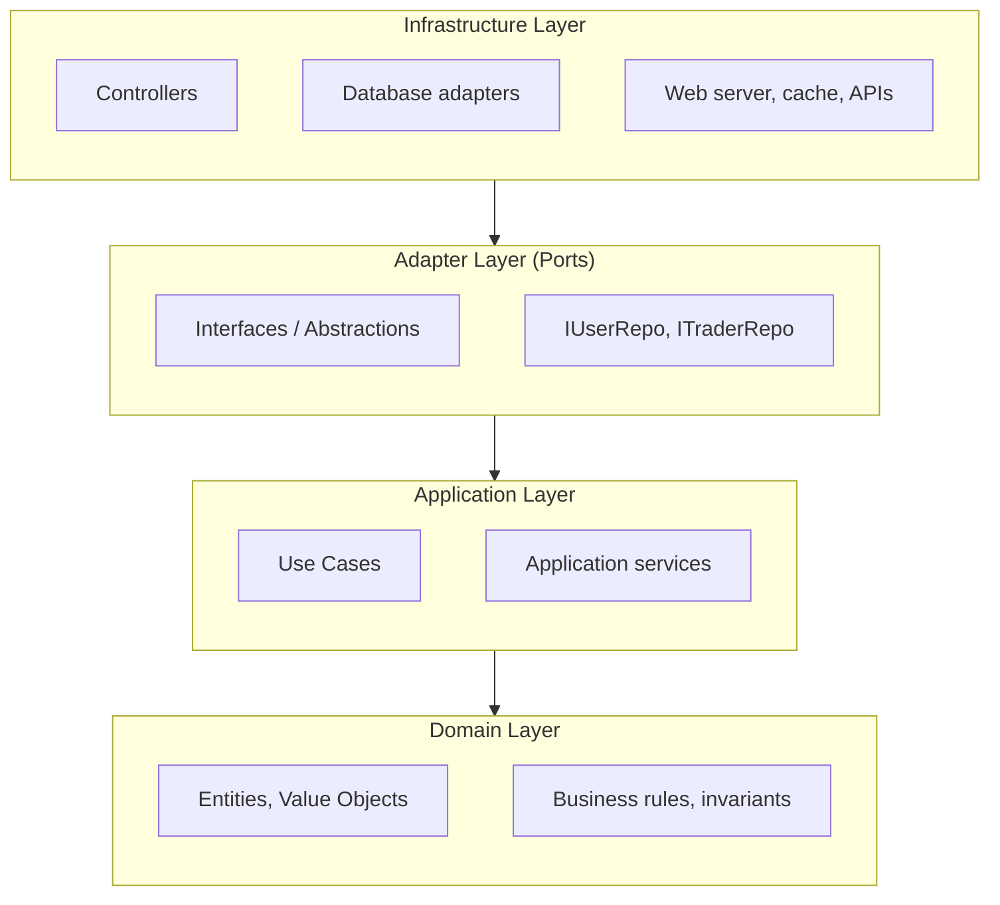
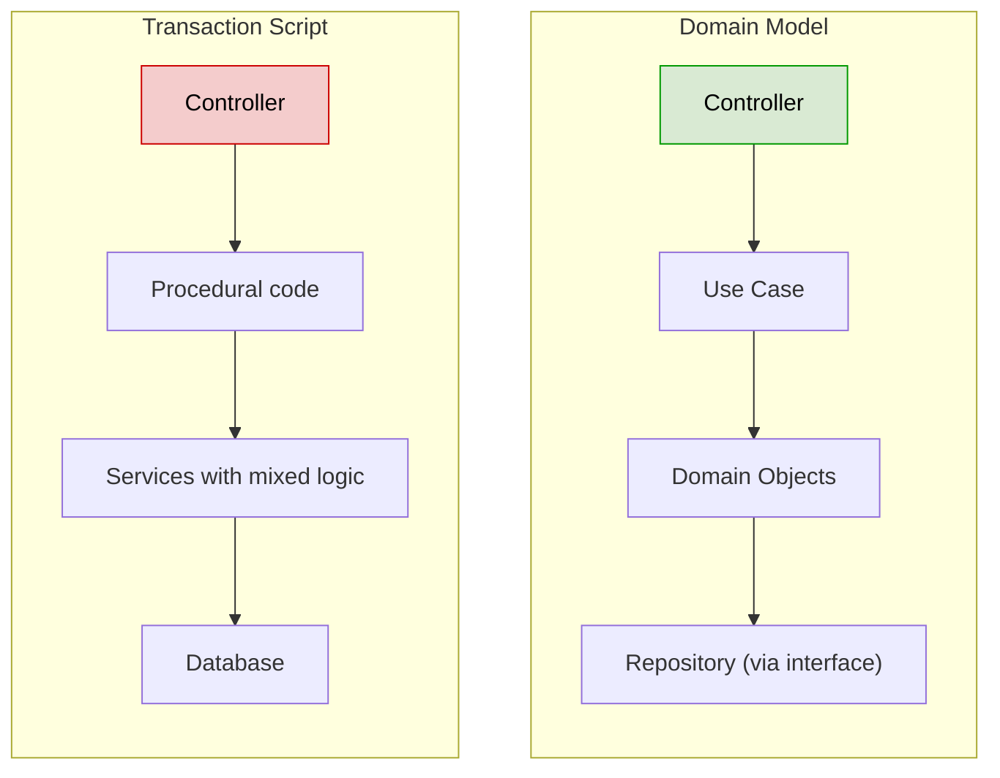
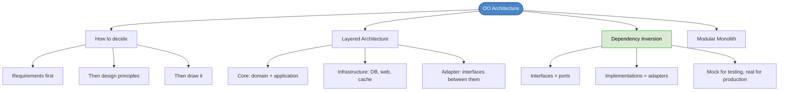

# Chapter 24: An Object-Oriented Architecture

## Core Question

**What architecture lets you write test-first, domain-first code for business applications?**

A **layered architecture** that separates core code from infrastructure code using dependency inversion. MVC alone isn't enough — the "M" mixes everything together.

---

## 1. How to Decide on an Architecture

Five inputs, in order:

| Step | What It Tells You |
|---|---|
| **1. Requirements** | Functional → external services/APIs needed. Non-functional → patterns, queues, caches needed. |
| **2. Design principles** | SOLID at the architectural level. E.g., dependency inversion for GraphQL schema design. |
| **3. Architectural principles** | Conway's Law, Last Responsible Moment, sustainable pace. |
| **4. Architectural patterns** | MVC, Clean Architecture, CQRS, Event Sourcing — which fits your problem? |
| **5. Draw it on a whiteboard** | If you can't draw it, you can't code it. |

---

## 2. MVC: The Trivial Layered Architecture

MVC gives you separation of concerns between View, Controller, and Model. That's great for:
- **Flexibility** — change layers independently
- **Maintainability** — separate frontend/backend teams
- **Testability** — test front and back separately

### The Problem with MVC

The **Model** mixes everything together: business rules, validation, persistence, response formatting, event handling. This means:

- Core code (features, domain logic) is **coupled** to infrastructure code (database, web server)
- You **can't unit test features** because they're tangled with database calls
- The only testing option is slow, expensive end-to-end tests

---

## 3. Core Code vs. Infrastructure Code

This is the most important distinction in the chapter:

| Core Code | Infrastructure Code |
|---|---|
| Features, business rules, domain logic | Database, web server, cache, file system |
| Pure — no I/O, no side effects | Connects core to the real world |
| Can be unit tested (fast) | Can only be integration tested (slow) |
| The family jewels | The plumbing |

### Michael Feathers' Rule

A test is **NOT** a unit test if it:
1. Talks to a database
2. Communicates across the network
3. Touches the file system
4. Can't run simultaneously with other tests
5. Requires special environment setup

If your feature code does any of these, you **can't unit test it**.

---

## 4. The Clean / Layered Architecture



### The Dependency Rule

Inner layers **cannot** depend on outer layers:
- Domain cannot depend on Application
- Application cannot depend on Infrastructure
- Infrastructure **can** depend on everything below it

---

## 5. Dependency Inversion: The Key

The problem: Use Cases need repositories. Repositories touch the database. So core depends on infrastructure?

The fix: **depend on abstractions, not concretions**.

```typescript
// BAD — core depends on infrastructure
class MakeOffer {
  constructor(private userRepo: SequelizeUserRepo) {} // concrete
}

// GOOD — core depends on abstraction
interface IUserRepo { ... }

class MakeOffer {
  constructor(private userRepo: IUserRepo) {} // abstract
}
```

Now you can inject either:

```typescript
// Production — real database
new MakeOffer(new SequelizeUserRepo())

// Testing — fast, in-memory mock
new MakeOffer(new MockUserRepo())
```

This is **ports and adapters**: the interface is the port, the concrete implementation is the adapter.

---

## 6. Transaction Script vs. Domain Model

Two ways to handle web requests:



The Domain Model approach keeps features as vertical slices through layers. Business rules live in domain objects, not scattered across services.

---

## 7. Start as a Modular Monolith

Don't start with microservices. Organize subdomains into **modules** within a monolith:

```
src/
  modules/
    trading/        ← core subdomain
    billing/        ← generic subdomain
    shipping/       ← supporting subdomain
  shared/
    core/
    infra/
```

When the team and codebase reach critical mass, the modular structure makes it straightforward to split into services later.

---

## 8. Mental Map



---

## Key Takeaways

1. **MVC alone isn't enough** — the Model mixes core and infrastructure, killing testability
2. **Core code vs. infrastructure code** — the most important distinction. Core = features/domain. Infrastructure = database/web/cache.
3. **Can't unit test infrastructure** — if your feature code touches a DB, you can't unit test it (Feathers' rule)
4. **Dependency inversion is the fix** — depend on abstractions (interfaces), inject real or mock implementations
5. **The dependency rule** — inner layers never depend on outer layers
6. **Domain Model over Transaction Script** — for anything with real business logic
7. **Start as a modular monolith** — organize by subdomain, split into services when it makes sense

---

## Concepts Introduced

- [Clean Architecture / Layered Architecture](../concepts/clean-architecture.md)
