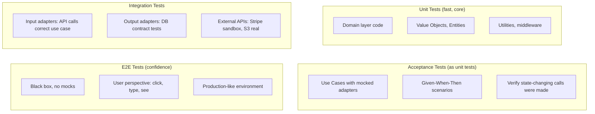
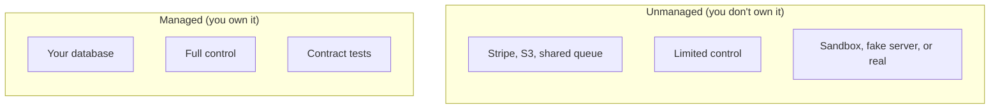
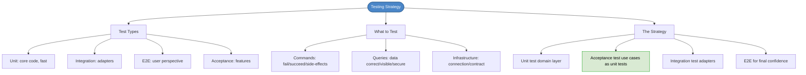

# Chapter 25: Testing Strategies

## Core Question

**What do you test, at which scope, and with which type of test?**

A layered architecture unlocks multiple testing options. The strategy: unit test core code, acceptance test features as unit tests, integration test adapters, E2E test for final confidence.

---

## 1. Test Types

| Type | What It Tests | Speed | Scope |
|---|---|---|---|
| **Unit** | Core code (pure, no I/O). Contract of a class/function. | Fast (ms) | Smallest |
| **Integration** | Our code works with code we didn't write (DB, APIs, libraries) | Medium (s) | Middle |
| **End-to-End** | Entire system from a real user's perspective (click, type, see) | Slow (s-min) | Largest |
| **Acceptance** | Feature works per customer specification (Given-When-Then) | Varies by scope | Feature-level |

### Integration Test Flavors

| Flavor | What It Tests |
|---|---|
| **Contract tests** | Concrete adapter implements the interface correctly (e.g., all `Repository` methods work) |
| **Incoming adapter tests** | Request handler (REST, GraphQL) calls the correct use case |
| **Outgoing adapter tests** | External dependency (Stripe, S3) can be connected to and used |

### Acceptance Test Scope Options

| Scope | Pros | Cons |
|---|---|---|
| **E2E** | Covers the most ground | Slow, hard to set up, can't verify everything |
| **Integration (API level)** | Covers front-to-back through API | Still needs infrastructure running |
| **Unit (Use Case level)** | Fast, cheap, tests core logic | Doesn't test infrastructure integration |

The author recommends: **coarse-grained unit tests** through Use Cases. Mock the adapters, test the feature logic.

---

## 2. What Needs Testing?

### Features (Commands)

- Fail when they should fail (correct error for invalid input)
- Succeed when they should succeed
- Adhere to security rules
- Invoke the correct state-changing calls with correct arguments

### Features (Queries)

- Data is visible
- Data is correct
- Security and scope are enforced

### Core Code

- Utilities, value objects, entities, domain services
- Custom auth/middleware logic
- Should rarely need mocks — this code is pure

### Infrastructure

| Dependency Type | What to Test | How |
|---|---|---|
| **Managed** (your DB) | Connection works, repository methods work | Contract tests against real DB |
| **Unmanaged** (external API) | Can connect, can perform needed operations | Real service, sandbox, or fake server |

---

## 3. The Testing Strategy

### Layer by Layer

| Layer | Test Type | Mocks Needed? |
|---|---|---|
| **Domain** | Unit tests | No — pure code |
| **Application (Use Cases)** | Acceptance tests as unit tests | Yes — mock repositories/adapters with spies |
| **Input adapters (API)** | Integration tests | Stub use case responses |
| **Output adapters (DB)** | Contract tests | No — test against real DB |
| **External APIs** | Integration tests | Real, sandbox, or fake server |
| **Full system** | E2E tests | No — black box |

### Mock Rules

- **Mocks for commands** — verify that state-changing effects happened
- **Stubs for queries** — return canned data without side effects

---

## 4. Managed vs. Unmanaged Dependencies

---

## 5. Mental Map

---

## Key Takeaways

1. **Unit tests = core code only** — pure, fast, no I/O (Feathers' rule)
2. **Acceptance tests as unit tests** — exercise Use Cases with mocked adapters. The best balance of speed and coverage.
3. **Integration tests for adapters** — contract tests for DB, incoming tests for API, outgoing for external services
4. **E2E tests for confidence** — black box, no mocks, production-like environment, user perspective
5. **Mocks for commands, stubs for queries** — verify state-changing effects happened, return canned data for reads
6. **Managed vs unmanaged** — you own your DB (contract tests). You don't own Stripe (sandbox/real/fake).

---

## Concepts Introduced

No new standalone concepts — this chapter synthesizes:
- [Acceptance Tests](../concepts/acceptance-tests.md) — written at the use case scope
- [Clean Architecture](../concepts/clean-architecture.md) — layers determine which test type to use
- [TDD](../concepts/tdd.md) — double-loop TDD uses this strategy
