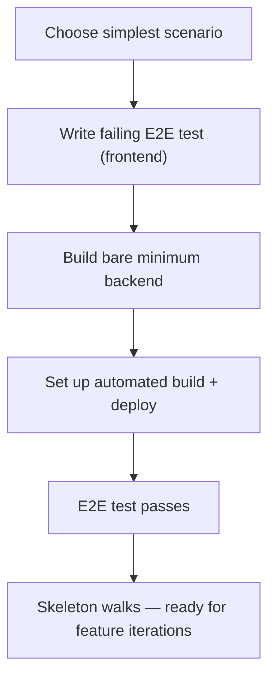
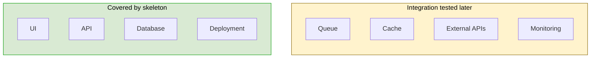
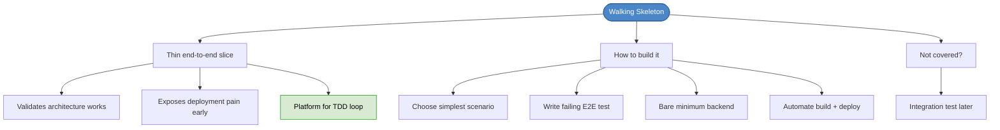

# Chapter 26: The Walking Skeleton

## Core Question

**How do you build just enough infrastructure to start the TDD loop without over-engineering?**

Build, test, and deploy a **walking skeleton** — the thinnest possible end-to-end slice of functionality. It validates the architecture, exposes deployment pain early, and gives you the platform to start acceptance testing.

---

## 1. What Is a Walking Skeleton?

A thin implementation that threads through **every main architectural component** — UI, API, database, deployment. It does one simple thing end-to-end and proves the pieces connect.

Also called **Tracer Bullets** (from *The Pragmatic Programmer*).

### What It Validates

| Concern | What You Learn |
|---|---|
| **Architecture** | Do the chosen libraries, frameworks, and patterns actually work together? |
| **Deployment** | Can we build, test, and deploy to a production-like environment? |
| **Testing** | Is our test infrastructure ready for acceptance tests? |
| **Integration** | Do the database, API, cache, and UI actually connect? |

### Why End-to-End?

"It worked on my machine" is not enough. You need:
- Real servers (or production-like environment)
- Real database connections
- Automated builds (CI)
- No mocking of major components

---

## 2. The Process



### Step 1: Choose the Simplest Scenario

Look across all your stories' acceptance tests. Find the **simplest scenario** of any of them. Use that to sculpt the skeleton.

Example: for a StudySpots app, "View all study spots in Toronto by default" is simpler than "Submit a new spot" because it only needs a read path.

### Step 2: Write a Failing E2E Test

Write the acceptance test in Given-When-Then style, using **Page Objects** for declarative, stable tests:

```
Feature: View all study spots

  Scenario: View spots in Toronto by default
    Given I'm on the map page
    And location is disabled
    When the page loads
    Then the current location should be Toronto
    And at least one spot should be displayed
```

Use **Page Object pattern** — add a layer of indirection between tests and HTML elements. Same principle as interfaces at class level.

### Step 3: Build Bare Minimum Backend

Don't start a full TDD loop yet. Just make the E2E test pass:
- Set up the API (GraphQL/REST)
- Connect the database
- Seed some test data
- Return it to the frontend

### Step 4: Automate Build + Deploy

Set up CI that:
1. Takes your code
2. Builds it
3. Runs tests
4. Deploys to a production-like environment

Use GitHub Actions, GitLab CI, Jenkins, CircleCI — whatever works.

---

## 3. What About Components Not Covered?

The walking skeleton won't thread through every component (queues, caches, monitoring). That's OK.



Un-covered components get **integration tested** during feature iterations.

---

## 4. Programming by Wishful Thinking

When writing the E2E test, you don't need to know how the implementation works yet. Write what you *wish* the API looked like:

```typescript
Given("I'm on the map page", () => {
  mapPage.load();
})

Then("at least one spot should be displayed", () => {
  mapPage.getCurrentStudySpotsInViewOnMap()
    .should('have.length.greaterThan', 0)
})
```

The `mapPage` object doesn't exist yet. You're designing the API by writing the test first. This is BDD in action.

---

## 5. Page Object Pattern

Don't write E2E tests directly against HTML elements. Add indirection:

| Without Page Objects | With Page Objects |
|---|---|
| `cy.get('#login-btn').click()` | `loginPage.submit()` |
| Test breaks when HTML changes | Test survives UI refactors |
| Imperative, coupled to structure | Declarative, coupled to behavior |

Same principle as dependency inversion — at the test level.

---

## 6. Mental Map



---

## Key Takeaways

1. **Walking skeleton = thinnest end-to-end slice** — validates architecture, deployment, and testing infrastructure
2. **Choose the simplest scenario** from any acceptance test to build the skeleton around
3. **Write a failing E2E test first** — use Given-When-Then style with Page Objects for stability
4. **Bare minimum backend** — just enough to make the E2E test pass, no full TDD loop yet
5. **Automate build + deploy** — CI must build, test, and deploy to a production-like environment
6. **Expose uncertainty early** — CORS errors, DB connection issues, deployment problems found now, not before the deadline
7. **Un-covered components** get integration tested during feature iterations

---

## Concepts Introduced

No new standalone concepts — this chapter applies:
- [Walking Skeleton](../concepts/walking-skeleton.md) — already created, now deepened with the full process
- [Acceptance Tests](../concepts/acceptance-tests.md) — the simplest scenario kicks off the skeleton
- [Clean Architecture](../concepts/clean-architecture.md) — the skeleton validates the layered architecture
