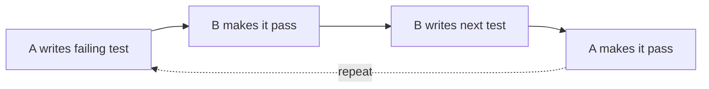
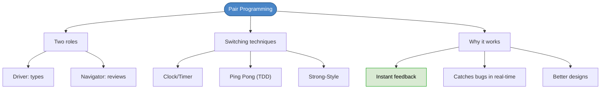

# Chapter 27: Pair Programming

## Core Question

**How do you get instant feedback on your design instead of waiting for a pull request?**

Pair programming. Two developers, one keyboard. Take turns driving and navigating. Feedback loop shrinks from days to seconds.

---

## 1. What Is It?

Writing code in pairs. One person types (**driver**), the other reviews and thinks strategically (**navigator**). Switch roles regularly.

| Role | Responsibility |
|---|---|
| **Driver** | Types the code. Focuses on the current line/method. |
| **Navigator** | Reviews strategically. Asks: mistakes? better design? edge cases? ripple effects? |

### Why It Works

- Feedback loop goes from "days later in a PR review" to "right now, while coding"
- Catches bugs, edge cases, and design problems in real-time
- Reduces frustration when stuck
- Produces better designs than solo work

---

## 2. Switching Techniques

| Technique | How It Works | Best For |
|---|---|---|
| **Clock/Timer** | Pomodoro timer. Switch when it expires. | Simplest. Works for any pair. |
| **Ping Pong** | A writes a failing test → B makes it pass → B writes next test → A makes it pass | TDD sessions. Natural switching. |
| **Strong-Style** | Navigator dictates, driver implements. Ideas must pass through someone else's hands. | Experienced pairs. Navigator sees the full picture. |

### Ping Pong Flow

### Strong-Style Rules

- Driver only asks questions to understand what to do
- Driver cannot question *why* until the idea is fully expressed
- Navigator says when the idea is complete and open for discussion

Requires trust and maturity. Highly effective when the navigator understands the full story.

---

## 3. Output

- **Each passing test = a commit**
- **Finished feature = pull request**

Pull requests are still valuable even with pairing — others who weren't in the session get to review.

---

## 4. How Often?

No single right answer:

| Approach | Who Does It |
|---|---|
| ~95% of the time | Some XP-strict companies |
| Mornings only | Common compromise |
| 3 out of 5 days | Leaves time for solo exploration |
| Opt-in, not enforced | Sandro Mancuso's recommendation |

Most developers who try it for 2-3 weeks end up preferring it.

---

## 5. Considerations

| Concern | How to Handle |
|---|---|
| **Power dynamics** | Senior devs: be patient, encouraging, stick to the timer |
| **Maturity** | Leave ego at home. Respect the rules. |
| **Timer discipline** | Let the timer remind you — don't rely on your partner asking |
| **Exhaustion** | Allow time for solo work. Pairing can be draining. |
| **Half-baked ideas** | Sometimes you need solo time to explore before sharing |

### What a Good Pair Looks Like

- Communicates solutions clearly
- Balances talking with listening
- Picks up on social cues
- Takes initiative — doesn't wait for partner to drive everything

---

## 6. Mental Map

---

## Key Takeaways

1. **Instant feedback** — shrinks the loop from PR review (days) to real-time (seconds)
2. **Driver types, navigator thinks strategically** — both roles are active
3. **Three switching styles** — timer (simple), ping pong (TDD-natural), strong-style (trust-based)
4. **Still use pull requests** — others should see the code too
5. **Opt-in works best** — forcing pairing creates resentment. 2-3 weeks of trying it converts most developers.
6. **Maturity required** — ego, patience, and social awareness matter as much as technical skill

---

## Concepts Introduced

No new standalone concepts — this chapter applies:
- [Extreme Programming](../concepts/extreme-programming.md) — pair programming is a core XP practice
- [TDD](../concepts/tdd.md) — ping pong pairing integrates naturally with TDD
