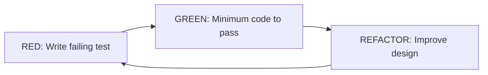
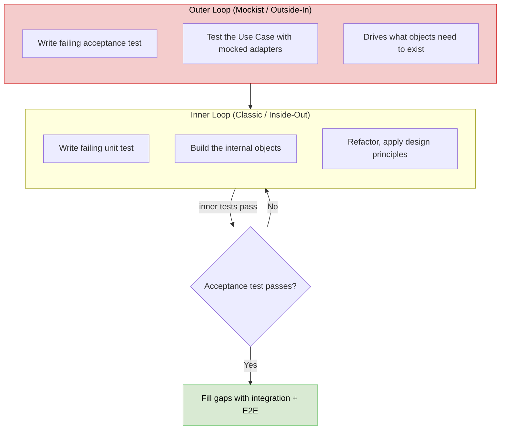
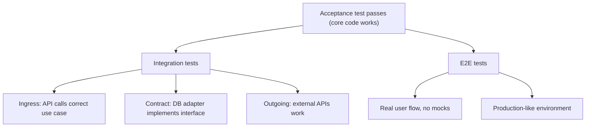
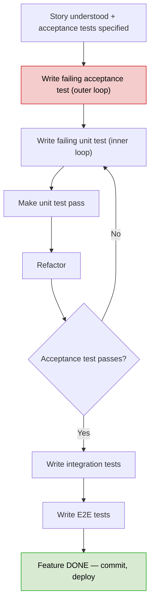
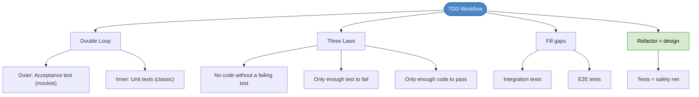

# Chapter 28: Test-Driven Development Workflow

## Core Question

**How does TDD actually work in a real-world project, end to end?**

Maintain two loops: an **outer** acceptance test loop (outside-in, mockist) and an **inner** unit test loop (inside-out, classic). When both pass, fill gaps with integration and E2E tests. Refactor constantly — that's where design happens.

---

## 1. Red-Green-Refactor (The Core Loop)



### The Three Laws of TDD

1. **No production code** unless it's to make a failing test pass
2. **No more test code** than is sufficient to fail (compilation failures count)
3. **No more production code** than is sufficient to pass the one failing test

After each green → **stop**. Look at the design. Refactor if needed. Then write the next failing test.

---

## 2. Double Loop TDD

Two loops, two TDD schools of thought:



### Two Schools of TDD

| | Classic (Inside-Out / Chicago) | Mockist (Outside-In / London) |
|---|---|---|
| **Start from** | Internal objects, build outward | Boundaries (controller/use case), build inward |
| **Mocks** | Rarely used | Used for infrastructure dependencies |
| **Good for** | Inner loop unit tests | Outer loop acceptance tests |
| **Masters in** | Part IV of the book | Part X of the book |

**Both are useful.** Double Loop TDD uses both: outside-in for the acceptance test, inside-out for the unit tests that make it pass.

---

## 3. TDD Prerequisites

TDD in a real-world app requires setup before writing the first test:

| Prerequisite | Where We Learned It |
|---|---|
| Testing strategy decided | Chapter 25 |
| Walking skeleton built, tested, deployed | Chapter 26 |
| Separate scripts for unit, integration, E2E | Test architecture setup |
| Environment switching (dev/staging/prod) | Polymorphism + config |

### Why Real-World TDD Is Hard

| Challenge | Why |
|---|---|
| Front-end vs back-end | Frontend has less core code, more framework coupling |
| Terminology disagreements | "Unit test" and "integration test" mean different things to different people |
| Starting TDD too late | Architecture must support testing from the start |
| What and how to test | Requires understanding of testing strategies, mocks, stubs |

---

## 4. Filling Gaps After the Acceptance Test

Once the acceptance test passes, ask: **how confident am I this works in production?**

You mocked the infrastructure. Now verify it for real:



### Contract Tests Example

Test that **all implementations** (real and mock) behave the same:

```typescript
let repos = [new FirebaseCustomerRepo(), new MockCustomerRepo()];

for (let repo of repos) {
  await repo.save(customer);
  let result = await repo.getCustomerById(customer.getId());
  expect(result.getId()).toEqual(customer.getId());
}
```

This ensures your mock didn't lie to you during the acceptance test.

---

## 5. Refactoring Is Where Design Happens

Refactoring isn't something you do once a month. It happens **several times per hour** in the refactor step.

What you apply during refactoring:

| Source | What You Apply |
|---|---|
| Part II (Humans & Code) | Naming, comments, formatting, HCD principles |
| Part V (OO Design) | Code smells, object calisthenics |
| Part VI (Design Patterns) | Refactor *to* patterns when needed |
| Part VII (Design Principles) | SOLID, coupling & cohesion |

> TDD creates the scenario where you can safely integrate everything you know about design.

The safety net: if a refactoring breaks something, the tests catch it. Fall back to the last green commit.

---

## 6. The Complete Workflow



---

## 7. Mental Map



---

## Key Takeaways

1. **Three Laws of TDD** — no production code without a failing test, only enough to fail, only enough to pass
2. **Double Loop TDD** — outer loop (acceptance, mockist, outside-in) + inner loop (unit, classic, inside-out)
3. **Both TDD schools are useful** — outside-in drives what needs to exist, inside-out builds the internals
4. **Fill gaps after acceptance** — integration tests verify adapters, E2E tests verify the real user flow
5. **Contract tests keep mocks honest** — test real and mock implementations against the same interface
6. **Refactoring is where design happens** — several times per hour, not once a month. Apply all your design knowledge.
7. **TDD requires architecture** — testing strategy, walking skeleton, separate scripts, and environment switching must exist first

---

## Concepts Introduced

No new standalone concepts — this chapter is the **culmination of all Part III concepts** working together:
- [TDD](../concepts/tdd.md) — the three laws and red-green-refactor
- [Acceptance Tests](../concepts/acceptance-tests.md) — the outer loop
- [Clean Architecture](../concepts/clean-architecture.md) — enables separation of core and infrastructure for testing
- [Walking Skeleton](../concepts/walking-skeleton.md) — the platform this workflow runs on

---

**Part III: Phronesis is complete.** This section covered the full lifecycle of professional software development — from scoping and planning to domain learning, story writing, estimation, architecture, testing, and the TDD workflow that ties it all together.
