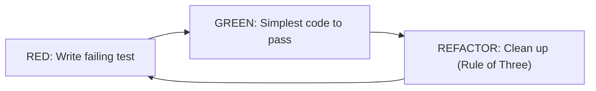
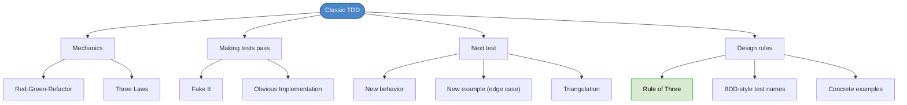

# Chapter 29: Getting Started with Classic Test-Driven Development

## Core Question

**How do you actually do TDD, step by step, starting from zero?**

Start with **Classic (Inside-Out) TDD**: no mocks, no infrastructure — just pure code, tests, and the red-green-refactor loop. Master the mechanics before adding complexity.

---

## 1. Classic vs. Mockist TDD

| | Classic (Chicago/Inside-Out) | Mockist (London/Outside-In) |
|---|---|---|
| **Mocking** | No mocks. Test with real dependencies. | Mock infrastructure dependencies. |
| **Best for** | Pure code, utilities, domain objects | Use cases with DB/API dependencies |
| **Confidence** | High (tests the real thing) | Design-focused (isolates core code) |
| **Start here** | Yes — learn the mechanics first | Later — Part V and Part X |

We start with Classic because it's simpler. No mocking decisions. Just behavior, tests, and code.

---

## 2. The Mechanics (Recap)

### Red-Green-Refactor



### Three Laws of TDD

1. No production code unless making a failing test pass
2. No more test than is sufficient to fail (compilation failures count)
3. No more production code than is sufficient to pass

---

## 3. Making a Test Pass: Two Strategies

| Strategy | What It Is | When to Use |
|---|---|---|
| **Fake It** | Return a hardcoded value to pass | When you're unsure of the implementation |
| **Obvious Implementation** | Write the real solution immediately | When you know exactly what to do |

### Fake It Example

```typescript
// Test: "mom" is a palindrome → expects true
isAPalindrome(str: string): boolean {
  return true; // Simplest thing that works!
}
```

This passes the first test. The second test ("bill" is NOT a palindrome) will force the real implementation.

### Obvious Implementation Example

```typescript
isAPalindrome(str: string): boolean {
  const reversed = str.split("").reverse().join("");
  return reversed === str;
}
```

When you know the answer, just write it. But prefer simpler transformations to avoid getting stuck.

---

## 4. Triangulation

As you add more tests, you **carve out the degrees of freedom** of your design — sculpting it toward a robust solution.

| Action | What It Does |
|---|---|
| **New behavior** | Adds a capability (forward/back → now also left/right) |
| **New example** | Hardens existing capability (what if input is empty? negative? null?) |

Each test constrains the implementation further, like triangulating a position from multiple reference points.

---

## 5. The Rule of Three (Refactoring Rule)

> Only clean up duplication when you see it **three times**.

Why not immediately?

- **Wrong abstractions are worse than duplication**
- Two occurrences might be coincidence
- Three occurrences reveal a real pattern
- A little duplication is 10x better than a wrong abstraction

Applies to **test code too** — refactor repeated setup into `beforeEach` after the third occurrence.

---

## 6. Naming Tests

### BDD-Style, Domain Language

```typescript
// Bad — technical, abstract
'should manage state'
'can add two numbers'

// Good — behavioral, concrete examples
'knows that "mom" is a palindrome'
'when I add 2 + 2, I get 4'
```

### Rules

| Rule | Why |
|---|---|
| Use domain language | Tests document behavior, not implementation |
| Concrete examples over abstract statements | More readable, reveals edge cases naturally |
| One example per test | Failures are easily traceable |
| No implementation details in names | Don't mention arrays, properties, internals |

---

## 7. The Palindrome Walkthrough

Full red-green-refactor cycle demonstrated:

**Test 1** (RED): "mom" is a palindrome → **Fake it**: `return true`

**Test 2** (RED): "bill" is NOT a palindrome → **Obvious implementation**: reverse and compare

**Test 3** (RED): "Mom" (mixed case) is still a palindrome → Add `.toLowerCase()`

**Refactor** (Rule of Three): extract `new PalindromeChecker()` into `beforeEach`

```typescript
describe('palindrome checker', () => {
  let checker: PalindromeChecker;

  beforeEach(() => { checker = new PalindromeChecker(); })

  it('knows "mom" is a palindrome', () => {
    expect(checker.isAPalindrome('mom')).toBeTruthy();
  });

  it('knows "bill" is not a palindrome', () => {
    expect(checker.isAPalindrome('bill')).toBeFalsy();
  });

  it('detects palindromes regardless of casing', () => {
    expect(checker.isAPalindrome('Mom')).toBeTruthy();
  });
});
```

---

## 8. Mental Map



---

## Key Takeaways

1. **Start with Classic TDD** — no mocks, just pure code and tests. Master the mechanics first.
2. **Fake It or Obvious Implementation** — two strategies for going from red to green
3. **Triangulation** — each test carves out a degree of freedom, sculpting toward a robust solution
4. **Rule of Three** — don't refactor duplication until you see it three times. Wrong abstractions are worse.
5. **BDD-style test names** — domain language, concrete examples, one example per test
6. **TDD is a design tool** — the tests drive the design. Refactoring is where design happens.
7. **You must practice** — reading about TDD doesn't make you good at it. Do the exercises.

---

## Concepts Introduced

No new standalone concepts — this chapter operationalizes:
- [TDD](../concepts/tdd.md) — the actual red-green-refactor mechanics in practice
- [Simple Design](../concepts/simple-design.md) — Rule of Three connects to "fewer elements"
- [Code Smells](../concepts/code-smells.md) — duplication is the first smell addressed
