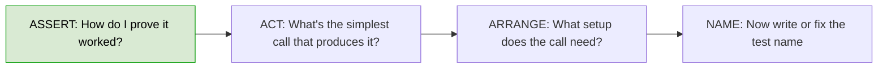
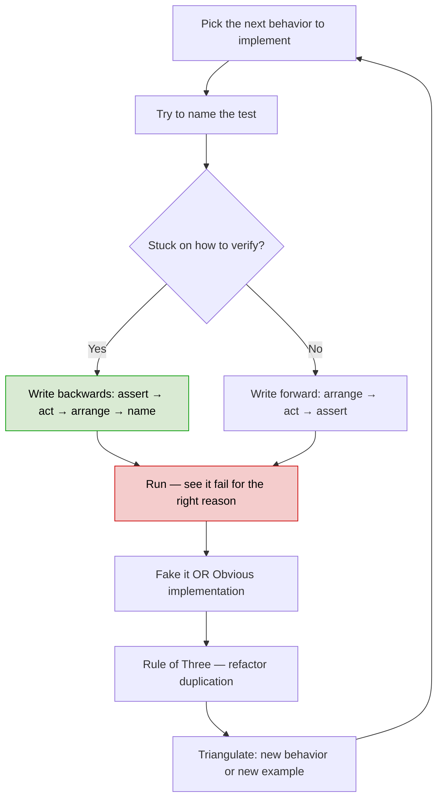
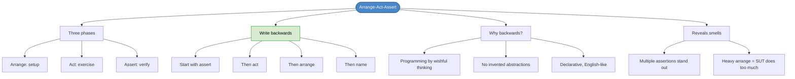

# Chapter 30: Working Backwards Using Arrange-Act-Assert

## Core Question

**When you're stuck writing a test — no idea how to prove it works — what do you do?**

Structure tests into **Arrange-Act-Assert** phases, then write them **backwards** (assert → act → arrange → name). Starting from "how would I prove this worked?" taps into design intuition you couldn't reach by going forward.

---

## 1. Three Challenges You'll Hit

After Chapter 29, you've probably tripped on one of these:

| Challenge | Symptom | Fix |
|---|---|---|
| **Can't name the test** | Stuck searching for clean, abstract names | Use concrete examples. Naming is a process — refine later. |
| **Can't express the behavior** | Know the name and how to verify, but not how to implement | Transformation Priority Premise (Chapter 31) + OO patterns/principles (later) |
| **No idea how to prove correctness** | Know what to do, can't figure out the assertion | **Write the test backwards** (this chapter) |

---

## 2. Arrange-Act-Assert

Same shape as Given-When-Then from acceptance tests, applied at the unit level:

```typescript
// Arrange (Given) — preconditions
let palindromeChecker = new PalindromeChecker();

// Act (When) — exercise the behavior
let result = palindromeChecker.isAPalindrome('mom');

// Assert (Then) — verify the outcome
expect(result).toBe(true);
```

| Phase | Purpose |
|---|---|
| **Arrange** | Build the variables and instances the test needs |
| **Act** | Plug them together and trigger the behavior |
| **Assert** | Verify the desired outcome happened |

### Why Structure Tests This Way?

| Benefit | What It Buys You |
|---|---|
| **Separation** | Setup is visually distinct from what's being tested |
| **Smell detection** | Multiple assertions stand out. Long arrange = test doing too much. |
| **Three-line target** | Most stateless tests collapse into a clean three-liner |

### Comments Are Training Wheels

Use `// Arrange` / `// Act` / `// Assert` comments while you're learning, then strip them. The phases should be visible from the structure alone:

```typescript
let checker = new PalindromeChecker();
let result = checker.isAPalindrome('mom');
expect(result).toBe(true);
```

---

## 3. The Backwards Technique

Conventional order: arrange → act → assert.
Backwards order: **assert → act → arrange → name.**

Why backwards works:

| Going Forward | Going Backwards |
|---|---|
| Build setup → wonder how to verify | Decide what success looks like → work back to setup |
| Easy to invent abstractions you don't need | Forced to stay declarative — only what's needed for the assertion |
| Procedural thinking | Wishful thinking — write code as if the API already exists |

### The Flow



---

## 4. Worked Example: Tic Tac Toe

**Requirement:** "After X moves, it's O's turn."

### Step 1 — Assert

Turn the requirement into declarative code. Don't know yet how `game` exposes the turn — invent it.

```typescript
expect(game.getCurrentTurn()).toBe('O');
```

The `getCurrentTurn()` method **doesn't exist yet**. That's fine. You're designing it by writing the assertion.

### Step 2 — Act

What's the simplest public interface for X to make a move?

```typescript
game.chooseMark({ row: 0, column: 0 });
```

You just designed the API. Rows and columns. Done.

### Step 3 — Arrange

What's the minimum setup? A fresh game, X by default.

```typescript
let game = new Game();
```

### Step 4 — Flip and Name

```typescript
describe('tic tac toe', () => {
  test("should know that it's O's turn to go after X", () => {
    let game = new Game();
    game.chooseMark({ row: 0, column: 0 });
    expect(game.getCurrentTurn()).toBe('O');
  });
});
```

**You designed three methods (`new Game()`, `chooseMark`, `getCurrentTurn`) without writing a single line of production code.** That's the power of the technique.

---

## 5. Programming by Wishful Thinking

The act of pretending an API already exists, then writing the code that uses it.

| Without It | With It |
|---|---|
| "I need to figure out the implementation first" | "What would I *wish* this looked like?" |
| Builds bottom-up — risk of wrong abstractions | Builds top-down from how it's used |
| Procedural | Declarative, English-like |

You take a baby step of faith. If it doesn't work, revert to the last green commit. The cost of trying is tiny.

This is the same technique used in the walking skeleton when writing the failing E2E test.

---

## 6. When AAA Phases Get Heavy

For stateless functions, AAA collapses to one line. But as soon as you have:

- Stateful objects
- Multiple dependencies
- Subtle success/failure paths

…the **arrange** phase grows. When it grows too much:

- Use the **Builder pattern** to simplify test setup
- Extract helpers to keep tests focused
- If arrange is huge, the SUT might be doing too much

---

## 7. Updated Workflow

Where this slots into the TDD workflow:



---

## 8. Mental Map



---

## Key Takeaways

1. **Three phases: Arrange-Act-Assert** — same shape as Given-When-Then, applied at the unit level
2. **Most stateless tests fit on three lines** — if yours is longer, ask why
3. **Write tests backwards when stuck** — assert → act → arrange → name
4. **Backwards = wishful thinking** — design the API by writing the test that uses it
5. **Comments are training wheels** — use them while learning, strip them after
6. **Heavy arrange is a smell** — consider the Builder pattern, or check if the SUT is doing too much
7. **Take baby steps of faith** — if it doesn't work, revert to last green. Cheap to try.

---

## Concepts Introduced

- [Programming by Wishful Thinking](../concepts/programming-by-wishful-thinking.md) — *new* — declarative top-down design via test-first

This chapter also operationalizes:
- [TDD](../concepts/tdd.md) — adds a structural rule (AAA) and a recovery technique (backwards)
- [Acceptance Tests](../concepts/acceptance-tests.md) — AAA is the unit-level cousin of Given-When-Then
