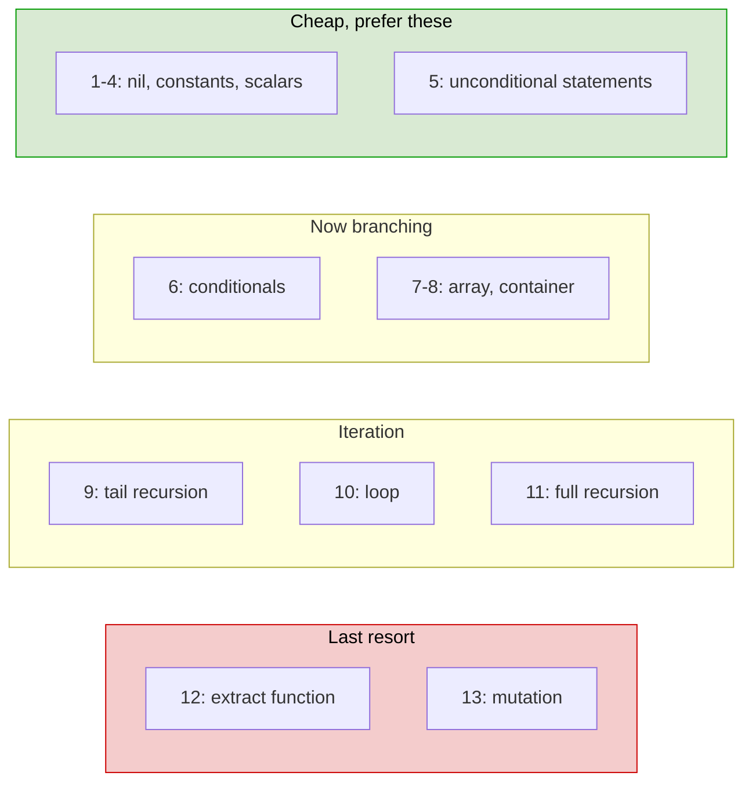
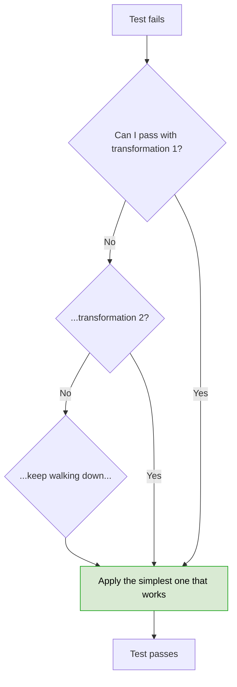
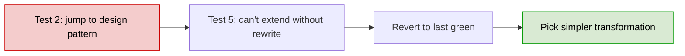
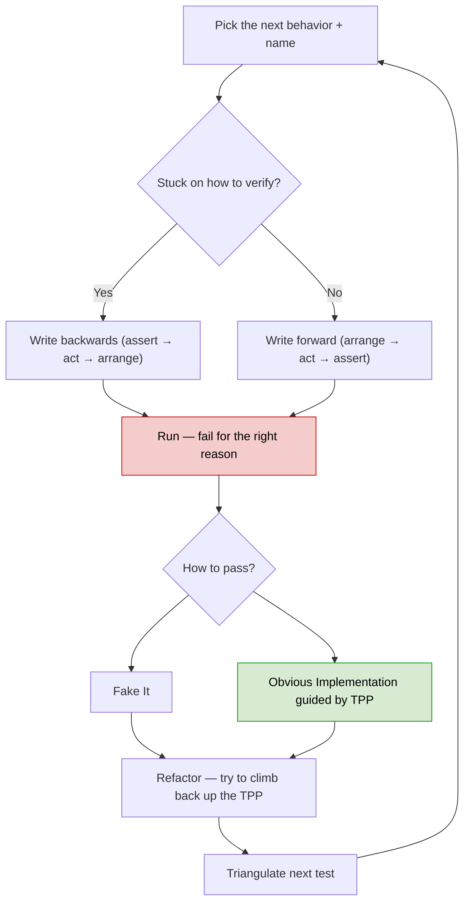
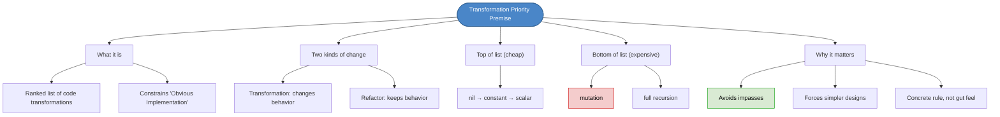

# Chapter 31: Avoiding Impasses with the Transformation Priority Premise

## Core Question

**When you write the simplest code to pass a test, which "simplest" do you pick?**

Pick the transformation **highest on the TPP list** that still passes the test. Simpler transformations early prevent **impasses** later — situations where the only way forward is to rip up most of what you've already written.

---

## 1. Transformations vs. Refactoring

Two ways code changes during TDD — keep them straight:

| | Transformation | Refactoring |
|---|---|---|
| **What it changes** | Behavior | Structure only |
| **When it happens** | Going from RED to GREEN | After GREEN |
| **Direction** | Specific → generic | Same behavior, cleaner shape |
| **Test result** | Test now passes | Tests still pass |

### Example

Test 1 (one example): fake it.

```typescript
function add(x, y) { return 25; }     // hardcoded
```

Test 2 (second example forces a generic answer): **transform**.

```typescript
function add(x, y) { return x + y; }  // transformed: constant → scalar
```

The shift from `25` to `x + y` is a transformation. Renaming `add` to `sum` would be a refactoring.

---

## 2. The Problem with "Obvious Implementation"

Two strategies for going green: Fake It, or Obvious Implementation. Obvious Implementation has cracks:

| Problem | Why It Bites |
|---|---|
| **No universal "obvious"** | Two devs solve the same kata totally differently |
| **Not all transformations are equal** | Some force you to rewrite 80% of existing code; others change one line |
| **Complex transformations breed impasses** | Reach for a design pattern in test 2 and you box yourself in |

> **Impasse / Deadlock:** You can't add the next test because of how you wrote the code for previous tests. The way out is reverting to the last green commit.

> **Design rule:** Always prefer the simplest possible transformation.

But "simplest" is fuzzy without a list. Enter TPP.

---

## 3. The Transformation Priority Premise

A ranked list of every transformation TDD code goes through. Higher on the list = simpler = preferred.

When stuck on what to do next, walk down the list: "Can I solve this with transformation N? No? Try N+1."

> **TPP imposes constraints on Obvious Implementation.** Constraints make decisions easier (Part II again).

---

## 4. The TPP Table (Top to Bottom = Simple to Complex)

| # | Transformation | Example |
|---|---|---|
| 1 | `{}` → `nil` | `return null;` |
| 2 | `nil` → constant | `return 1;` |
| 3 | constant → constant+ | `return 1 + 2;` |
| 4 | constant → scalar | `return arg + 2;` |
| 5 | statement → statements | unconditional sequence: assignment + subroutine calls |
| 6 | unconditional → conditional | `if/else`, `switch`, ternary |
| 7 | scalar → array | indexed lookup `arr[index]` |
| 8 | array → container | object/class wrapping the data |
| 9 | statement → tail recursion | `return f(x-1, acc+x)` |
| 10 | `if` → loop | `for`, `while` |
| 11 | statement → recursion | non-tail recursion |
| 12 | expression → function | extract subroutine |
| 13 | variable → mutation | reassign / change state |

### Key Boundaries



### Why Mutation Is Last

State is the source of most bugs. Reach for it only when nothing higher on the list will do.

### Why Tail Recursion Beats `for`

Tail recursion is functionally equivalent but doesn't introduce mutable loop variables. Many languages compile it to a loop anyway.

---

## 5. How to Use the TPP

### Going Red → Green



### When Refactoring

Look at your current implementation. Can you refactor it **back up** the list? Replace mutation with a return value. Replace a loop with `array.map`. Each upward move reduces complexity.

---

## 6. Worked Example: `add(x, y)`

| Test | Strategy | Code | Transformation |
|---|---|---|---|
| `add(0, 0) === 0` | Fake it | `return 0;` | `{}` → `nil` (1) → constant (2) |
| `add(10, 5) === 15` | Force generic | `return x + y;` | constant → scalar (4) |

We skipped 3 (constant+) — fine. Don't apply transformations that aren't needed.

---

## 7. Worked Example: Fibonacci

| Test | Code | Transformation |
|---|---|---|
| `fib(0) === 0` | `return 0;` | constant (2) |
| `fib(1) === 1` | `return n === 0 ? 0 : 1;` | conditional (6) |
| `fib(2) === 1` | `return n < 2 ? n : 1;` | still conditional |
| `fib(5) === 5` | `return n < 2 ? n : fib(n-1) + fib(n-2);` | recursion (11) |

Notice the climb is gradual: constant → conditional → recursion. Don't jump straight to a memoized iterative solution in test 2 — that's an impasse waiting to happen.

---

## 8. Avoiding Impasses



Signs you're heading toward an impasse:
- Test 2 already needs a class hierarchy
- You're reaching for a design pattern with two examples
- The "simplest thing that could work" feels elaborate

When stuck: revert. Try a transformation higher on the list.

---

## 9. Updated TDD Workflow



---

## 10. Mental Map



---

## Key Takeaways

1. **Transformations change behavior, refactorings preserve it** — different tools, different phases
2. **"Obvious Implementation" is fuzzy** — two devs land on different "obvious" solutions, often complex
3. **Impasses happen when early transformations are too complex** — you box yourself in for tests 3, 4, 5
4. **TPP is a ranked list of transformations** — top is simplest (`{}` → nil), bottom is hardest (mutation)
5. **Always prefer the highest transformation that passes the test** — gradual escalation
6. **When refactoring, climb the list back up** — replace mutation with returns, loops with map/recursion
7. **Stuck? Revert and try a higher transformation** — the cost of a baby step is one commit
8. **Mutation is last resort** — state is the source of most bugs

---

## Concepts Introduced

- [Transformation Priority Premise](../concepts/transformation-priority-premise.md) — *new* — the ranked list and the rule
- [Impasses in TDD](../concepts/impasses-in-tdd.md) — *new* — how you get stuck and how to escape

This chapter also operationalizes:
- [TDD](../concepts/tdd.md) — refines the GREEN step with a concrete heuristic
- [Simple Design](../concepts/simple-design.md) — TPP is "fewest elements" applied to transformations

---

**Part IV: TDD Basics is complete.** You now have the full inner-loop toolkit:
- Classic vs Mockist (when to use which)
- Red-Green-Refactor mechanics + Three Laws
- Fake It vs Obvious Implementation
- Triangulation + Rule of Three
- BDD-style naming
- Arrange-Act-Assert + writing tests backwards
- Programming by wishful thinking
- Transformation Priority Premise

Next: **Part V — Object-Oriented Design.** TDD has been guiding the design all along. Now we name what it's been guiding us toward.
