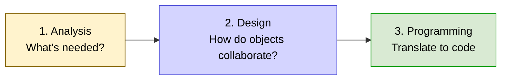
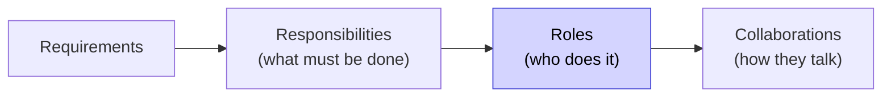
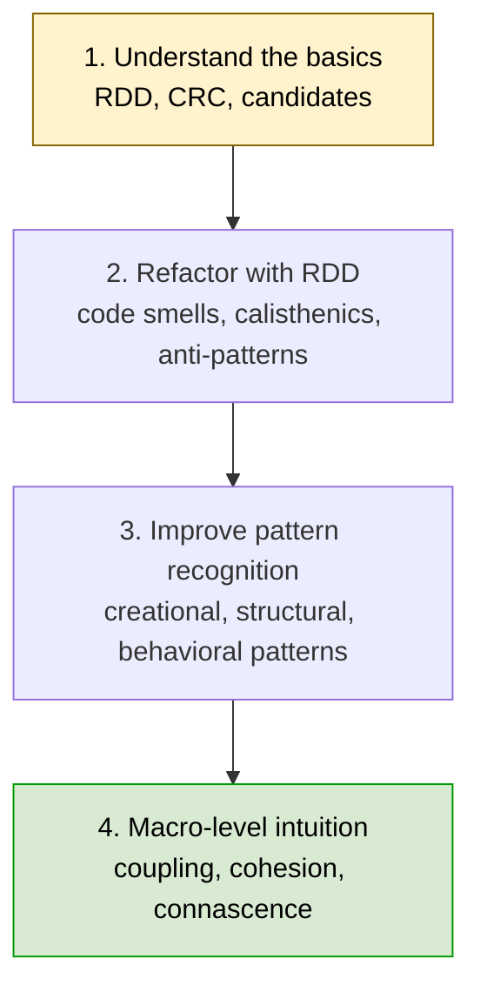

# Chapter 32: Why & How to Learn Object-Oriented Software Design

## Core Question

**You can write tests. You can make them pass. So why does your OO code still feel messy?**

Because **tests aren't design**. Tests verify behavior; they don't tell you what objects should exist, what they're responsible for, or how they should collaborate. Object Design fills that gap with three parts: **analysis, design, programming** — in that order.

---

## 1. The Kobe Lesson

> "Why do you think I'm the best in the world? Because I never get bored with the basics." — Kobe Bryant

OO is part of those basics. Whether or not you stay in OO long-term, learning it teaches you about **structure and relationships** — the heart of all design.

---

## 2. Why You're Stuck

Common symptoms when OO basics are missing:

| Symptom | What It Looks Like |
|---|---|
| Don't know how to structure things | Files keep growing, no clean break points |
| Don't know when to use `extends` | Inheritance feels arbitrary |
| Don't know where to put logic | Decision-making leaks into UI/controllers |
| Constantly relearning frameworks | Each library re-teaches its own "best practice" |
| Imposter syndrome on non-web work | Games, robotics, desktop apps feel scary |
| Can't handle cross-cutting concerns | Auth, routing, state management feel unsolvable |

---

## 3. Tests Aren't Design

Goal of software design: **build products that serve customers AND can be cost-effectively changed by developers.**

| Aspect | TDD Helps? |
|---|---|
| Functional requirements (features work) | ✅ |
| Non-functional requirements (NFRs) | ❌ |
| Maintainability, testability, flexibility | ❌ — design choices, not test choices |
| Scalability, portability | ❌ — must be designed in early |

Even mapping to **Simple Design's four rules**:

| Rule | TDD Covers? |
|---|---|
| 1. Tests pass | ✅ |
| 2. No duplication | ✅ |
| 3. Expressive (high cohesion) | ❌ |
| 4. Fewest elements (low coupling) | ❌ |

**TDD gets you to "works." Design gets you to "works *and* readable, flexible, maintainable."**

---

## 4. Object Design Has Three Parts



Most developers skip 1 and 2. That's why their code is messy.

> Doing OOP without OOAD is like a kid building a treehouse with nails, hammer, and wood — *something* gets built, but you're not sitting in it 30 feet up.

---

## 5. Analysis — Identify Requirements

**Goal:** Discover both functional and non-functional requirements.

### Functional vs Non-Functional

| Functional | Non-Functional (NFRs) |
|---|---|
| "User can place an order" | "System handles 10,000 orders/sec" |
| Specific feature behavior | Quality attributes |

### Two Categories of NFRs

| Category | Examples | Who Cares |
|---|---|---|
| **Execution qualities** | Usability, efficiency, correctness, reliability | End users at runtime |
| **Evaluation qualities** | Maintainability, testability, flexibility | Developers at code time |

NFRs must be discovered **early** — they shape architecture. You don't get scalability or testability by accident.

### Analysis Techniques

For the **big picture**:
- Event Storming, Event Modelling
- Impact Mapping, Context Mapping
- Design Stories, Use Case Diagrams, UI Mockups

For **detail-level requirements**:
- Use case pseudocode
- Given-When-Then BDD tests
- Example Mapping
- UML sequence diagrams
- Rough sketches

---

## 6. Design — Plan the Object Neighborhood

**Goal:** Divide requirements into neighborhoods of collaborating objects, each with well-defined responsibilities.

The output: **object candidates** — rough ideas of what should exist, what it knows, who it talks to.

### Responsibility-Driven Design (RDD)

Invented by **Rebecca Wirfs-Brock** in the late 80s. The dominant OO design philosophy.

The core move:



### Closing the Gap: Invent vs Integrate

Two ways to fill a role:

| Approach | When to Use |
|---|---|
| **Invent** an object | Domain-specific logic only you can build |
| **Integrate** existing | Frameworks, libraries, components, platforms |

Need drag-and-drop? Don't build it — integrate a library and design how it collaborates with your domain. Need physics in a game? Integrate a physics engine. **Object design is the conscious decision of what to build vs. what to compose.**

### Tools for Designing (No Code Yet)

You don't write production code in this phase. Use:

- **CRC Cards** (Class-Responsibility-Collaboration) — popularized by Cunningham & Beck
- Whiteboards / virtual whiteboards
- Markdown files
- UML class & sequence diagrams
- Paper sketches

#### CRC Card Layout

```
+---------------------------+
| ClassName                 |
+-------------+-------------+
| Responsibilities | Collaborators |
| - does X         | - SomeClass    |
| - knows Y        | - OtherClass   |
+-------------+-------------+
```

Stay nimble. CRC cards aren't contracts — they're idea-testing playgrounds.

---

## 7. Programming — Translate Designs to Code

**Goal:** Turn the design (CRC cards, diagrams, sketches) into classes and objects, usually inside a TDD loop.

This is what most developers think OO is. It's actually the **last** step.

You bring in:
- Object machinery (classes, interfaces, abstract classes)
- Design patterns (when refactoring)
- Code smells & anti-pattern detection
- TDD as a guide-rail

### TDD Doesn't Discriminate

Classic TDD won't *enforce* RDD — but RDD informs how you write Mockist tests later. Mocks make sense when you've named the **roles** and **collaborations**.

---

## 8. The Mastery Path

Four stages from beginner to design intuition:



| Stage | What You're Learning | Book Section |
|---|---|---|
| **1. Basics** | RDD philosophy, CRC cards, candidates | Chapters 33-34 |
| **2. Refactor with RDD** | Object Calisthenics, code smells, anti-patterns | Chapters 35-37 |
| **3. Pattern recognition** | Design patterns + tradeoffs | Part VI |
| **4. Macro intuition** | Coupling, cohesion, connascence — design principles | Part VII |

---

## 9. Why It Pays Off

Object design is the foundation for:

- **Distributed systems** — they're objects with network boundaries
- **Event-driven architectures** — they're objects communicating async
- **Front-end architecture** — components are objects with state and collaborators
- **Domain-Driven Design** — DDD's tactical patterns are RDD applied to business logic
- **Clean / Hexagonal architecture** — boundaries are role-based collaborations

> Design principles act as a **shortcut to the philosophy of RDD**.

Once you get RDD, SOLID and DDD start to feel like natural consequences of one underlying idea.

---

## 10. Mental Map

```mermaid
flowchart TB
    OD(["Object Design"])

    OD --> WHY["Why?"]
    WHY --> TD["Tests aren't design"]
    WHY --> NFR["TDD ignores NFRs"]
    WHY --> SD["TDD only covers 2/4 Simple Design rules"]

    OD --> THREE["Three parts"]
    THREE --> AN["Analysis: identify requirements"]
    THREE --> DE["Design: roles and collaborations"]
    THREE --> PR["Programming: translate to code"]

    OD --> RDD["Responsibility-Driven Design"]
    RDD --> R1["Requirements → responsibilities"]
    RDD --> R2["Responsibilities → roles"]
    RDD --> R3["Roles → collaborations"]

    OD --> GAP["Closing the gap"]
    GAP --> INV["Invent objects"]
    GAP --> INT["Integrate libraries"]

    OD --> TOOLS["Design tools"]
    TOOLS --> CRC["CRC cards"]
    TOOLS --> UML["UML diagrams"]
    TOOLS --> WB["Whiteboard / paper"]

    style OD fill:#4a86c8,stroke:#2a5a8c,color:#fff
    style RDD fill:#d9ead3,stroke:#090,color:#000
```



---

## Key Takeaways

1. **Tests aren't design** — they verify behavior, not structure or NFRs
2. **TDD covers only 2 of 4 Simple Design rules** — passing tests + no duplication. Expressiveness and minimal coupling are design choices.
3. **Object Design has three parts** — Analysis, Design, Programming. Most devs skip the first two.
4. **NFRs come in two flavors** — execution qualities (runtime) and evaluation qualities (developer experience)
5. **Responsibility-Driven Design** — convert requirements into responsibilities, assign to roles, define collaborations
6. **Design is about closing the gap** — decide what to *invent* vs *integrate* (frameworks, libraries)
7. **Design happens outside the editor** — CRC cards, whiteboards, UML, sketches. Don't write code yet.
8. **OO mastery is a four-stage journey** — basics → refactoring → patterns → macro intuition

---

## Concepts Introduced

- [Object Design](../concepts/object-design.md) — *new* — the discipline of analysis + design + programming
- [Responsibility-Driven Design](../concepts/responsibility-driven-design.md) — *new* — RDD philosophy (deepened in Ch 33)
- [Non-Functional Requirements](../concepts/non-functional-requirements.md) — *new* — execution vs evaluation qualities
- [CRC Cards](../concepts/crc-cards.md) — *new* — class-responsibility-collaboration design tool

This chapter also operationalizes:
- [Simple Design](../concepts/simple-design.md) — explains why TDD only covers 2 of the 4 rules
- [TDD](../concepts/tdd.md) — positions TDD as one tool inside Object Design, not the whole thing
