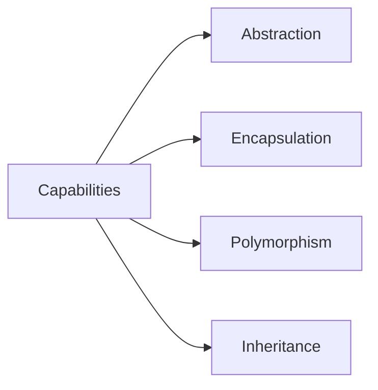
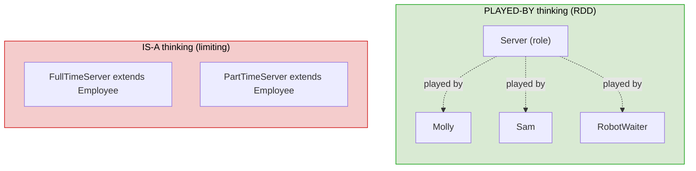
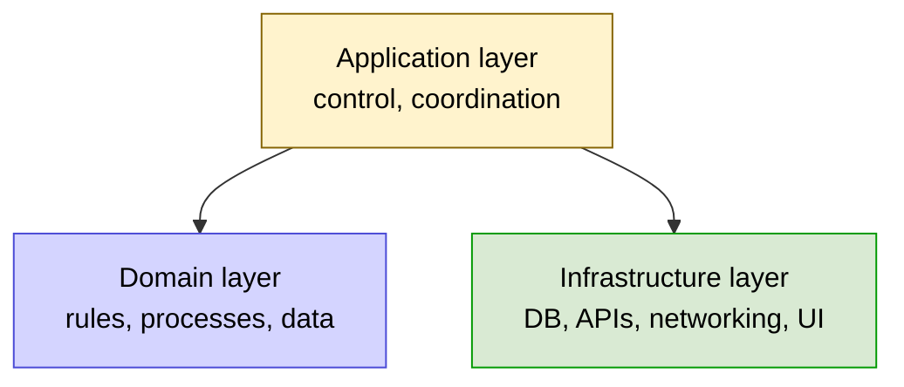
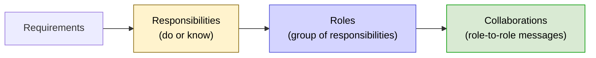
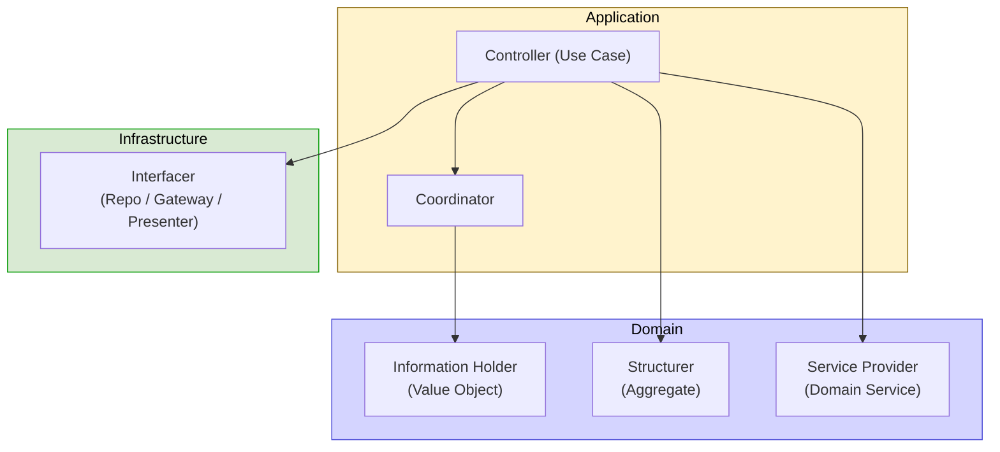

# Chapter 33: Responsibility-Driven Design 101

## Core Question

**What if you stopped seeing code as classes and methods, and started seeing it as a cast of characters playing roles?**

That's the RDD frame shift. Objects aren't data containers — they're **role-fillers** with **responsibilities**, and your job is to design how they **collaborate**. Once you see code this way, you can't unsee it.

---

## 1. The Frame Shift

> "Object-oriented applications are composed of objects that come and go, assuming their roles and fulfilling their *responsibilities*." — Rebecca Wirfs-Brock

Most developers see software as a Rube Goldberg machine of frameworks, endpoints, and DB schemas. RDD asks you to drop that and see software as **behavior expressed through roles**.

| Old Frame | RDD Frame |
|---|---|
| "What endpoints/tables/components do I need?" | "What must be done? Who does it?" |
| Database-first / API-first | Behavior-first |
| Classes as data containers | Objects as role-fillers |
| Inheritance is "is-a" | Inheritance is "plays the role of" |

---

## 2. What Objects Are For

Four core capabilities. These are why objects exist.

| Capability | What It Means | Example |
|---|---|---|
| **Know information** | Hold state | `User` knows email, preferences |
| **Make decisions** | Apply rules to state | `Order` calculates total with discounts |
| **Advertise services** | Public methods others can call | `repo.save(order)` |
| **Maintain connections** | Collaborate via composition/delegation | `Order` holds a `PricingPolicy` |

These four capabilities enable the four OO concepts:



---

## 3. Objects Come and Go, Filling Roles

> Objects play one or more *roles*; roles contain a set of *responsibilities*.

Like actors in a Broadway show: the audience cares that someone plays Hamlet, not which actor it is on a given night.

### Restaurant Analogy

A manager short on staff doesn't care if it's Molly, Sam, Dennis, or Frank — they just need someone playing the **Server** role. As long as the role is filled, the responsibilities get done.

### "Played By" vs "Is A"



This is the foundation for **polymorphism** done right.

---

## 4. Models Violate Real-World Physics (Intentionally)

> "All models are wrong. Some are useful." — Rebecca Wirfs-Brock

Common mistake: trying to model reality faithfully. **Don't.** Model only what you need to fulfill the requirement.

### Three Modeling Scenarios

| Scenario | Domain | Application | Infrastructure |
|---|---|---|---|
| Modeling a **car** (toy) | Doors, wheels, frame | Minimal | None |
| Car **rental app** | Car, Rental, Customer | Bookings, Payments, Forms | DB, API, Email |
| Multiplayer **racing game** | Car, Track, Lap | Input, Match, Lobby | WebSockets, Renderer, Physics engine |

You **invent** what's domain-specific. You **integrate** what isn't (graphics engine, physics, networking).

> We are *not* in the business of creating models that mimic the real world. We are in the business of creating models that get things done.

### Stereotypical Architecture



---

## 5. The Three Core Concepts



### Responsibilities

An obligation to **do** (a task) or **know** (some data).

**Example: house-bot design story:**

> "The house-bot gradually learns the layout of the house. If you say 'house-bot' he'll look at you and light up. You can say 'this is the kitchen' and he'll learn. He can be told 'go to the kitchen'. He doesn't bump into walls."

**Responsibilities derived:**

*Doing:*
- Turn left/right
- Move forward/backward
- Take pictures
- Listen for voice commands
- Detect "house-bot" wake word
- Blink in acknowledgment
- Play audio responses
- Compose layout from pictures

*Knowing:*
- The layout of a room
- The connections between rooms
- Which room he's currently in

### Roles

Groups of related responsibilities. Role candidates from above:

- `PathFinder`, `Path`
- `RoomLayout`, `Home`
- `CommandController`, `NameRoom` (use case), `ChangeRoom` (use case)
- `Microphone`, `Blinker`
- `Wheels`, `Motor`

> Old advice: "look for the nouns in the design story." Outdated — it only finds *domain* roles, missing application & infrastructure ones.

### Collaborations

Role-to-role messages. The asker is the **client**; the receiver is the **collaborator**.

**Finding collaborations:** for each responsibility, ask:
- *Doing:* "What other role helps with this task?"
- *Knowing:* "Who else needs this information?"

Example: `ChangeRoom` use case needs to know `Path`s, talk to `Wheels`/`Motor`, query `RoomLayout`. New responsibilities (coordination) emerge in the process.

> "Collaborations raise the IQ of the whole neighbourhood."

---

## 6. The Six Object Stereotypes

Like LEGO bricks. You'll keep reaching for these same six patterns.

| # | Stereotype | Job | Examples |
|---|---|---|---|
| 1 | **Information Holder** | Hold info | Value Objects, DTOs |
| 2 | **Structurer** | Maintain relationships, invariants | Aggregates, caches, connection pools |
| 3 | **Service Provider** | Stable computation / utilities / cross-cutting | TextUtil, Domain Services, Logger |
| 4 | **Coordinator** | Pass info between roles | Mediators, orchestrators |
| 5 | **Controller** | Application-layer use case | Use Cases, Command handlers |
| 6 | **Interfacer** | Bridge between neighborhoods | Repositories, Gateways, Presenters, EventListeners |

### Quick Visual



### 1. Information Holder

Holds state. Closest match: Value Object.

```typescript
class Money {
  constructor(readonly amount: number, readonly currency: string) {}
  add(other: Money): Money { /* ... */ }
}
```

### 2. Structurer

Maintains relationships and invariants between objects.

Examples: DDD Aggregates (e.g., `Order` containing `OrderLine`s and enforcing rules across them), caches, connection pools.

### 3. Service Provider

Three flavors:

| Flavor | Example | Role |
|---|---|---|
| **Stable** | `DateUtil`, `TextUtil`, `JSON.stringify` | Rarely changes; broadly used |
| **Pure Fabrication** (Domain Service) | `PriceCalculator`, `TaxPolicy` | Domain logic that doesn't fit any one Aggregate |
| **Cross-cutting** | `Logger`, `Tracer`, `AuthGuard` | Wraps or is called by use cases |

### 4. Coordinator

Passes data between roles so they can do work. With Controllers, determines **how control flows** through the app.

### 5. Controller (= Use Case)

The application-layer object that orchestrates a feature. Same idea as the Use Case pattern from earlier chapters. Declaratively expresses what should happen at the feature level.

### 6. Interfacer

Bridges neighborhoods.

| Subtype | Where | Example |
|---|---|---|
| **Internal Interfacer** | Front of a component | Module facade |
| **Gateway** | To external systems | API client, payment gateway |
| **Repository** | To persistence | `OrderRepository` |
| **Presenter** | To UI | View-models, formatters |
| **Event Listener** | From UI | DOM event handlers |

---

## 7. Stereotype Rules of Thumb

| Tip | Why |
|---|---|
| Pick the most-fitting stereotype for each candidate | Forces clarity about its purpose |
| If responsibilities span multiple stereotypes, consider splitting | High cohesion |
| Combinations are OK in moderation | A `CachingRepository` is Interfacer + Structurer |
| Names should hint at stereotype | `OrderRepository`, `OrderUseCase`, `OrderPresenter` |

> **Exercise:** Look at one of your projects. Pick 5 classes. Which stereotype is each? You'll never see your code the same way again.

---

## 8. Mental Map

```mermaid
flowchart TB
    RDD(["RDD 101"])

    RDD --> FRAME["Frame shift"]
    FRAME --> BEHAV["Behavior over data"]
    FRAME --> PLAY["Played by, not is-a"]

    RDD --> CAP["Object capabilities"]
    CAP --> KNOW["Know"]
    CAP --> DECIDE["Decide"]
    CAP --> ADV["Advertise"]
    CAP --> CON["Connect"]

    RDD --> CORE["Core concepts"]
    CORE --> RES["Responsibilities"]
    CORE --> ROL["Roles"]
    CORE --> COL["Collaborations"]

    RDD --> STER["Six stereotypes"]
    STER --> S1["Information Holder"]
    STER --> S2["Structurer"]
    STER --> S3["Service Provider"]
    STER --> S4["Coordinator"]
    STER --> S5["Controller (Use Case)"]
    STER --> S6["Interfacer"]

    RDD --> MOD["Models violate physics"]
    MOD --> USEFUL["Useful, not realistic"]

    style RDD fill:#4a86c8,stroke:#2a5a8c,color:#fff
    style STER fill:#d9ead3,stroke:#090,color:#000
```



---

## Key Takeaways

1. **Frame shift: behavior, not data** — see code as roles fulfilling responsibilities
2. **Four object capabilities** — know, decide, advertise services, maintain connections
3. **"Played by," not "is-a"** — multiple objects can fulfill the same role; this is real polymorphism
4. **Models are useful, not realistic** — invent and integrate what's needed, ignore everything else
5. **Three core concepts** — Responsibilities → Roles → Collaborations
6. **Six stereotypes are your LEGO bricks** — Information Holder, Structurer, Service Provider, Coordinator, Controller, Interfacer
7. **Names should hint at stereotype** — Repository, Gateway, UseCase, Presenter all communicate role
8. **Collaborations raise the IQ** — design the conversations between objects, not just the objects themselves

---

## Concepts Introduced

- [Object Stereotypes](../concepts/object-stereotypes.md) — *new* — the six standard role types
- [Roles and Responsibilities](../concepts/roles-and-responsibilities.md) — *new* — the RDD vocabulary
- [Object Capabilities](../concepts/object-capabilities.md) — *new* — what objects are for (know, decide, advertise, connect)

This chapter also operationalizes:
- [Responsibility-Driven Design](../concepts/responsibility-driven-design.md) — deepened from Ch 32
- [Polymorphism](../concepts/polymorphism.md) — "played by" thinking is its foundation
- [Anemic Domain Model](../concepts/anemic-domain-model.md) — what happens without RDD
