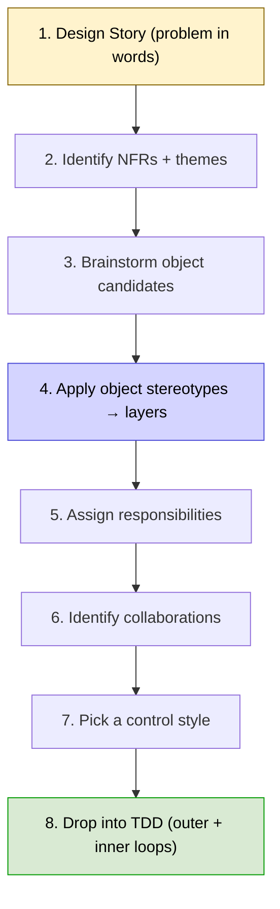
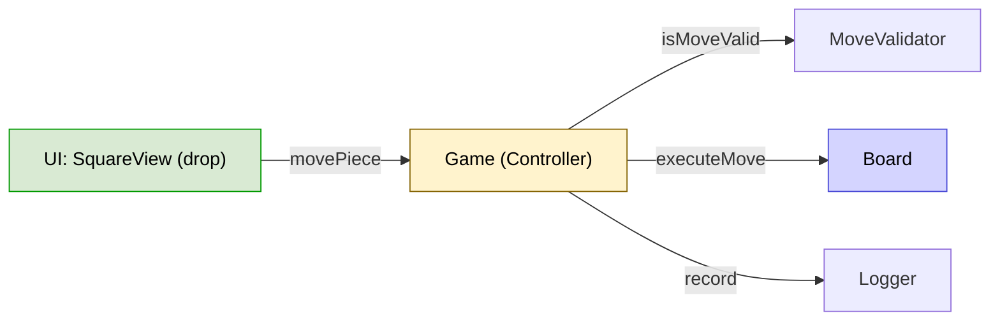
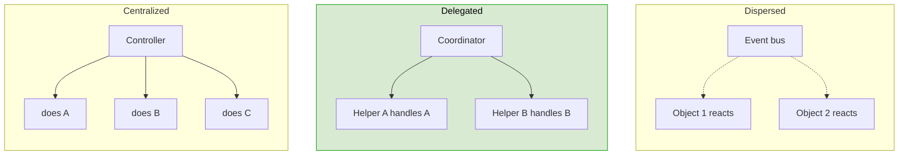
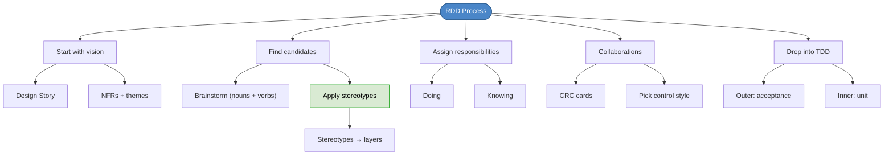

# Chapter 34: The RDD Process By Example

## Core Question

**How do you actually run RDD on a real feature, end-to-end?**

Walk through it on a checkers game in React + MobX. Start from a design story, brainstorm roles, apply stereotypes to map them to layers, identify responsibilities and collaborations, then drop into TDD. Design happens **before** the code.

---

## 1. The Process at a Glance



> "Responsibility-Driven Design is the most efficient path to designing great software." — John Vlissides

---

## 2. Step 1: Write a Design Story

Capture **what the app must do** in plain language. For checkers:

**Rules:**
- Two players (black, white). Pieces move diagonally forward.
- Capture by jumping. Reaching the far side = "kinged" (can move backward).
- Must keep jumping if possible.
- Game ends when one player has no moves or pieces.

**UI:**
- 8x8 board, drag to move, highlight valid moves.

**Console:**
- Log each move and turn change.

---

## 3. Step 2: Identify Themes + NFRs

| Theme | What It Covers |
|---|---|
| **Game logic** | Rules, turns, captures |
| **Board representation** | Squares, pieces, validity |
| **UI interaction** | Drag-and-drop, visual feedback |
| **Console** | Move log |

| NFR | Why It Matters |
|---|---|
| **Testable** | Game logic must run without UI |
| **Maintainable** | Rules might evolve (custom boards) |
| **Flexible** | Could become networked multiplayer |

---

## 4. Step 3: Brainstorm Candidates

Don't worry about layers yet. Just list potential roles:

- `Game` — overarching controller
- `Board` — squares + pieces
- `Square` — knows position, occupant
- `Piece` — color, position, kinged?
- `MoveValidator` — rule checker
- `BoardView`, `SquareView`, `PieceView` — React UI
- `DragManager` — wraps the DnD library
- `Logger` — message panel

---

## 5. Step 4: Apply Stereotypes → Layers

Tag each candidate with its stereotype. The stereotype tells you which architectural layer it belongs to.

| Candidate | Stereotype | Layer |
|---|---|---|
| `Game` | Controller / Coordinator | Application |
| `Board` | Structurer | Domain |
| `Square` | Information Holder | Domain |
| `Piece` | Information Holder | Domain |
| `MoveValidator` | Service Provider | Domain |
| `Logger` | Service Provider / Interfacer | Infrastructure |
| `DragManager` | Interfacer | Infrastructure |
| `*View` components | Interfacer (Presenter) | Infrastructure (UI) |

### Stereotype-to-Layer Cheat Sheet

| Stereotype | Typical Layer |
|---|---|
| Information Holder | Domain |
| Structurer | Domain |
| Service Provider | Domain (rules) or Infra (cross-cutting) |
| Controller (Use Case) | Application |
| Coordinator | Application |
| Interfacer | Infrastructure (always) |

> If a class is doing things from multiple stereotypes, that's a hint it should be split.

---

## 6. Step 5: Assign Responsibilities

For each candidate, list what it must **do** and **know**.

### Board (Structurer)
- *Knows:* 8x8 grid of squares, which piece occupies each
- *Does:* `getSquare(coords)`, `placePiece`, `removePiece`, `getPieceById`

### Piece (Information Holder)
- *Knows:* color, position, is-kinged
- *Does:* (mostly knows; `MoveValidator` does the deciding)

### MoveValidator (Service Provider)
- *Does:* `isMoveValid(board, piece, target)`, `getValidMoves(piece)`, `mustJump(piece)`

### Game (Controller)
- *Knows:* current turn, winner
- *Does:* `movePiece(id, target)`, asks `MoveValidator`, updates `Board`, calls `Logger`, switches turn

### Logger (Service Provider)
- *Does:* `record(msg)`, exposes log to UI

---

## 7. Step 6: Identify Collaborations

For each "doing" responsibility, ask: **who helps?**



### CRC Card for Game

```
+---------------------------------------------+
| Game                                        |
+--------------------+------------------------+
| Responsibilities   | Collaborators          |
| - track turn       | - Board                |
| - orchestrate move | - MoveValidator        |
| - check game over  | - Logger               |
+--------------------+------------------------+
```

---

## 8. Step 7: Pick a Control Style

Three styles for how control flows through your app:

| Style | Description | When to Use |
|---|---|---|
| **Centralized** | One Controller knows everything, calls everyone | Simple apps, scripts |
| **Delegated** | Controller orchestrates; helpers handle their own logic | Most apps — including this one |
| **Dispersed** | No central controller, objects react to events | Event-driven systems, games with many independent agents |

For checkers, **delegated** fits best: `Game` orchestrates but delegates rule-checking to `MoveValidator`, board updates to `Board`, logging to `Logger`.



---

## 9. Step 8: Drop Into TDD

### Outer Loop — Acceptance Test

> *Scenario:* "A black piece can jump a white piece if it's diagonally adjacent and the square beyond is free."
>
> **Given** a board with black at (2,3) and white at (3,4)
> **When** black attempts to move to (4,5)
> **Then** black lands at (4,5), white is removed, turn changes to white

### Inner Loop — Unit Tests

```typescript
describe('MoveValidator', () => {
  it('allows jumping diagonally over opponent pieces', () => {
    const mv = new MoveValidator();
    const board = makeBoard()
      .with('black', { x: 2, y: 3 })
      .with('white', { x: 3, y: 4 });
    expect(mv.isMoveValid(board, board.pieceAt(2,3), { x: 4, y: 5 })).toBe(true);
  });
});
```

> Test the **doing** responsibilities. Knowing responsibilities are usually exercised through doing tests.

---

## 10. The Code Falls Out Naturally

```typescript
class Game {
  constructor(
    private board: Board,
    private moveValidator: MoveValidator,
    private logger: Logger
  ) {}

  private currentPlayer: Color = 'Black';

  movePiece(pieceId: string, to: SquareCoords) {
    const piece = this.board.getPieceById(pieceId);
    if (!piece) return;

    if (!this.moveValidator.isMoveValid(this.board, piece, to)) {
      this.logger.record(`Invalid move by ${this.currentPlayer}`);
      return;
    }

    this.board.executeMove(piece, to);
    this.logger.record(`${this.currentPlayer} moves ${pieceId} to ${to.x},${to.y}`);
    this.switchTurn();
  }
}
```

### And the UI

```tsx
function SquareView({ square }: { square: Square }) {
  const [{ isOver }, dropRef] = useDrop(() => ({
    accept: 'PIECE',
    drop: (item) => game.movePiece(item.pieceId, square.coords),
    collect: (monitor) => ({ isOver: !!monitor.isOver() }),
  }));

  return (
    <div ref={dropRef} className={`square ${isOver ? 'highlight' : ''}`}>
      {square.piece && <PieceView piece={square.piece} />}
    </div>
  );
}
```

The UI **collaborates with the domain** through `game.movePiece`. It doesn't know about rules, board structure, or logging.

---

## 11. Getting Unstuck

| Symptom | Likely Cause | Fix |
|---|---|---|
| Hard to test logic | UI and logic mixed | Pull domain out of components |
| Unclear who does what | Mixed stereotypes in one class | Re-tag with stereotypes; split |
| Same code rewritten in 3 places | Missing Service Provider | Extract a shared rule object |
| Class with 8 collaborators | God class | Look for a missing Coordinator |
| Test setup is huge | Too many dependencies | Replace some with mocks |

---

## 12. Mental Map



---

## Key Takeaways

1. **Start with vision** — design story before code, every time
2. **Stereotypes map to layers** — Holder/Structurer = domain, Controller = app, Interfacer = infra
3. **Brainstorm freely first, organize after** — don't worry about layers in step one
4. **Assign responsibilities by asking "knows what?" / "does what?"** — both matter
5. **Find collaborations by following the doing** — for each verb, ask "who helps?"
6. **Pick a control style explicitly** — centralized, delegated, or dispersed (most apps: delegated)
7. **Then drop into TDD** — outer (acceptance) + inner (unit) loops
8. **The code falls out naturally** — when the design is right, implementation is mostly translation

---

## Concepts Introduced

- [Control Styles](../concepts/control-styles.md) — *new* — centralized vs delegated vs dispersed

This chapter also operationalizes:
- [Responsibility-Driven Design](../concepts/responsibility-driven-design.md) — full step-by-step demo
- [Object Stereotypes](../concepts/object-stereotypes.md) — applied to a real feature
- [CRC Cards](../concepts/crc-cards.md) — used to capture responsibilities and collaborators
- [Clean Architecture](../concepts/clean-architecture.md) — stereotypes naturally map to layers
- [TDD](../concepts/tdd.md) — RDD provides the design; TDD provides the loop
