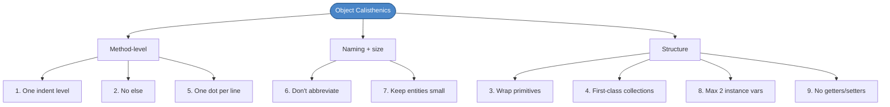
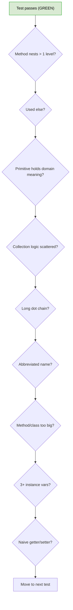

# Chapter 35: Better Objects with Object Calisthenics

## Core Question

**What constraints can you impose on yourself to keep OO designs from rotting?**

Nine rules. Some seem extreme. They're meant to be — that's the point. They're a workout, not a permanent style. Use them during the **refactor** step of TDD; they'll force the structural improvements your code is dodging.

---

## 1. Why Calisthenics?

> "Just because you can doesn't mean you should."

OO gives you powerful features (inheritance, getters, deep nesting, primitive types). Used freely, they produce brittle code. Object Calisthenics is a set of **temporary constraints** that force better habits.

| Without Constraints | With Calisthenics |
|---|---|
| 10-level deep methods | One indent level — break into helpers |
| `if/else` everywhere | Early returns + polymorphism |
| Primitives (`string`, `number`) carrying domain meaning | Value objects |
| Getters/setters on every field | Tell, don't ask |

> Origin: Jeff Bay, *The ThoughtWorks Anthology* (2008).

---

## 2. The Nine Rules



---

## 3. Rule 1 — One Level of Indentation per Method

**Why:** Nested loops + conditionals signal multiple responsibilities.

### Before
```typescript
generateSalesReport(reps: SalesRep[][]): string {
  let report = "Sales Report:\n";
  for (let r = 0; r < reps.length; r++) {        // level 1
    report += `Region ${r}:\n`;
    for (const rep of reps[r]) {                  // level 2
      if (rep.sales > 10000) {                    // level 3
        report += ` - ${rep.name} bonus!\n`;
      } else {
        report += ` - ${rep.name} under quota.\n`;
      }
    }
  }
  return report;
}
```

### After
```typescript
generateSalesReport(reps: SalesRep[][]): string {
  let report = "Sales Report:\n";
  for (let r = 0; r < reps.length; r++) {
    report += this.regionReport(reps[r], r);
  }
  return report;
}

private regionReport(reps: SalesRep[], r: number): string {
  let out = `Region ${r}:\n`;
  for (const rep of reps) out += this.repLine(rep);
  return out;
}

private repLine(rep: SalesRep): string {
  if (rep.sales > 10000) return ` - ${rep.name} bonus!\n`;
  return ` - ${rep.name} under quota.\n`;
}
```

Each method has at most one loop or one conditional.

---

## 4. Rule 2 — Don't Use `else`

**Why:** `else` doubles the cognitive paths. Early returns flatten flow.

### Before
```typescript
function login(u, p) {
  if (userService.isValid(u, p)) {
    redirect("home");
  } else {
    showError("Bad credentials");
    redirect("login");
  }
}
```

### After
```typescript
function login(u, p) {
  if (!userService.isValid(u, p)) {
    showError("Bad credentials");
    return redirect("login");
  }
  return redirect("home");
}
```

When you can't avoid branching, replace `if/else` with **polymorphism**, **Null Object**, or **State** patterns.

---

## 5. Rule 3 — Wrap All Primitives and Strings

**Why:** Avoid **Primitive Obsession** — primitives carrying domain meaning without enforcing it.

### Before
```typescript
class Order {
  checkout(price: number, currency: string, userID: string) { /* ... */ }
}
```

### After
```typescript
class Money {
  constructor(private amount: number, private currency: string) {
    if (amount < 0) throw new Error("Negative amount");
  }
  add(other: Money): Money {
    if (this.currency !== other.currency) throw new Error("Currency mismatch");
    return new Money(this.amount + other.amount, this.currency);
  }
}

class UserID {
  constructor(private readonly value: string) {
    if (!value) throw new Error("UserID required");
  }
}

class Order {
  checkout(price: Money, user: UserID) { /* ... */ }
}
```

| Win | How |
|---|---|
| Domain concepts explicit | `Money` reads better than `number` |
| Validation in one place | The constructor enforces it |
| Type system catches errors | Can't accidentally pass `currency` where `userID` is expected |

---

## 6. Rule 4 — First-Class Collections

**Why:** Collection-related logic spreads across the codebase. Wrap arrays in domain-named classes.

### Before
```typescript
function getActiveTasks(tasks) { return tasks.filter(t => t.isActive); }
function countCompletedTasks(tasks) { return tasks.filter(t => t.isCompleted).length; }
```

### After
```typescript
class Tasks {
  constructor(private items: Task[]) {}

  active(): Tasks {
    return new Tasks(this.items.filter(t => !t.isCompleted()));
  }

  completedCount(): number {
    return this.items.filter(t => t.isCompleted()).length;
  }
}
```

A class wrapping a collection should be the **only** class with that collection as a field.

---

## 7. Rule 5 — One Dot Per Line

**Why:** Long chains expose internals (violates **Law of Demeter**).

### Before
```typescript
person.getWallet().getCreditCard().charge(50);
```

### After
```typescript
person.chargeCreditCard(50);

// Internally:
chargeCreditCard(amount: number) {
  this.wallet.charge(amount);
}
```

> "Tell, don't ask."

**Exception:** Builder patterns and fluent APIs (`query.where(...).orderBy(...).limit(...)`) are intentional chains within one role.

---

## 8. Rule 6 — Don't Abbreviate

**Why:** Cryptic names hide domain concepts.

| Bad | Good |
|---|---|
| `usrObj` | `userProfile` |
| `calcSrvc` | `calculatorService` |
| `mgr` | `manager` |
| `tmp` | `pendingTotal` |

If a name feels too long, the symptom usually points to a missing abstraction, not a need to shorten.

---

## 9. Rule 7 — Keep All Entities Small

| Entity | Suggested Limit |
|---|---|
| **Method** | 5-10 lines, ≤2 args |
| **Class** | 50-100 lines, 1-2 responsibilities |
| **Package/module** | 10-15 files |

These aren't laws — they're alarms. Cross them, and ask whether the code is doing too much.

---

## 10. Rule 8 — No More Than Two Instance Variables

**Why:** Many fields = many responsibilities. Group related data into value objects.

### Before
```typescript
class Game {
  private score: number;
  private level: number;
  private players: Player[];
  private powerUps: PowerUp[];
  private timer: Timer;
}
```

### After
```typescript
class GameState {
  constructor(public score: number, public level: number, public timer: Timer) {}
}

class Game {
  constructor(
    private players: Players,        // first-class collection
    private state: GameState         // grouped state
  ) {}
}
```

This rule pairs perfectly with **Rule 3** (wrap primitives) and **Rule 4** (first-class collections).

---

## 11. Rule 9 — No Getters / Setters / Properties

**Why:** Naive getters/setters break encapsulation — external code drives state changes through them.

### Before
```typescript
class Game {
  private score = 0;
  getScore() { return this.score; }
  setScore(s: number) { this.score = s; }
}

// Caller:
game.setScore(game.getScore() + 3);   // logic outside the object
```

### After
```typescript
class Game {
  private score = 0;
  addPoints(points: number) {
    if (points < 0) throw new Error("Negative");
    this.score += points;
  }
  getScore() { return this.score; }   // read access OK if needed
}

// Caller:
game.addPoints(3);                    // logic inside the object
```

**Tell**, don't ask. The object decides how its state changes.

---

## 12. The Calisthenics Refactor Pass

After GREEN, run through this checklist before moving to the next test:



Apply rules **after** the test passes — never let calisthenics block GREEN.

---

## 13. When to Relax the Rules

These are training rules. Real code allows tradeoffs:

| Rule | When to Bend |
|---|---|
| One indent | Library code where extraction adds noise |
| No else | Symmetric branching that reads naturally |
| Wrap primitives | Truly anonymous values (loop indices, sums) |
| First-class collections | Throwaway arrays in tests |
| One dot | Builder/fluent APIs |
| 2 instance variables | Aggregates that genuinely contain N parts |
| No getters | Read-only data exposure for serialization |

The point: you should be able to **defend** every violation. If you can't, fix it.

---

## 14. Mental Map

```mermaid
flowchart TB
    OC(["Object Calisthenics"])

    OC --> WHY["Why?"]
    WHY --> CON["Constraints force good habits"]
    WHY --> REF["Run during REFACTOR step"]

    OC --> METH["Methods"]
    METH --> M1["1 indent level"]
    METH --> M2["No else"]
    METH --> M5["One dot"]
    METH --> M7["Small (5-10 lines)"]

    OC --> NAMES["Naming"]
    NAMES --> N6["Don't abbreviate"]

    OC --> CLASSES["Classes"]
    CLASSES --> C3["Wrap primitives"]
    CLASSES --> C4["First-class collections"]
    CLASSES --> C7["Small (50-100 lines)"]
    CLASSES --> C8["Max 2 fields"]
    CLASSES --> C9["No naive getters"]

    OC --> RES["Result"]
    RES --> SIMPLE["Simpler designs"]
    RES --> EXPR["Expressive domain"]
    RES --> TELL["Tell don't ask"]

    style OC fill:#4a86c8,stroke:#2a5a8c,color:#fff
    style RES fill:#d9ead3,stroke:#090,color:#000
```



---

## Key Takeaways

1. **Calisthenics are temporary constraints** — they teach habits, not lock you into a style
2. **Apply during REFACTOR** — never block GREEN
3. **One indent, no else** — methods stay focused on one decision
4. **Wrap primitives** — kill primitive obsession; domain becomes explicit
5. **First-class collections** — collection logic centralizes, prevents duplication
6. **One dot per line** — Law of Demeter; tell don't ask
7. **No abbreviations** — long names usually hint at missing abstractions
8. **Small entities, two fields** — forces cohesion and discovery of new concepts
9. **No naive getters** — logic stays inside the object
10. **Defend every violation** — bending a rule should be deliberate, not careless

---

## Concepts Introduced

- [Object Calisthenics](../concepts/object-calisthenics.md) — *new* — the nine rules and how to apply them
- [Primitive Obsession](../concepts/primitive-obsession.md) — *new* — the smell Rule 3 prevents
- [Law of Demeter](../concepts/law-of-demeter.md) — *new* — the principle behind Rule 5
- [Tell Don't Ask](../concepts/tell-dont-ask.md) — *new* — design philosophy underlying Rules 5 and 9

This chapter also operationalizes:
- [Value Objects](../concepts/value-objects.md) — Rule 3's mechanism
- [Code Smells](../concepts/code-smells.md) — calisthenics is largely a smell-prevention list
- [Coupling and Cohesion](../concepts/coupling-and-cohesion.md) — every rule serves one or both
