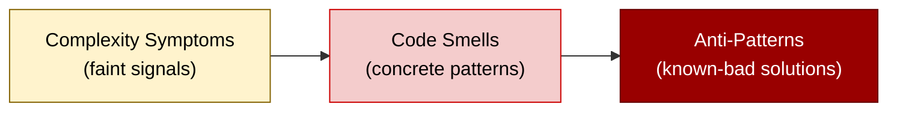
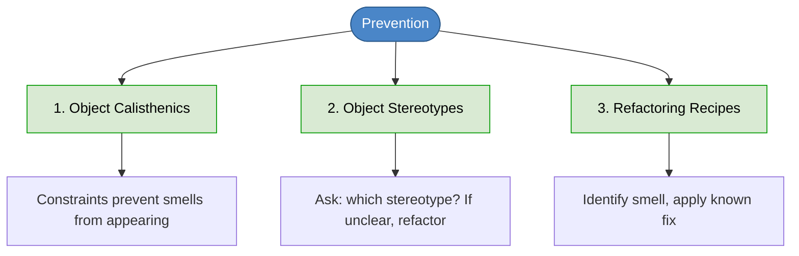
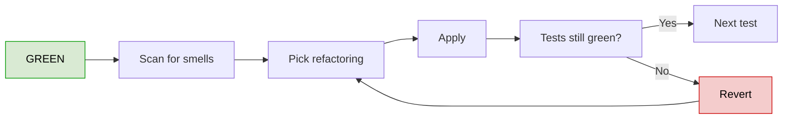

# Chapter 36: Detecting Code Smells & Anti-Patterns

## Core Question

**How do you spot bad design before it bites?**

Three layers of warning signs: **complexity symptoms** (faint early signals), **code smells** (concrete patterns hinting at deeper problems), and **anti-patterns** (recurring solutions that produce negative consequences). Catch them early — fix them with refactoring patterns. Prevent them with calisthenics and stereotypes.

---

## 1. Three Levels of Warning



| Level | What It Is | Example | Fix Effort |
|---|---|---|---|
| **Complexity symptoms** | Early signals (methods growing, conditionals piling up) | Cyclomatic complexity creeping | Tiny — incremental refactoring |
| **Code smells** | Specific patterns that hint at deeper problems | Long parameter list, feature envy | Medium — apply refactoring recipes |
| **Anti-patterns** | Recurring bad solutions you should avoid from the start | God Object, Golden Hammer | Large — rethink architecture |

---

## 2. The Five Categories of Code Smells

| Category | Theme | Common Members |
|---|---|---|
| **Bloaters** | Things that grow too big | Long Method, Large Class, Long Parameter List, Data Clumps |
| **OO Abusers** | Misuse of OO features | Switch Statements, Refused Bequest, Temporary Field |
| **Change Preventers** | Code that resists modification | Shotgun Surgery, Divergent Change, Parallel Inheritance |
| **Dispensables** | Code that doesn't earn its keep | Dead Code, Comments, Lazy Class, Speculative Generality |
| **Couplers** | Inappropriate dependencies | Feature Envy, Inappropriate Intimacy, Message Chains |

---

## 3. Bloaters

> Code that's grown excessively large or complex.

### Example: Long Function with Long Parameter List

```typescript
function processOrder(
  userId: string,
  productId: string,
  shippingAddress: string,
  paymentMethod: string,
  discountCode?: string,
  giftWrap?: boolean,
  loyaltyPoints?: number
) {
  // 1. Retrieve user
  // 2. Validate payment
  // 3. Apply discount
  // 4. Calculate loyalty
  // 5. Generate invoice
  // 6. Send email
  // ... 50+ more lines
}
```

### Refactor

| Refactoring | What It Does |
|---|---|
| **Extract Method** | Pull each step into its own private method |
| **Introduce Parameter Object** | Bundle related params into a request type |

```typescript
interface OrderRequest {
  userId: string;
  productId: string;
  shippingAddress: string;
  paymentMethod: string;
  discountCode?: string;
  giftWrap?: boolean;
  loyaltyPoints?: number;
}

class OrderProcessor {
  processOrder(request: OrderRequest): void {
    const user = this.retrieveUser(request.userId);
    if (!this.validatePayment(request.paymentMethod, user)) throw new Error("invalid payment");

    const discount = this.applyDiscount(request.discountCode);
    const loyaltyPointsUsed = this.applyLoyaltyPoints(request.loyaltyPoints, user);

    const invoice = this.generateInvoice(request, discount, loyaltyPointsUsed);
    this.sendConfirmation(user, invoice);
  }
}
```

---

## 4. Object-Orientation Abusers

> Code that should use OO features (polymorphism, encapsulation), but doesn't.

### Example: Switch on Type

```typescript
class Shape {
  constructor(public type: ShapeType, public a: number, public b: number) {}

  calculateArea(): number {
    switch (this.type) {
      case ShapeType.Circle: return Math.PI * this.a * this.a;
      case ShapeType.Rectangle: return this.a * this.b;
      case ShapeType.Triangle: return 0.5 * this.a * this.b;
      default: return 0;
    }
  }
}
```

**What's wrong:** Adding a shape requires editing this switch (Open-Closed Principle violation). Behavior is centralized rather than living with each type.

### Refactor: Replace Conditional with Polymorphism

```typescript
abstract class ShapeBase {
  constructor(public a: number, public b: number) {}
  abstract calculateArea(): number;
}

class Circle extends ShapeBase {
  calculateArea() { return Math.PI * this.a * this.a; }
}

class Rectangle extends ShapeBase {
  calculateArea() { return this.a * this.b; }
}

class Triangle extends ShapeBase {
  calculateArea() { return 0.5 * this.a * this.b; }
}
```

Adding `Hexagon` later doesn't touch any existing code.

---

## 5. Change Preventers

> Code where one change forces edits in many places (or vice versa).

### Example: Shotgun Surgery

```typescript
function canDeletePost(role: UserRole) {
  return role === UserRole.Admin || role === UserRole.Moderator;
}

function canBanUser(role: UserRole) {
  return role === UserRole.Admin;
}
// ... role checks scattered across 20 files
```

Adding a "Janitor" role with custom permissions = edit 20 files. Miss one → inconsistent behavior.

### Refactor: Strategy / Polymorphism

```typescript
interface PermissionChecker {
  canDeletePost(): boolean;
  canBanUser(): boolean;
}

class AdminPermissions implements PermissionChecker {
  canDeletePost() { return true; }
  canBanUser() { return true; }
}

class ModeratorPermissions implements PermissionChecker {
  canDeletePost() { return true; }
  canBanUser() { return false; }
}

class RegularPermissions implements PermissionChecker {
  canDeletePost() { return false; }
  canBanUser() { return false; }
}

function getPermissionChecker(role: UserRole): PermissionChecker { /* factory */ }
```

Adding a role = one new class.

### Two Faces of Change Prevention

| Smell | Pattern |
|---|---|
| **Shotgun Surgery** | One change → many edits |
| **Divergent Change** | One class changes for many reasons |

Both indicate misplaced responsibilities.

---

## 6. Dispensables

> Code that earns nothing.

### Example

```typescript
class OrderService {
  // This method calculates the order total for a user
  // (comment that just repeats the method name)
  calculateOrderTotal(orderId: string, debugMode?: boolean): number {
    // debugMode never read
    let total = 0;
    return total;
  }

  // Never called anywhere
  private convertCurrency(amount: number, currency: string): number {
    return amount;
  }
}
```

### Refactor

```typescript
class OrderService {
  calculateOrderTotal(orderId: string): number {
    let total = 0;
    return total;
  }
}
```

| Smell | Fix |
|---|---|
| **Dead code** | Delete it |
| **Useless comment** | Rename method to be self-explanatory |
| **Speculative generality** | Remove unused parameters / classes / interfaces |
| **Lazy class** | Inline or merge |

---

## 7. Couplers

> Classes that know too much about each other.

### Example: Inappropriate Intimacy

```typescript
class UserProfile {
  private _username: string;
  private _email: string;
  // private accessors only
}

class UserStatistics {
  logProfileData(profile: UserProfile) {
    console.log(
      "Logging user data:",
      (profile as any)._username,   // reaches into private fields
      (profile as any)._email
    );
  }
}
```

### Refactor

| Refactoring | What It Does |
|---|---|
| **Hide Delegate** | Use only public methods |
| **Move Method** | Move logic to where the data lives |

```typescript
class UserProfile {
  constructor(private username: string, private email: string) {}

  // If logging is part of the domain:
  logProfileData(): void {
    console.log("Logging user data:", this.username, this.email);
  }
}
```

### Other Couplers

| Smell | Pattern |
|---|---|
| **Feature Envy** | Method uses another class's data more than its own |
| **Message Chains** | `a.b().c().d().e()` |
| **Middle Man** | A class that just delegates to another with no added value |

---

## 8. Anti-Patterns vs Code Smells

| | Code Smell | Anti-Pattern |
|---|---|---|
| **Where it lives** | In existing code | A general approach |
| **Severity** | Often fixable with one refactoring | Usually requires architectural rethinking |
| **Fix** | Apply a refactoring recipe | Avoid from the start; major rework |
| **Examples** | Long Method, Feature Envy | God Object, Golden Hammer, Lava Flow, Big Ball of Mud |

### Common Anti-Patterns

- **God Object** — one class hoards all responsibilities
- **Golden Hammer** — same solution applied to every problem
- **Lava Flow** — outdated code retained "just in case"
- **Big Ball of Mud** — no discernible architecture
- **Spaghetti Code** — flow control jumps everywhere

---

## 9. The Seven Smells You'll See Most

Focus on these. They're 80% of what you'll encounter.

| Smell | Refactoring |
|---|---|
| **Duplication** | Extract Method / Template Method |
| **Long Method** | Extract Method, Decompose Conditional |
| **Large Class** | Extract Class |
| **Long Parameter List** | Introduce Parameter Object |
| **Primitive Obsession** | Replace with Value Object |
| **Feature Envy** | Move Method |
| **Message Chains** | Hide Delegate |

---

## 10. Three Strategies for Prevention



### Strategy 1: Object Calisthenics
Following the nine rules makes most smells nearly impossible to introduce.

### Strategy 2: Stereotypes
Ask "which stereotype is this class?" If the answer is "two or three" — split it.

### Strategy 3: Refactoring Recipes
Smell ↔ Refactoring is a known mapping. Pick from Fowler's catalog or refactoring.guru.

| If You See | Apply |
|---|---|
| Data Clumps | Introduce Parameter Object, Encapsulate Collection |
| Switch on Type | Replace Conditional with Polymorphism |
| Shotgun Surgery | Move Method, Inline Class, Encapsulate Collection |
| Comments | Extract Method, Rename, Replace Comment with Function |
| Inappropriate Intimacy | Hide Delegate, Move Method |

---

## 11. The Refactor Loop in TDD



---

## 12. Mental Map

```mermaid
flowchart TB
    SMELLS(["Code Smells & Anti-Patterns"])

    SMELLS --> LEVELS["Three levels of warning"]
    LEVELS --> SY["Complexity symptoms"]
    LEVELS --> CS["Code smells"]
    LEVELS --> AP["Anti-patterns"]

    SMELLS --> CATS["Five smell categories"]
    CATS --> BL["Bloaters"]
    CATS --> OO["OO abusers"]
    CATS --> CP["Change preventers"]
    CATS --> DI["Dispensables"]
    CATS --> CO["Couplers"]

    SMELLS --> TOP7["Top 7 smells"]
    TOP7 --> DUP["Duplication"]
    TOP7 --> LM["Long Method"]
    TOP7 --> LC["Large Class"]
    TOP7 --> LP["Long Param List"]
    TOP7 --> PO["Primitive Obsession"]
    TOP7 --> FE["Feature Envy"]
    TOP7 --> MC["Message Chains"]

    SMELLS --> PREV["Prevention"]
    PREV --> CAL["Calisthenics"]
    PREV --> STR["Stereotypes"]
    PREV --> REC["Refactoring recipes"]

    style SMELLS fill:#4a86c8,stroke:#2a5a8c,color:#fff
    style PREV fill:#d9ead3,stroke:#090,color:#000
```



---

## Key Takeaways

1. **Three warning levels** — complexity symptoms, code smells, anti-patterns. Catch them early.
2. **Five smell categories** — Bloaters, OO Abusers, Change Preventers, Dispensables, Couplers
3. **Smells hint, they don't prove** — investigate before refactoring
4. **Anti-patterns require rework, not refactoring** — avoid them from the start
5. **Top 7 smells = 80% of cases** — Duplication, Long Method, Large Class, Long Param List, Primitive Obsession, Feature Envy, Message Chains
6. **Smells map to known refactorings** — Fowler's *Refactoring* and refactoring.guru are reference catalogs
7. **Prevent with three layers** — Object Calisthenics for daily form, Stereotypes for clarity, Refactoring recipes when smells appear
8. **Refactor inside the GREEN-REFACTOR loop** — never with broken tests

---

## Concepts Introduced

- [Anti-Patterns](../concepts/anti-patterns.md) — *new* — known-bad recurring solutions
- [Code Smell Categories](../concepts/code-smell-categories.md) — *new* — Bloaters/OO Abusers/Change Preventers/Dispensables/Couplers
- [Refactoring Recipes](../concepts/refactoring-recipes.md) — *new* — smell-to-refactoring mapping

This chapter also operationalizes:
- [Code Smells](../concepts/code-smells.md) — deepens with categories and detection patterns
- [Object Calisthenics](../concepts/object-calisthenics.md) — positioned as smell prevention
- [Object Stereotypes](../concepts/object-stereotypes.md) — used as a smell-detection lens
- [Primitive Obsession](../concepts/primitive-obsession.md) — one of the top 7 smells

---

**Part V: Object-Oriented Design with Tests is complete.** You now have:

- A reason for OO design beyond TDD (Ch 32)
- The RDD philosophy: roles, responsibilities, collaborations + six stereotypes (Ch 33)
- A worked-through RDD process from design story to code (Ch 34)
- Nine calisthenics rules to keep code lean (Ch 35)
- A full vocabulary of smells, categories, and refactorings to fix them (Ch 36)

Next: **Part VI — Design Patterns.** With RDD, calisthenics, and smell-spotting, you have the design context patterns were invented to serve.
